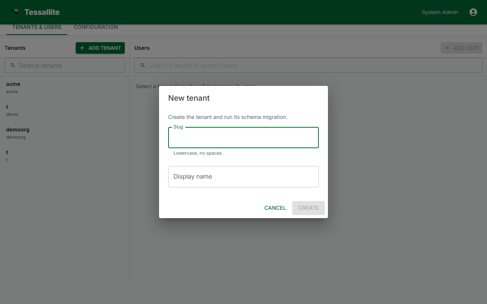

## What this covers

Only the System Admin can create workspaces. This article explains where to do it, what fields are required, and what is provisioned after creation.

---

## Who can create a workspace

Workspace creation is restricted to the System Admin. This account is configured by the environment variables `ADMIN_USER` and `ADMIN_PASS` set during deployment. Tenant Admins cannot create workspaces; they manage users and settings within an existing workspace.

---

## Steps to create a workspace

1. Open a browser and navigate to Tessallite on port `3000`.
2. Sign in using the `ADMIN_USER` and `ADMIN_PASS` credentials. The application opens directly to the System Administration screen.
3. Click the **Workspaces** tab.
4. Click **New Workspace**.
5. Fill in the workspace fields (see reference below).
6. Enter the email address of the initial Tenant Admin user.
7. Click **Create**.

---

## Workspace fields

| Field | Description | Constraints |
|-------|-------------|-------------|
| Display name | The label shown in the UI. Can be changed at any time. | Any text; max 80 characters. |
| Slug | Short identifier used as the JDBC database name and XMLA catalog name. Analysts need this value to connect BI tools. | Lowercase letters, numbers, and hyphens only. No spaces. Must be unique across the installation. |

The slug cannot be changed after the workspace is created. It is used as the JDBC database field and the XMLA catalog name for all analyst connections. Choose it carefully before clicking Create.

---

## What the slug is used for

- **JDBC connections** (port 5433): the *Database* field must be set to the workspace slug.
- **XMLA connections** (port 8080): the *Catalog* field must be set to the workspace slug.

Share the slug with Analysts so they can configure their connections correctly.

---

## What is provisioned after creation

- An isolated PostgreSQL schema for workspace metadata (projects, models, aggregates, users).
- An empty workspace dashboard, accessible by the assigned Tenant Admin once they accept their invitation.
- An invitation email sent to the Tenant Admin's address, valid for 48 hours.

---

## Related

- [Manage Users](manage-users.md)
- [Workspaces and Tenants (concepts)](../concepts/workspaces-and-tenants.md)
- [First-Time Setup](../getting-started/first-time-setup.md)

---

← [Manage Aggregate Schedules](../modelling/manage-aggregate-schedules.md) | [Home](../index.md) | [Manage Users →](manage-users.md)
