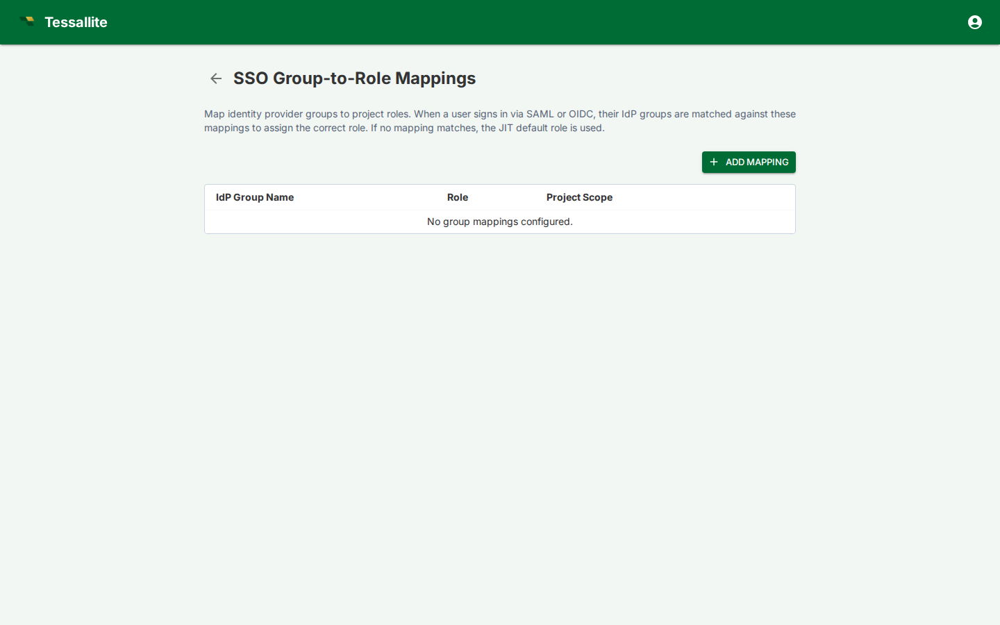

## What this covers

SSO group mappings translate identity-provider groups into Tessallite workspace and project roles. They are evaluated when a user signs in through SAML or OIDC, allowing access to follow the user's IdP group membership instead of being managed only by local Tessallite user records.

## What a mapping contains

| Field | Meaning |
|---|---|
| Provider group | Group name or claim value received from the identity provider. |
| Workspace | Tenant workspace where the mapping applies. |
| Project | Optional project scope. If omitted, the mapping applies at workspace level where supported. |
| Role | Tessallite role granted by the mapping, such as viewer, modeler, or admin. |
| Status | Whether the mapping is active. |

## How mappings are applied

On SSO login, Tessallite reads the configured group claim, finds matching mappings, and applies the corresponding roles. If a user is removed from an IdP group, the mapped access is removed on the next sign-in. Local emergency admin access should be kept separate so administrators are not locked out by an IdP outage.

## Good practice

Use narrow IdP groups that match business responsibilities. Avoid mapping broad groups such as "all employees" to modeler or admin roles. Review mappings alongside [Project Settings](project-settings.md), [Manage Users](manage-users.md), and [Audit Log](audit-log.md) when investigating access issues.

## Related

- [SSO Configuration](sso-configuration.md)
- [Manage Roles](manage-roles.md)
- [Model-Scoped RBAC](rbac-model-scoped.md)
- [Security Audit Trail](security-audit-trail.md)

---

← [SSO Configuration](sso-configuration.md) | [Home](../index.md) | [Webhooks →](webhooks.md)
