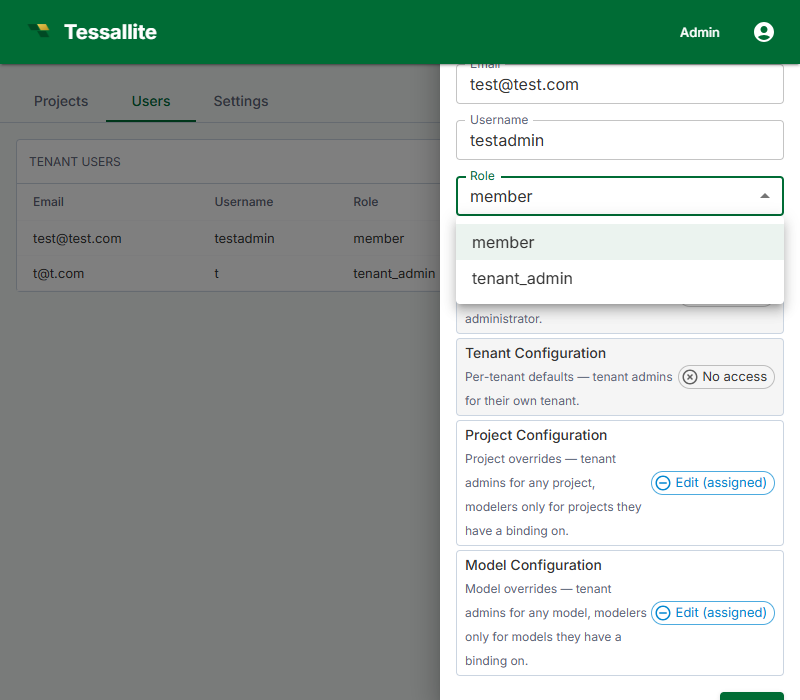

## What this covers

This article explains the four Tessallite roles, how to change a user's workspace role, the difference between workspace-level and project-level access, and how to assign project-level permissions.

---

## Role overview

| Role | Scope | Who assigns it | What they can do |
|------|-------|---------------|-----------------|
| System Admin | Installation-wide | Defined by environment variables at deployment; not assignable via UI. | Create workspaces, manage all workspace users, access the System Administration screen. |
| Tenant Admin | Workspace-wide | System Admin (initial); Tenant Admin (additional) | Invite and remove users, assign roles, configure workspace settings. |
| Modeller | Workspace-wide (with per-project access) | Tenant Admin | Create and edit models, define dimensions and measures, configure aggregates and schedules, view diagnostics. |
| Analyst / Viewer | Per project | Tenant Admin or Modeller (via project settings) | Connect BI tools via JDBC or XMLA, run queries, view query results. |

---

## Role capabilities reference

| Action | System Admin | Tenant Admin | Modeller | Analyst |
|--------|-------------|-------------|---------|---------|
| Create workspaces | Yes | No | No | No |
| Manage workspace users | No | Yes | No | No |
| Configure workspace settings | No | Yes | No | No |
| Create / edit models | No | No | Yes | No |
| Configure aggregates | No | No | Yes | No |
| Connect BI tools | No | No | Yes | Yes |
| Run queries | No | No | Yes | Yes |

---

## Changing a user's workspace role

1. In the workspace sidebar, click **Admin**.
2. Click the **Users** tab.
3. Click the user's name to open their detail panel.
4. In the **Role** dropdown, select the new role.
5. Click **Save**.

The change takes effect on the user's next sign-in. Existing sessions continue with the old role until the user signs out and signs back in.

---

## Workspace-level vs. project-level access

Tenant Admin and Modeller are workspace-wide roles. An Analyst role at the workspace level provides no project access by default — users must be explicitly added to each project.

---

## Assigning project-level access

1. Open the project in Model Builder.
2. Click **Settings** in the project toolbar.
3. Click the **Access** tab.
4. Click **Add User**, enter the user's email, and select their project-level permission: **Viewer** or **Modeller**.
5. Click **Save**.

A user's workspace role is the ceiling for their effective permissions. A Modeller cannot be granted Tenant Admin access at the project level. Change the workspace role first if a higher level is needed.

---

## Related

- [Manage Users](manage-users.md)
- [Workspace Settings](workspace-settings.md)
- [Roles and Permissions (concepts)](../concepts/roles-and-permissions.md)

---

← [Manage Users](manage-users.md) | [Home](../index.md) | [Workspace Settings →](workspace-settings.md)
