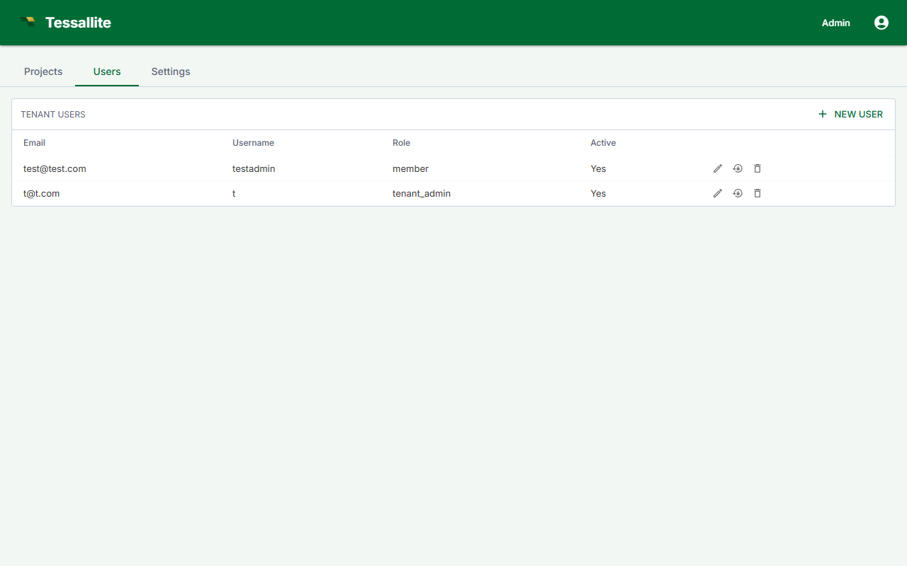

## What this covers

This article covers all user management tasks available to a Tenant Admin: viewing the user list, inviting new users, removing users, resetting passwords, and reading user details.

---

## Navigating to the user list

1. Sign in to your workspace.
2. In the workspace sidebar, click **Admin**.
3. Click the **Users** tab.

The Users tab displays all users in the workspace with their email address, role, last-active timestamp, and project memberships.

---

## Inviting a user

1. On the Users tab, click **Invite User**.
2. Enter the user's email address.
3. Select the role to assign: Tenant Admin, Modeller, or Analyst.
4. Click **Send Invitation**.

The user receives an email containing a one-time invitation link, valid for 48 hours. On first sign-in, the user sets their own password.

### If the invitation expires

Return to the Users tab. The invited user appears with status **Invitation expired**. Click **Resend** next to their row. A new invitation link is generated; the old link is invalidated.

---

## Removing a user

1. On the Users tab, find the user you want to remove.
2. Click **Remove** in that user's row.
3. Confirm the action in the dialog.

Removal takes effect immediately. All active sessions are invalidated. Historical activity (query logs, model edits) is retained.

A Tenant Admin cannot remove another Tenant Admin. Only the System Admin can remove or demote a Tenant Admin.

---

## Resetting a user's password

1. On the Users tab, click the user's name to open their detail view.
2. Click **Reset Password**.
3. Confirm in the dialog.

The user receives a password reset link valid for 24 hours. Their current password remains active until they complete the reset.

---

## Viewing user details

Clicking a user's name opens a detail panel showing:

- **Last active**: timestamp of the user's most recent authenticated request.
- **Assigned role**: the workspace-level role currently in effect.
- **Project memberships**: the projects the user can access and their role within each.

---

## Related

- [Manage Roles](manage-roles.md)
- [Create a Workspace](create-a-workspace.md)
- [Roles and Permissions (concepts)](../concepts/roles-and-permissions.md)

---

← [Create a Workspace](create-a-workspace.md) | [Home](../index.md) | [Manage Roles →](manage-roles.md)
