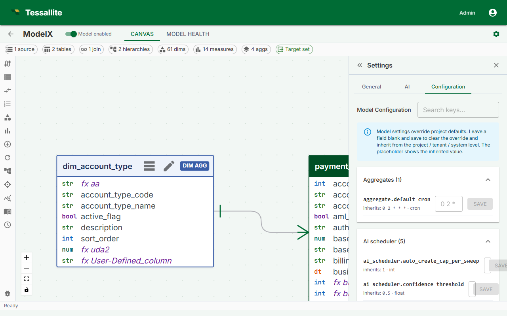

# Model Configuration

**Audience:** Tenant Admin / Modeler · **Updated:** 2026-04-18

## What this covers

The Configuration sub-tab inside the Model Builder Settings panel lets you override per-model knobs: the default refresh cron applied to new aggregates on this model, the AI scheduler's cron / lookback window / max creates per run / confidence threshold, and the optimizer's per-model aggregate cap.

## Where to find it

1. Open the Model Builder for the model you want to configure.
2. Click the **Settings** icon in the toolbelt (right side).
3. Switch to the **Configuration** sub-tab (third tab after General and AI).

The sub-tab is hidden when no model is open — model-level settings only make sense with a model in scope.

## Who can edit it

Tenant admins can edit any model in their workspace. Modelers can edit models they have a project- or model-level access binding for. The backend rejects writes from any other role, so the Save button has no effect for unauthorised users even if the panel is visible.

## How overrides work

Each row is an override. The placeholder shows the value currently inherited from the project level (which itself may inherit from tenant, system, and finally the registry default). Save a value to override; clear and save to remove the override and fall back upward.

Common reasons to override at the model level:

- A model with very large aggregates needs a less frequent refresh cron than the project default.
- A model with frequent miss patterns benefits from a different AI scheduler cadence or a lower confidence threshold.
- One particular model should run a higher per-model aggregate cap than the system default.

## Available keys

| Key | What it controls |
|---|---|
| `aggregate.default_cron` | Cron applied to a new aggregate on this model when no explicit schedule is provided. |
| `ai_scheduler.cron` | Cron at which the AI optimizer is invoked for this model. |
| `ai_scheduler.lookback_hours` | Hours of telemetry the optimizer considers when picking candidates. |
| `ai_scheduler.max_creates_per_run` | Maximum aggregates the optimizer is allowed to create per run. |
| `ai_scheduler.confidence_threshold` | Minimum confidence below which a recommendation is dropped. |
| `ai_scheduler.auto_create_cap_per_sweep` | Hard cap on aggregates auto-created per optimizer sweep for this model. |
| `optimizer.max_aggregates` | Per-model override of the platform-wide aggregate cap. |

## Inheritance preview

Each row's caption shows the inherited value, e.g. *inherits: `0 2 * * *`*. When you save a value, the row reads "overrides project value" and the new value is what the resolver returns for this model. Clearing the override returns the row to the inherited state immediately.

## Related

- [Project settings](project-settings.md)
- [Workspace settings (tenant level)](workspace-settings.md)
- [Manage aggregate schedules](../modelling/manage-aggregate-schedules.md)
- [Use the AI optimiser](../modelling/use-the-ai-optimiser.md)

---

[← Project Settings](project-settings.md) · [Home](../index.md) · [Architecture Overview →](../system-admin/architecture-overview.md)
