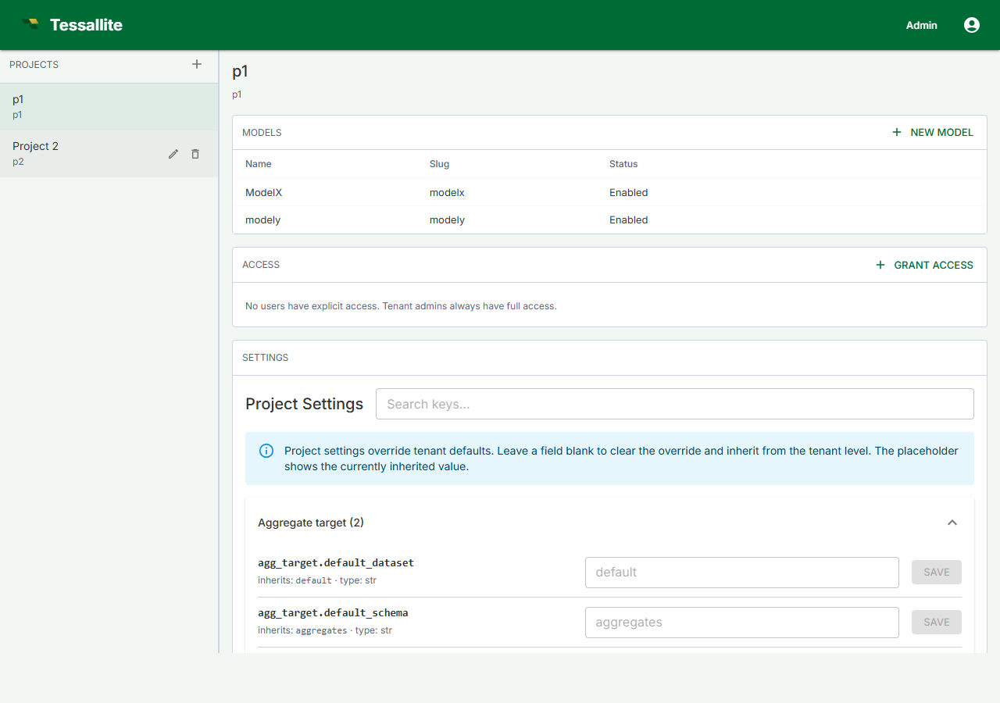

# Project Settings

**Audience:** Tenant Admin / Modeler · **Updated:** 2026-04-18

## What this covers

The Settings section on each Project page lets you override workspace-level defaults for a single project. Use it when one project needs a different source-DB fallback host, a different aggregate target schema, or a different default refresh cadence than the rest of the workspace.

## Who can edit it

Tenant admins can edit any project in their workspace. Modelers can edit projects they have an access binding for. Viewers cannot see the section.

## How overrides work

Every row on the Settings panel is a pure override. The placeholder shown in each input is the value that would be inherited from the tenant level. Save a new value to override; clear the field and save (or click **Clear**) to remove the override and fall back to the tenant default. The resolver walks **model → project → tenant → system → registry default** and returns the first non-null value, so a project override applies to every model in the project that does not itself override the same key.

## Editing a setting

1. Open **Admin → Projects** and select the project you want to configure.
2. Scroll past the Models and Access sections to the **Settings** section.
3. Find the key you want to override. The inherited value appears as the placeholder; the input is empty when the project has no override yet.
4. Type the new value and click **Save**. To remove an existing override, click **Clear** (only visible on overridden rows).

## What you can override at the project level

- **Source database fallbacks** — host, port, database name used when a connection's stored values are missing.
- **Aggregate target defaults** — schema or dataset where new aggregate tables are created for this project.
- **Default aggregate cron** — the cron string applied to a new aggregate when no explicit schedule is provided.

## Inheritance preview

Each row's caption shows what is currently inherited (e.g. *inherits: `localhost`*). When you save an override, the placeholder stays the same but the input now holds the override and the row is marked "overrides tenant value". When you clear it, the input goes blank and the row inherits again.

## Related

- [Workspace settings (tenant level)](workspace-settings.md)
- [Model configuration](model-configuration.md)
- [System Configuration](../system-admin/system-configuration.md)

---

[← Workspace Settings](workspace-settings.md) · [Home](../index.md) · [Model Configuration →](model-configuration.md)
