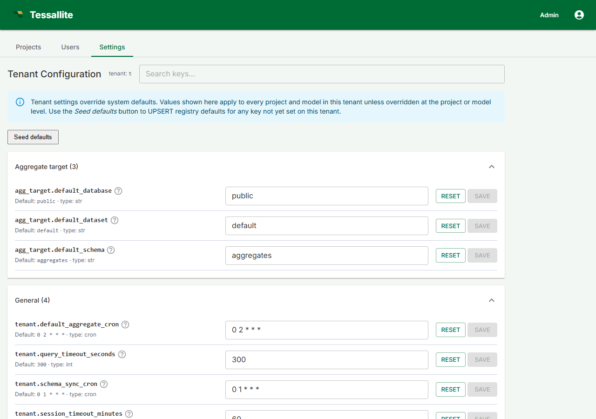

## What this covers

The Settings tab in the Admin panel controls workspace-level configuration: display name, aggregate scheduling defaults, query timeout, schema sync schedule, and session timeout. This article lists each setting, its default, and its effect. It also covers how to delete a workspace.

---

## Navigating to workspace settings

1. In the workspace sidebar, click **Admin**.
2. Click the **Settings** tab.

---

## Settings reference

| Setting | Description | Default | Notes |
|---------|-------------|---------|-------|
| Display name | The workspace label shown in the UI. | Set at creation | Can be changed at any time. Does not affect the slug or connection strings. |
| Default aggregate schedule | Cron expression applied automatically to new aggregates unless overridden in the aggregate Drawer. | `0 2 * * *` | Affects only aggregates created after the change. Existing aggregates keep their current schedule. |
| Query timeout | Seconds before a raw-source query is cancelled and an error is returned to the client. | 300 | Applies to new query connections. In-flight queries are not affected until re-submitted. |
| Schema sync schedule | Cron for automatic schema sync, which re-reads source table column definitions and flags drift in the Health tab. | `0 1 * * *` | Schema sync only detects drift; it does not modify the model automatically. |
| Session timeout | Minutes of inactivity before a user is signed out automatically. | 60 | Takes effect for new sessions after saving. Existing sessions use the value in effect when they authenticated. |

---

## Saving settings

1. Make the required changes on the Settings tab.
2. Click **Save Settings**.

Changes apply immediately for new connections and new sessions. Active sessions continue under the settings in effect when they authenticated.

---

## Deleting the workspace

The Settings tab includes a **Danger Zone** section at the bottom. Workspace deletion is accessed from there.

**Workspace deletion is irreversible.** It permanently removes all projects, models, aggregate metadata, and user records. Source data in connected databases is not affected.

1. In the Danger Zone section, click **Delete Workspace**.
2. In the confirmation dialog, type the workspace slug exactly as shown.
3. Click **Confirm Delete**.

The workspace is removed immediately. All users lose access.

---

## Tenant-level defaults (extended)

The Settings tab also exposes tenant-level defaults for resources that span every project: source-database fallbacks, aggregate target locations, and Spark Thrift connection defaults. Each row shows its current value (which falls back to the platform default if you never set it) and lets you save a tenant-wide override.

| Section | Settings | What it does |
|---|---|---|
| Source database | `source_db.fallback_host`, `source_db.fallback_port`, `source_db.fallback_database` | Used by the model service and query router when a connection record omits the host / port / database name. |
| Aggregate target | `agg_target.default_schema`, `agg_target.default_dataset`, `agg_target.default_database` | Default schema (PostgreSQL), dataset (BigQuery), and database (Spark) where new aggregate tables are created when a target does not specify one. |
| Spark Thrift | `spark.thrift_port`, `spark.thrift_database`, `spark.thrift_auth_mode` | Defaults applied when a Spark connection's stored credentials omit these fields. |

These tenant-level rows can be further overridden at the project or model level — see [Project settings](project-settings.md) and [Model configuration](model-configuration.md). The full per-key catalog lives in `docs/guides/guides_configuration-reference.md`.

## Seed defaults button

The Settings tab includes a **Seed defaults** button that UPSERTs registry defaults for every tenant-level key not yet set on this tenant. Existing rows are left untouched. Use it after upgrading to populate any new keys added to the registry by a release.

---

## Related

- [Project settings](project-settings.md)
- [Model configuration](model-configuration.md)
- [System Configuration](../system-admin/system-configuration.md)
- [Manage Roles](manage-roles.md)
- [Create a Workspace](create-a-workspace.md)
- [Workspaces and Tenants (concepts)](../concepts/workspaces-and-tenants.md)

---

← [Manage Roles](manage-roles.md) | [Home](../index.md) | [Project Settings →](project-settings.md)
