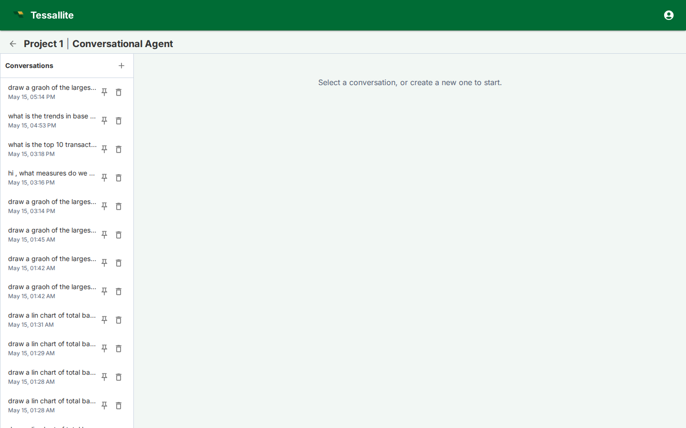

## What this covers

Agent Chat lets a user ask questions about project data in natural language. It uses the project agent configuration, the approved model context, glossary terms, optional project-level personas, and judge rubrics to plan queries and explain results.

## How scope is chosen

The agent works at project level. A project can contain multiple models, but only models enabled for the agent are included in context. If a project-level persona is selected, the agent sees only the models, measures, and dimensions allowed by that persona. Model-level row security and persona rules still apply when a query is executed.

## Conversation controls

- **New conversation** starts a fresh thread with its own memory window.
- **Conversation list** lets users return to previous work.
- **Persona or model controls** narrow the semantic context when configured.
- **Trace and citations** show which model objects, glossary terms, and query steps influenced the answer.
- **Judge verdicts** flag whether the answer passed the configured quality rubric.

## Writing effective questions

Ask in business terms first: "What changed in April margin for EMEA?" is better than starting with table names. If the answer is ambiguous, add grain and filters: region, date range, merchant category, fiscal period, or persona. The agent can plan multi-step answers, but it is still governed by the semantic model; undefined measures need to be created in Model Builder first.

## When to switch to Model Builder

Use Agent Chat for exploration and explanation. Switch to Model Builder when the answer reveals missing semantics: a measure needs a clearer definition, a dimension alias is confusing, a glossary term is missing, an aggregate is needed, or a row-security/persona rule blocks the intended audience.

## Related

- [Configure your project agent](configure-agent.md)
- [Project-level personas](project-personas.md)
- [Agent log screen](agent-log-screen.md)
- [Write a judge rubric](write-a-judge-rubric.md)

---

← [Export and Import a Project](../modelling/export-and-import-a-project.md) | [Home](../index.md) | [Configure your project agent →](configure-agent.md)
