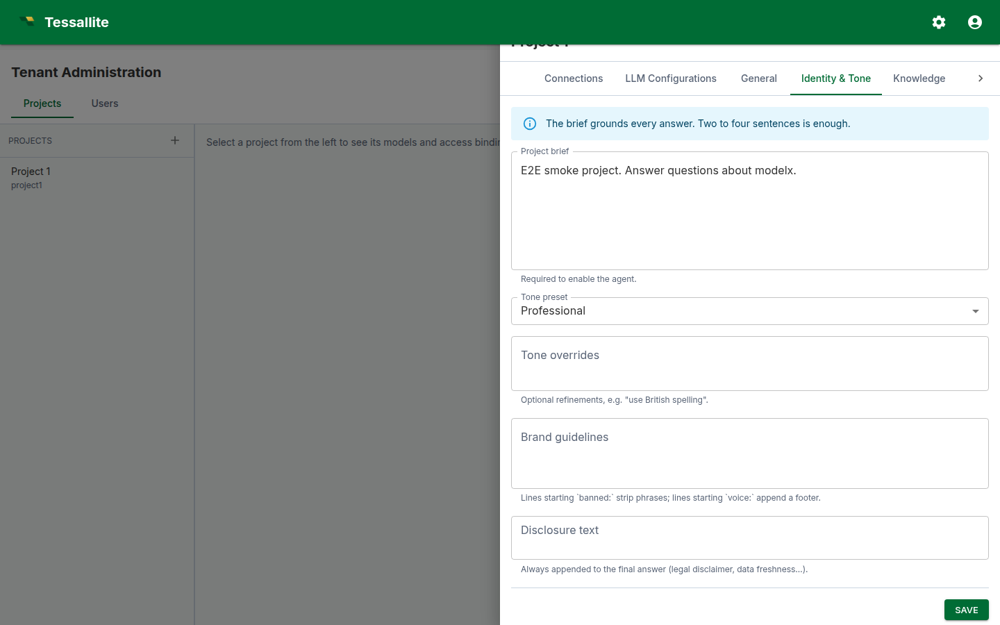
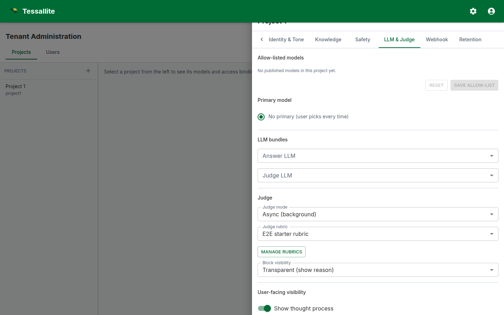

## What this covers

Every Tessallite project can carry an embedded conversational agent. The agent answers questions in natural language by translating them into queries against the project's published models. This article explains what the agent is, when it is the right tool, and how to configure it without weakening the project's safety, brand, and observability posture.

[Home](../index.md) — Next: [Author the glossary alias map](glossary-alias-map.md)

---

## What the agent is, and what it is not

The agent is a thin orchestration layer sitting on top of two LLM calls and the existing semantic engine. The first LLM (the *answer model*) reads the project policy plus the user's question, then emits a structured tool call: either a query plan, a clarification, or a refusal. The semantic engine validates and executes the query plan against the allow-listed models. A narration step turns the rows into prose. A second LLM (the *judge*) scores the final answer against a rubric.

The agent is **not** a free-form chatbot. It cannot invent measures, query unpublished models, return rows that violate row-level security, or act outside the project policy. Every answer is grounded in a deterministic query — the LLM chooses *what* to ask, the engine controls *how* the data is returned.

---

## When to enable the agent — and when not to

Enable it when:

- The project's models are well-modelled, with crisp measure and dimension names, and at least one published target so the engine can route queries.
- A defined audience (tenant users, embedded API callers, or both) needs natural-language access without writing JDBC clients.
- You can dedicate a few hours to writing the project brief, the glossary, and the judge rubric. The agent's quality is bounded by these three artefacts.

Hold off when:

- The model is mid-migration. The agent will hallucinate plausible answers from a half-published catalogue and erode user trust.
- You cannot articulate which questions are in-scope. An agent without a sharp scope refuses too often or answers too widely.
- You want a generative writing assistant. That is not what this is — the agent only narrates verified data.

---

## The configuration surface

Configuration lives in the **project drawer**, opened from *Tenant Administration → Projects* by clicking the gear icon on the project row. The drawer carries nine tabs; seven of them drive the agent. Each agent tab carries one **Save** button at the bottom that persists the entire agent record in a single call to `PUT /api/v1/projects/{id}/agent/config`.

### General

- **Enable conversational agent.** Master switch. Off by default. The other tabs surface their fields whether the switch is on or off, but the agent is inert until this is enabled. Enabling requires a non-empty project brief, a non-empty safety policy, at least one allow-listed model, and a selected judge rubric — the API rejects the save otherwise.
- **Display name.** Shown above the chat panel. Use the brand the user expects ("Acme Insights"), not the project slug.
- **Agent role.** Free-text label. Defaults to "data analyst". Sets the LLM's stance — "analyst", "controller", "merchandiser" all produce different reading styles.
- **Default locale.** BCP-47 tag (e.g. `en-GB`) used in the answer narration.

### Identity & Tone

- **Project brief.** A short paragraph the answer LLM sees first. Describe the business: domain, key measures, who the audience is, the time grain. Two to four sentences is enough; longer briefs crowd out the per-model context.
- **Tone preset.** *Professional* or *Friendly*. Influences phrasing.
- **Tone overrides.** Small additions to the preset, e.g. "use British spelling, never use exclamation marks".
- **Brand guidelines.** Two structured directives are honoured by the output guardrail: lines beginning `banned:` strip the matching phrase from the final answer; lines beginning `voice:` append a one-line voice note as a footer. Other lines are read by the LLM as soft guidance.
- **Disclosure text.** Always appended to the final answer. Use this for legal disclaimers ("Figures are unaudited" / "Provisional data, subject to revision").

### Knowledge

- **Manage recipes.** Opens the recipe editor in a dialog. Recipes are reusable cross-model query plans — see [Cross-model calculation recipes](cross-model-recipes.md).
- **Per-model context.** For each allow-listed model, an *Edit context* button opens the per-model context dialog (model overview, analytical capabilities, abbreviation rules, example questions, derived aliases).

### Safety

- **Safety policy.** One forbidden topic per line. Each line is matched case-insensitively as a substring against incoming user messages. Any match returns a templated refusal before any LLM call. Use this for genuinely off-limits domains ("salaries", "individual customer PII"), not for general taste preferences — overly broad lines block legitimate questions.
- **Content rules.** Free text, surfaced to the LLM as guidance. Use for nuanced rules the substring matcher cannot enforce ("when reporting revenue, always show currency").

### LLM & Judge

- **Allow-list checkboxes.** Tick each model the agent may query. The list is bound to the project's published models. The first ticked model becomes the default primary; you can change the primary with the radio button.
- **Answer LLM.** Picker bound to the project's LLM Configurations tab. Pick the bundle that powers the answer model.
- **Judge LLM.** Picker bound to the same list. Use a smaller / faster bundle for the judge if you run sync mode.
- **Judge mode.** *Async* runs the judge after the answer is returned (faster perceived latency, the verdict lands later in the trace drawer). *Sync* blocks the answer until the verdict is available — required if you intend to gate on the verdict.
- **Judge rubric.** A reference to a rubric defined in this project. The *Manage rubrics* button opens the rubric editor in a dialog. See [Write a judge rubric](write-a-judge-rubric.md).
- **Judge block visibility.** *Transparent* shows the verdict and reasoning to the user when the judge blocks an answer; *opaque* shows a generic "withheld for review" message. Pick transparent for internal users where the rubric is well-tuned; opaque for external users.
- **Visibility toggles.** Four switches — *show thought process*, *show semantic query*, *show physical query*, *enable feedback* — control how much of the trace the user can see in the answer card and the trace drawer. The judge verdict and the citations are always shown.

### Webhook

- **Webhook URL.** Optional outbound URL fired on each agent turn. Leave blank to disable. The signing secret is rotated separately from the project agent record — use the *Rotate webhook secret* action on the agent service if you need to change it.

### Retention

- **Conversation retention (days).** How long agent turns and traces are kept before a scheduled job deletes them. Tighten to meet compliance windows; widen for long-form audit. Default is 30 days.

### Models and routing

The allow-list and per-model context live on the project drawer. Set the allow-list on the *LLM & Judge* tab (checkboxes for each published model) and edit per-model context from the *Knowledge* tab (*Edit context* button next to each allow-listed model).

---

## A worked example: enabling the agent on the demo project

This walkthrough assumes the bundled `acme-demo` tenant. The exact menu wording matches the live UI.

1. Sign in as an admin and open *Tenant Administration → Projects*.
2. On the `project1` row, click the gear icon to open the project drawer.
3. *LLM Configurations* tab: confirm there is at least one bundle (e.g. "OpenAI · gpt-4o"). Add one if the list is empty.
4. *LLM & Judge* tab: tick the checkboxes for `modelx` and `modely` in the allow-list. Pick the OpenAI bundle as the Answer LLM and the Judge LLM. Pick the bundled "Acme finance rubric"; leave mode on Async; visibility on Transparent.
5. *Identity & Tone* tab: set the display name to "Acme Insights"; paste a one-paragraph project brief describing the e-commerce domain. In *Brand guidelines*, add `banned: just kidding` (so the agent does not slip into casual asides) and `voice: Acme Insights — figures live as of last refresh.`
6. *Safety* tab: add at least one line to the safety policy (e.g. "individual employee salaries"). The API requires a non-empty safety policy to enable.
7. *General* tab: switch *Enable conversational agent* on.
8. Click **Save**. Navigate to the Explorer and open the *Chat* button. Send "What were sales last month?". You should see a streamed answer with the route badge, citations, and the judge verdict.

If the judge verdict comes back "fail", read the reasoning column on the *Metrics → Recent calibration* table and refine the rubric. See [Write a judge rubric](write-a-judge-rubric.md) for how to iterate.

---

## Common pitfalls

- **Empty allow-list.** The agent will refuse every question with "no allow-listed models". Tick at least one model.
- **Project brief stuffed with model details.** The brief is read on every turn. Keep it short; put per-model context in the glossary alias map. See [Author the glossary alias map](glossary-alias-map.md).
- **Safety-policy lines that match common words.** "Sales" as a forbidden topic blocks every legitimate sales question. Use specific multi-word phrases.
- **Sync judge with a slow LLM.** Sync mode adds the judge latency to the user-visible response time. If you must run sync, pick a fast small judge model (e.g., a 7B class model on the same provider).
- **Brand guidelines treated as prose.** The `banned:` and `voice:` keywords are *significant* — only those are mechanically enforced. Other lines are advisory.

---

## Operating the agent

Once enabled, the agent earns its keep through three feedback loops:

- **Per-turn user feedback.** Up/down votes land on the turn record. Track the up/down ratio in *Metrics*.
- **Judge calibration.** The judge runs on every OK turn and produces a verdict. Review the *Recent calibration* table weekly: if pass-rate is below 70 %, the rubric or the model context needs work.
- **Eval runs.** *Metrics → Run eval* fires the agent against every example question registered in the per-model contexts. Use this after every meaningful change to the brief, the glossary, or the rubric to catch regressions before users see them.

---

## Related reading

- [Author the glossary alias map](glossary-alias-map.md)
- [Write a judge rubric](write-a-judge-rubric.md)
- [Cross-model calculation recipes](cross-model-recipes.md)

← [Export and Import a Project](../modelling/export-and-import-a-project.md) | [Home](../index.md) | [Author the glossary alias map →](glossary-alias-map.md)
