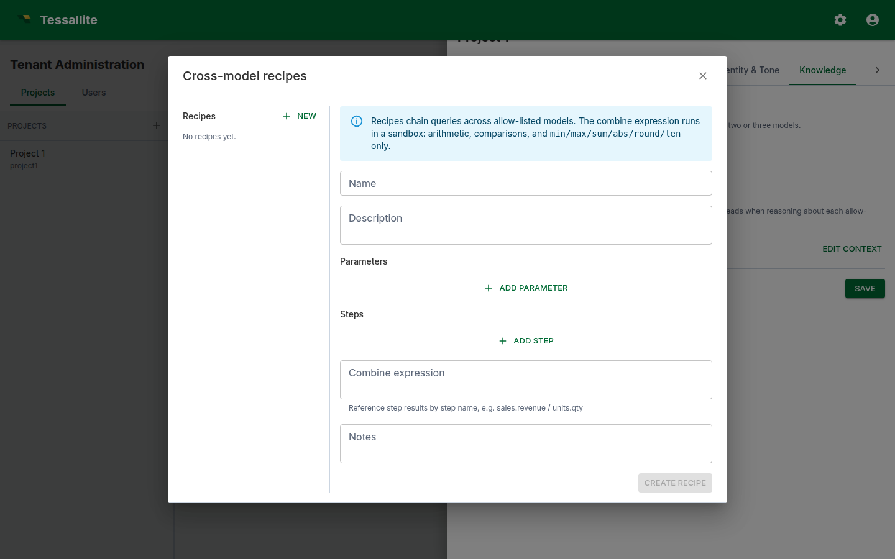

## What this covers

A *recipe* is a multi-step calculation the agent can run against more than one model in a single turn. Recipes solve the class of analytical questions whose answer requires combining numbers from different fact tables — questions a single semantic query cannot answer. This article explains when a recipe is the right tool, how the recipe spec is shaped, how the engine executes it, and how to author recipes that the agent picks up reliably.

[Previous: Write a judge rubric](write-a-judge-rubric.md) — [Home](../index.md) — Next: [Agent log screen](agent-log-screen.md)

---

## Why recipes exist

The semantic engine answers single-model questions: one fact table, one set of measures and dimensions, one time window. That covers most questions, but not all. Some questions are inherently multi-model:

- **A ratio across facts.** "What was inventory turnover last quarter?" requires `cogs` from the orders fact and `avg_inventory` from the stock fact.
- **A funnel across facts.** "How many of last week's signups placed an order in the same week?" requires the signups fact and the orders fact.
- **A re-baselining.** "Express last month's revenue as a percentage of the trailing twelve months" requires two queries against the same model with different time windows.

The agent could in principle ask each query and stitch the result together in narration, but in practice that path is unreliable: the LLM forgets which numbers it has, the citations get muddled, and the judge has no clean structure to evaluate. A recipe gives the engine a deterministic plan to execute and the LLM a single result to narrate.

---

## What a recipe is

A recipe is a small JSON document a modeller authors. It has:

- **A name and description.** Human-readable. The description is what the answer LLM reads when deciding whether to call the recipe.
- **Parameters.** Named placeholders the user's question fills in (typically a time window, a region, a category).
- **Steps.** An ordered list of single-model queries. Each step pins to a model in the project's allow-list, names its measures, dimensions, filters, and limit, and is given a step name.
- **A combine expression.** A short formula that combines the step results into a single value or table. Common combines: `step_a / step_b`, `step_a - step_b`, or no combine when the recipe simply runs the queries side-by-side.
- **Notes.** Free text. Read by the judge as a hint about what good output looks like.

Recipes live under *Tenant Administration → Projects → \<project> → Conversational agent → Recipes*. The same surface is exposed via the recipes API.



---

## When to write a recipe

Write a recipe when:

- The answer requires data from two or more facts that share at least one dimension.
- The combine is stable (a fixed formula or a fixed ordering) and worth registering as a first-class capability.
- Users are asking the question often enough that they would benefit from a single-shot answer instead of stringing multiple turns together.

Do **not** write a recipe when:

- A single-model query answers the question. The semantic engine is faster, cheaper, and better-tested.
- The combine logic is bespoke per question. Free-form combines belong in narration, not in a recipe.
- The dimensions diverge across facts. If two facts grain at incompatible levels (e.g., daily orders vs. monthly inventory snapshots), the combine produces a misleading number. Reshape the underlying models first.

---

## Anatomy of a recipe

A worked example. The recipe answers "what is inventory turnover for [time window]" by dividing COGS by average inventory.

```json
{
  "name": "Inventory turnover",
  "description": "Inventory turnover is COGS divided by average inventory over the same window. Call this when the user asks about stock turn or how fast inventory moves.",
  "parameters": [
    {
      "name": "window",
      "description": "The time window the question is about.",
      "resolves_to_glossary_entity": true
    }
  ],
  "steps": [
    {
      "name": "cogs",
      "model_id": "<orders model id>",
      "measures": ["cogs"],
      "dimensions": [],
      "filters": [{"name": "order_date", "op": "in_window", "value": "{window}"}],
      "limit": 1
    },
    {
      "name": "avg_inventory",
      "model_id": "<stock model id>",
      "measures": ["avg_inventory"],
      "dimensions": [],
      "filters": [{"name": "snapshot_date", "op": "in_window", "value": "{window}"}],
      "limit": 1
    }
  ],
  "combine": "cogs / avg_inventory",
  "notes": "Express the answer as a unitless ratio with two decimal places. Mention the window."
}
```

The engine resolves `{window}` from the user's question via the glossary, runs the two queries against their respective models, evaluates the combine, and returns the value plus the two underlying step results. The narration LLM turns this into prose. The judge sees the combine and the step rows and verifies the answer against them.

---

## How the LLM picks a recipe

The answer LLM is shown the description and parameters of every recipe in the project. When the user's question matches a recipe's description well, the LLM emits a `run_recipe` tool call instead of a `query` tool call. Two practical implications:

- **Descriptions matter.** The LLM picks recipes by description match. Write descriptions that name the metric the recipe computes ("inventory turnover", "year-on-year change", "conversion funnel") in the same words your users use.
- **Avoid overlapping recipes.** If two recipes have nearly identical descriptions, the LLM picks one essentially at random. Merge them or differentiate the descriptions sharply.

---

## Common pitfalls

- **Mismatched grains.** Daily and monthly facts combined without re-grain produce numbers that look right but are off by an order of magnitude. Filter to a common grain in each step's filters before combining.
- **Hard-coded time windows.** Embedding "last 30 days" in the steps locks the recipe to one window. Use a parameter instead.
- **Combines that hide divisions by zero.** If the denominator step can return zero, add a note in the recipe so the narration explicitly handles it.
- **Recipes that wrap a single query.** If the recipe has one step and no combine, it is just a query. Use a query.
- **Forgetting to allow-list both models.** A recipe that references a model not on the agent's allow-list refuses at execution time. Allow-list every model named by every recipe.

---

## Operating recipes

After authoring a recipe, exercise it:

1. Open the *Chat* tab and ask the question the recipe is meant to answer. Check that the trace drawer shows a `run_recipe` plan, that each step ran, and that the combine value matches a hand calculation.
2. Watch the judge verdict on the *Metrics → Recent calibration* table. If the judge consistently warns or fails on recipe answers, the rubric needs a section that judges combine values explicitly.
3. Add the question to the per-model glossary's *Example questions* so the eval runner exercises the recipe path on every run.

---

## Related reading

- [Configure your project agent](configure-agent.md)
- [Author the glossary alias map](glossary-alias-map.md)
- [Write a judge rubric](write-a-judge-rubric.md)

[Previous: Write a judge rubric](write-a-judge-rubric.md) — [Home](../index.md) — Next: [Agent log screen](agent-log-screen.md)
