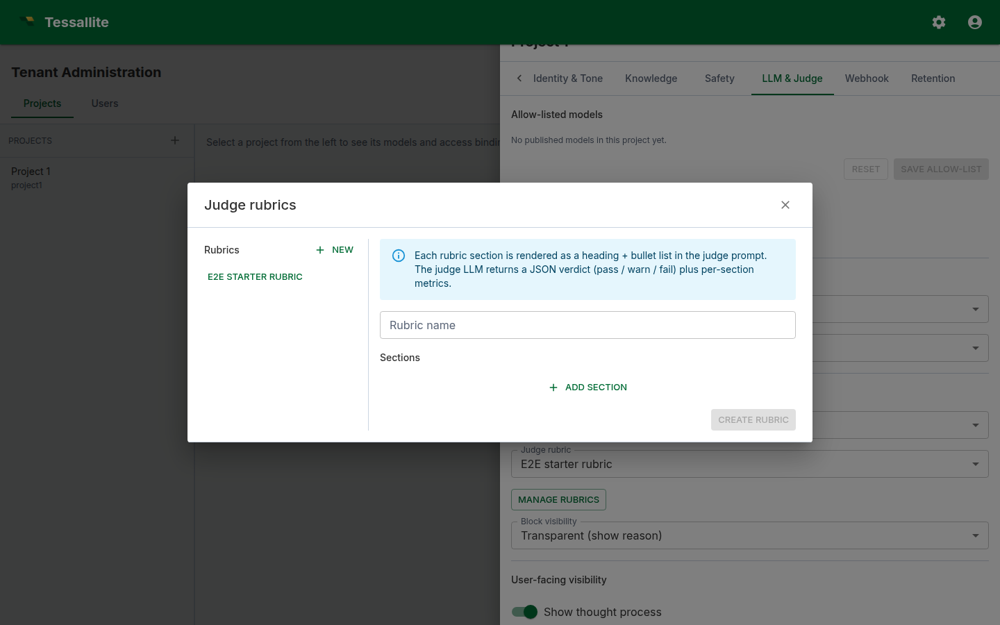

## What this covers

The judge is a second LLM that scores every answer the agent produces against a rubric. This article explains why the judge exists, how a rubric is shaped, how to write sections that the judge can act on consistently, and how to calibrate the rubric using the metrics the platform already records.

[Previous: Author the glossary alias map](glossary-alias-map.md) — [Home](../index.md) — Next: [Cross-model calculation recipes](cross-model-recipes.md)

---

## Why a judge

A grounded LLM still drifts. It can pick the wrong measure, misread a clarifying question as a refusal, or narrate a number with a confident phrasing that the data does not support. The judge runs after the answer has been formed and either signs it off (*pass*), flags a minor gap (*warn*), or blocks it (*fail*). In synchronous mode the user sees the verdict immediately; in asynchronous mode the verdict appears on the trace drawer once it lands.

Two products fall out of running a judge:

- **A real-time guardrail.** A `fail` verdict in synchronous mode replaces the user-visible answer with a block message before it leaves the server.
- **A continuously updating quality signal.** Pass-rate, warn-rate, and per-section metrics are visible in *Metrics → Recent calibration*. A drop in pass-rate is a leading indicator that the model context, the safety policy, or the answer LLM has regressed.

---

## What a rubric is

A rubric is a JSON document with a name and a list of *sections*. Each section is a focused criterion the judge applies to the answer. The agent service ships with a default rubric so projects work out-of-the-box; you author a tenant-specific rubric when the defaults do not match your domain.



Each section has three optional fields:

- **title.** Free text. Used as the metric key in the verdict's `metrics` map.
- **body.** A paragraph the judge reads as guidance.
- **bullets.** A short list of pass/fail tests the judge can apply mechanically.

A good section names one concern. A rubric whose sections each cover six things produces noisy verdicts; a rubric whose sections each cover one produces verdicts you can act on.

---

## What makes a section easy to judge

LLMs evaluate answers more consistently when the criterion is framed as a small number of binary tests. Three patterns work well:

### 1. The "must contain" pattern

> **Title:** Currency present
> **Body:** Every numeric answer that quotes revenue must include the currency symbol or ISO code.
> **Bullets:**
>  - The answer mentions a numeric value paired with the currency.
>  - If no currency is named, the section fails.

This sort of test is unambiguous: the judge either spots the currency or does not.

### 2. The "must not contain" pattern

> **Title:** No personal speculation
> **Body:** The answer must report what the data shows, not the assistant's opinion about why.
> **Bullets:**
>  - Phrases like "I think", "this is probably", "perhaps" must not appear.
>  - Statements of cause that are not in the data fail this section.

### 3. The "must justify" pattern

> **Title:** Time window stated
> **Body:** Every aggregated number must be paired with the time window it was calculated over.
> **Bullets:**
>  - The answer names a window (e.g. "last 30 days", "Q3 2025").
>  - If a number is given without a window, the section fails.

These three patterns cover most domains. Avoid sections that ask the judge to evaluate tone, novelty, or insight — they produce verdicts that drift across runs.

---

## How the judge maps a rubric to a verdict

The judge LLM is told to read the answer plus the rubric and return one JSON object:

```json
{
  "verdict": "pass" | "warn" | "fail",
  "reasoning": "<one short paragraph>",
  "metrics": { "<section title>": <0..1 score>, ... }
}
```

The verdict aggregates across sections: *pass* means every section is satisfied, *warn* means one section has a minor gap, *fail* means a section is materially violated. The reasoning paragraph explains the verdict in human terms — it is what users see when *Judge block visibility* is set to transparent.

The `metrics` map is a per-section score. *Metrics → Recent calibration* charts these so you can see which section is failing most often.

---

## A worked example: a rubric for an e-commerce dashboard

Assume the project answers questions about an Acme retail data model. A working rubric has four sections.

1. **Currency present.** Pass when every numeric answer carries a currency.
2. **Time window stated.** Pass when every aggregated number names a window.
3. **No personal speculation.** Pass when no opinion-words ("I think", "probably") appear.
4. **Faithful to data.** Pass when the numeric values quoted match the rows shown in the citations.

Each section gets a `title`, a one-sentence `body`, and three to five binary `bullets`. The whole rubric is fewer than 600 tokens, which keeps the judge call cheap and fast.

---

## Calibrating the rubric

Calibration is the process of tightening sections until the verdicts match what an admin would say if they reviewed each answer by hand. The platform makes this concrete:

- Open *Project Agent → Metrics*. The *Recent calibration* table lists the most recent judged turns with verdict, reasoning, and the original answer text.
- For each row, ask: would I have made the same call as the judge? If yes, the section is calibrated. If no, look at the reasoning column — it usually identifies which section was misapplied.
- Edit the rubric. Tighten the body, add a bullet that names the missed case, or split an over-broad section into two.
- Re-run *Run eval* (also under *Metrics*) — that re-runs the agent against every example question registered in the per-model glossaries and gives you a regression view.

In practice, three rounds of calibration are usually enough to get pass-rate above 80 % on a well-modelled project. After that, gains come from improving the project brief and the per-model glossary, not from more rubric edits.

---

## Choosing async vs sync mode

*Async mode* is the default. The answer streams to the user; the judge runs in the background; the verdict appears later in the trace drawer and on the dashboard. User-visible latency is unchanged. Use this for internal tooling where you want the quality signal but the user is trusted.

*Sync mode* runs the judge before the answer is delivered. If the verdict is *fail* and *Judge block visibility* is set, the user sees a block message instead of the answer. Latency goes up by the judge call's wall time. Use this for external-facing surfaces or for regulated domains where an unreviewed answer cannot leave the service.

Pick the cheapest, fastest LLM you can stomach for the judge — judging is a constrained task, and a 7B-class model is usually adequate.

---

## Common pitfalls

- **Sections that overlap.** Two sections that test the same thing produce double-counted verdicts. Each section should be one concern.
- **Vague bullets.** "The answer should be useful." This is unjudgeable. Replace with binary tests.
- **Long bodies, no bullets.** A paragraph of guidance without bullets is hard to score consistently. The judge over-weights the closing sentence.
- **Sync mode with a slow judge model.** User latency suffers and the judge timeout will swallow some calls. Use a fast model or stay async.
- **Skipping calibration.** A rubric that has never been calibrated fails honest answers and passes wrong ones. Reserve an admin half-hour each week to walk *Recent calibration*.

---

## Related reading

- [Configure your project agent](configure-agent.md)
- [Author the glossary alias map](glossary-alias-map.md)
- [Cross-model calculation recipes](cross-model-recipes.md)

[Previous: Author the glossary alias map](glossary-alias-map.md) — [Home](../index.md) — Next: [Cross-model calculation recipes](cross-model-recipes.md)
