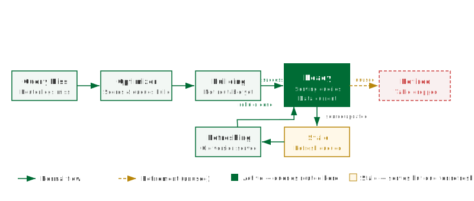

## What this covers

This article explains what aggregate tables are, how they are created and maintained, when the Query Router uses them, and how the Optimizer and Scheduler manage their lifecycle.

---

## What an aggregate is

An aggregate is a pre-computed summary table stored in a target schema. Where the fact table might contain hundreds of millions of individual transaction rows, an aggregate compresses that data into thousands of summary rows — one per unique combination of grouped dimensions. A query that previously required a full scan of the fact table can instead read a small number of aggregate rows.

Aggregates are physical tables, not views. They exist in the target schema until the Optimizer retires them. Tessallite manages their creation, refresh, and deletion through the Scheduler and Optimizer services.

---

## Grain and measures

Each aggregate is defined by two things:

- **Grain** — the set of dimensions at which the data was grouped. Example: {Region, Product Category, Month}.
- **Measures** — the aggregated values stored at that grain. Example: SUM(order_total), COUNT(order_id).

The aggregate table has one column per grain dimension and one column per measure. For the example above, its schema would be: `region`, `product_category`, `month`, `sum_order_total`, `count_order_id`.

---

## The aggregate lifecycle

Aggregates move through a defined set of states from creation to retirement:

1. **Miss detection** — the Query Router logs each query that cannot be served by an existing aggregate. These misses are the raw input for the Optimizer.
2. **Optimizer scoring** — the Optimizer periodically reviews the miss log and scores candidate aggregates by estimated query acceleration gain versus storage cost. High-scoring candidates are submitted to the Scheduler as build jobs.
3. **Build** — the Scheduler executes a `CREATE TABLE AS SELECT ... GROUP BY ...` against the source. The aggregate is in the **Building** state.
4. **Ready** — the build completes successfully. The aggregate is registered with the Query Router.
5. **Stale** — source data has changed. The Scheduler queues a refresh.
6. **Refreshing** — the Scheduler is rebuilding the aggregate. Queries continue to be routed to the previous version during this window.
7. **Retired** — the Optimizer determined the aggregate has not been used within the configured usage window. The Scheduler drops the table.

| State | Queries routed to it | Description |
|---|---|---|
| Building | No | Initial build in progress. Not yet registered with the router. |
| Ready | Yes | Build complete and data is current. |
| Stale | Yes (by default) | Source data has changed. Refresh is queued. |
| Refreshing | Yes — previous version | Refresh build is running. Previous version serves queries. |
| Retired | No | Optimizer determined the aggregate is unused. Table has been dropped. |

---

## Manual vs automated aggregates

**Manual aggregates** are defined in the Model Builder. You select the grain dimensions and the measures, then save. The Scheduler picks up the definition and builds the table on its next run. Manual aggregates give you precise control and are appropriate for known high-frequency query patterns.

**Automated aggregates** are created by the Optimizer. You enable the AI Optimizer from the Model Builder and configure thresholds for miss frequency and storage budget. The Optimizer monitors query misses and creates, adjusts, and retires aggregates without manual intervention.

Manual and automated aggregates coexist in the same model. The Optimizer will not create a duplicate of a manually defined aggregate, but it may create additional aggregates at different grains.

---

## Refresh policy

An aggregate becomes stale when data in its source tables changes. The Scheduler detects staleness by comparing the source table's last-modified timestamp against the aggregate's last-build timestamp. You configure the refresh schedule per model: either on a fixed interval (e.g., every hour) or triggered after a source ETL completes via the Scheduler API.

If an aggregate has not been refreshed within its expected window, the Health tab raises an "Aggregate refresh overdue" warning. Check the Scheduler job log for build errors.

---

## Related

- [Dimensions and measures](dimensions-and-measures.md)
- [Query routing](query-routing.md)
- [Configure aggregates](../modelling/configure-aggregates.md)
- [Run a refresh](../modelling/run-a-refresh.md)
- [Use the AI Optimizer](../modelling/use-the-ai-optimiser.md)

---

← [Dimensions and Measures](dimensions-and-measures.md) | [Home](../index.md) | [Query Routing →](query-routing.md)
