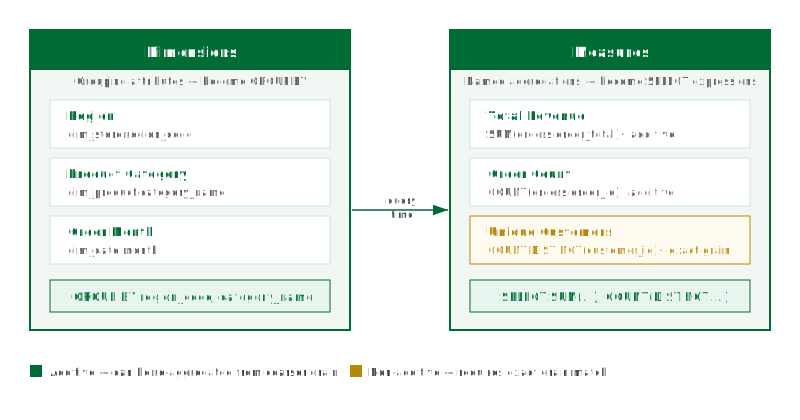

## What this covers

This article explains what dimensions and measures are, how they map to source columns, what role they play at query time, and the key distinction between additive and non-additive measures.

---

## Dimensions

A dimension is a named grouping attribute. It is defined by pointing to a column in one of the model's source tables and giving it a logical name that BI tools and users will see. For example, a dimension called **Region** might map to `dim_store.region_code`, and **Product Category** might map to `dim_product.category_name`.

At query time, dimensions translate to `GROUP BY` clauses. When a BI tool issues a query grouped by Region, Tessallite maps that to `GROUP BY dim_store.region_code`.

Dimensions also define the **grain** of an aggregate. The grain is the set of dimensions at which the aggregate was pre-computed. A query can only be served by an aggregate if the aggregate grain is a superset of the dimensions requested by the query.

---

## Measures

A measure is a named aggregation. It is defined by selecting an aggregation function and a source column, then giving the result a logical name. For example, **Total Revenue** might be `SUM(orders.order_total)`, and **Order Count** might be `COUNT(orders.order_id)`.

At query time, measures translate to aggregate expressions in the `SELECT` list. Every measure in a model must be explicitly named — anonymous expressions are not permitted. This ensures Tessallite can match query requests to specific aggregate columns without ambiguity.

Measures are exposed through the JDBC gateway as computed columns and through the XMLA gateway as measures in the OLAP cube.

---

## Aggregation types

| Aggregation | Additive | Requires exact grain match | Example use |
|---|---|---|---|
| `SUM` | Yes | No | Total revenue, total quantity sold |
| `COUNT` | Yes | No | Number of orders, number of events |
| `AVG` | No | Yes | Average order value, average session duration |
| `MAX` | Yes | No | Highest single-order value, latest event timestamp |
| `MIN` | Yes | No | Earliest date, lowest price observed |
| `COUNT DISTINCT` | No | Yes | Unique customers, unique SKUs sold |

---

## Additive vs non-additive measures

An additive measure can be correctly re-aggregated from a coarser grain. If an aggregate stores `SUM(order_total)` at the Region + Month grain, a query that requests the total for a full year can sum the monthly rows and get the correct answer. The router can serve a finer-grained query from a coarser aggregate for SUM, COUNT, MAX, and MIN.

A non-additive measure cannot be combined this way:

- **AVG**: the average of a set of averages is not the overall average unless the group sizes are equal.
- **COUNT DISTINCT**: the union of distinct counts from two partitions can double-count values that appear in both.

For non-additive measures, Tessallite requires an **exact grain match**. The aggregate must have been built at exactly the grain the query requests. If no exact match exists, the query falls through to raw data.

COUNT DISTINCT is the most common source of unexpected fallthrough to raw data. Define an aggregate explicitly at the grain used by your most frequent COUNT DISTINCT queries.

---

## How dimensions and measures appear in the Model Builder

In the Model Builder Canvas, each table node lists its defined dimensions and measures. The Toolbelt on the left allows you to add, rename, or remove them. The Drawer on the right shows the full definition of whichever object is selected — source column, aggregation type, and logical name.

The Summary Bar at the bottom of the canvas shows a count of total dimensions and measures in the model. This count is used during Health checks to verify that no measures are defined on non-numeric columns.

---

## Related

- [Sources, tables, and joins](sources-tables-and-joins.md)
- [Aggregates](aggregates.md)
- [Query routing](query-routing.md)
- [Define dimensions](../modelling/define-dimensions.md)
- [Define measures](../modelling/define-measures.md)

---

← [Sources, Tables, and Joins](sources-tables-and-joins.md) | [Home](../index.md) | [Aggregates →](aggregates.md)
