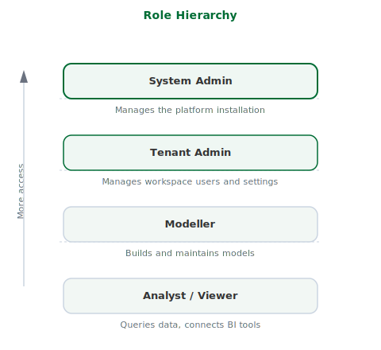

## What this covers

This article describes the four roles in Tessallite, what each role can do, and how roles are assigned and take effect.

---

## The four roles

### System Admin

The System Admin manages the Tessallite installation itself. There is one system admin per installation. This role is defined by environment variables set during deployment — it is not stored in the application database and cannot be created or removed through the interface.

The System Admin can:

- Create and list workspaces
- Create users within any workspace
- Access the System Administration screen

The System Admin cannot access workspace-level content, including projects, models, and data.

---

### Tenant Admin

The Tenant Admin manages users and settings within a single workspace. Multiple users in the same workspace can hold the Tenant Admin role.

The Tenant Admin can:

- Invite and remove users
- Assign roles to users within the workspace
- Configure workspace settings

---

### Modeller

The Modeller builds and maintains data models. This role is assigned per project within a workspace.

The Modeller can:

- Create and edit projects and models
- Add data source connections
- Define tables, joins, dimensions, and measures
- Configure aggregates and refresh schedules
- View diagnostics and model health
- Run queries and view results

---

### Analyst / Viewer

The Analyst connects BI tools and queries data. This role is assigned per project.

The Analyst can:

- Connect via JDBC or XMLA
- Run queries
- View data returned by the model

The Analyst cannot:

- Edit models, dimensions, measures, or joins
- Add or remove data sources
- Manage users

---

## How roles are assigned

The Tenant Admin assigns workspace-level roles (Tenant Admin) from the Admin panel. Project-level roles (Modeller, Viewer) are assigned from the project's Access settings.

Role changes take effect immediately. There is no caching or delay.

---

## Role hierarchy

Roles are ordered from lowest to highest access:

Analyst → Modeller → Tenant Admin → System Admin

A user with a higher role holds all capabilities of the roles below it in the hierarchy.

---

## Permissions reference

| Action | System Admin | Tenant Admin | Modeller | Analyst |
|---|---|---|---|---|
| Create workspaces | Yes | No | No | No |
| Manage workspace users | No | Yes | No | No |
| Create / edit models | No | No | Yes | No |
| Configure aggregates | No | No | Yes | No |
| Connect BI tools | No | No | Yes | Yes |
| Run queries | No | No | Yes | Yes |

---

## Related

- [Manage users](../admin/manage-users.md)
- [Manage roles](../admin/manage-roles.md)
- [Workspaces and tenants](workspaces-and-tenants.md)

---

← [Model Health](model-health.md) | [Home](../index.md) | [Create a Project →](../modelling/create-a-project.md)
