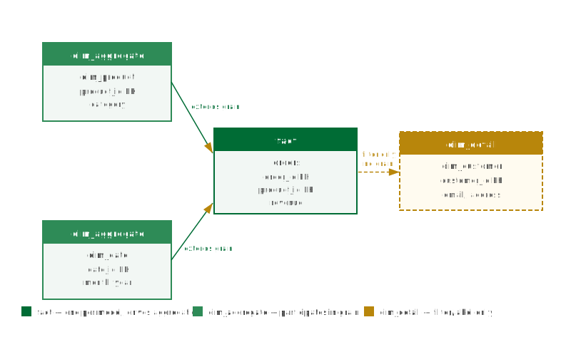

## What this covers

This article explains what a source is in Tessallite, how tables are classified within a model, how joins connect them, and why these classifications directly affect query routing and aggregate building.

---

## Sources

A source is the data warehouse or query engine that a project connects to. Tessallite supports three source types: **PostgreSQL**, **Google BigQuery**, and **Hadoop/Spark Thrift Server**. The source connection is configured at the workspace level and is shared by all models in that workspace.

When you add a table to a model, you are selecting a table or view that exists in the connected source. Tessallite reads the schema from the source to populate column lists. The source itself is never modified. Pre-computed aggregate tables are written to a separate target schema, which may be in the same source or a different one.

---

## The three table types

Every table added to a model is assigned one of three types. The type tells Tessallite how the table participates in aggregation and query routing.

| Type | Role | Participates in aggregate grain | Typical example |
|---|---|---|---|
| `fact` | The primary transaction table. Drives the aggregate grain. Each model must have exactly one fact table. | Yes | `orders`, `sales_events`, `page_views` |
| `dim_aggregate` | A dimension table whose columns may extend the aggregate grain. | Yes | `dim_product`, `dim_date`, `dim_store` |
| `dim_detail` | A dimension table used for filtering and labelling only. Cannot define an aggregate grain. | No | `dim_customer_contact`, `dim_employee_notes` |

Use `dim_detail` sparingly. Any dimension drawn from a `dim_detail` table bypasses aggregates entirely. If a column is frequently used for grouping, its source table should be classified as `dim_aggregate`.

---

## The fact table as primary table

Every model must have exactly one `fact` table. This is the central table from which all aggregates are built. Every join in the model connects either directly or transitively back to the fact table. If a model contains no fact table, the Health tab will surface a "Fact table missing" error and no aggregates can be built.

---

## Joins

A join connects two tables within a model. Each join is defined by:

- **Left table and left column** — the column on the driving side of the join.
- **Right table and right column** — the column being joined to.
- **Join type** — either `LEFT` or `INNER`.

Use `INNER` when every row in the fact table is guaranteed to have a matching row in the dimension table. Use `LEFT` when the dimension is optional.

```sql
LEFT JOIN dim_product
  ON orders.product_id = dim_product.product_id
```

Joins are not transitive by default. If you want to access a column from a table that is not directly joined to the fact table, you must define each join step explicitly.

If a column named in a join definition is later removed from the source schema, Tessallite will raise a "Join column not found" error in the Health tab after the next schema sync. The affected join must be updated or removed before aggregate builds resume.

---

## Why table type matters for routing

When the Query Router evaluates an incoming query, it checks whether every `GROUP BY` column is drawn from a `fact` or `dim_aggregate` table. A column from a `dim_detail` table is not tracked in any aggregate grain, so the router cannot confirm a match and the query falls through to raw data.

Classifying a frequently-grouped column's source table as `dim_detail` instead of `dim_aggregate` silently prevents aggregate acceleration for all queries that include that column.

---

## Related

- [Projects and models](projects-and-models.md)
- [Dimensions and measures](dimensions-and-measures.md)
- [Add tables to a model](../modelling/add-tables-to-a-model.md)
- [Define joins](../modelling/define-joins.md)

---

← [Projects and Models](projects-and-models.md) | [Home](../index.md) | [Dimensions and Measures →](dimensions-and-measures.md)
