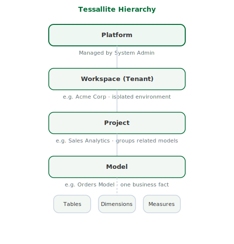

## What this covers

This article explains what workspaces (tenants) are in Tessallite, how the organisational hierarchy works, and what is isolated between workspaces.

---

## The hierarchy

Tessallite organises all data and access in four levels.

### Platform

The platform is the Tessallite installation as a whole. It is managed by the System Admin. It contains one or more workspaces. No content exists outside of a workspace — the platform is the containing boundary.

### Workspace (Tenant)

A workspace is an isolated environment for one organisation or team. Each workspace is fully separated from every other workspace. It has its own user accounts, projects, models, data source connections, and physical database. Nothing is shared between workspaces.

A workspace is identified by its slug — a short, URL-safe name set at creation time. The slug cannot be changed after the workspace is created. It is used in the JDBC connection string as the database name and in the XMLA URL path.

Only the System Admin can create workspaces.

### Project

A project is a collection of related models within a workspace. Projects group models by subject area, team, or purpose. A workspace can contain as many projects as needed. Projects are created by Modellers or Tenant Admins.

### Model

A model is a definition of one business fact. A model specifies which source tables are used, how they join together, which dimensions are available for slicing, which measures are available for computation, and how aggregates should be built. A project can contain multiple models, one per business fact.

---

## What workspace isolation means in practice

A user in workspace A cannot see or access anything in workspace B.

The JDBC connection's `database` parameter must match the workspace slug exactly. Connecting with the wrong slug results in an authentication failure.

Each workspace has its own user database. User accounts are not shared between workspaces. Granting a user access in one workspace has no effect on any other workspace.

---

## Workspace slugs

A slug is a short identifier using lowercase letters, numbers, and hyphens. Spaces are not permitted.

Examples: `acme`, `sales-team`, `analytics`

The slug appears in two places:

- JDBC database name: `host:5433/acme`
- XMLA URL path: `/api/v1/xmla/acme`

The slug is set when the System Admin creates the workspace. It cannot be modified after creation.

---

## Hierarchy at a glance

| Level | Who manages it | What it contains |
|---|---|---|
| Platform | System Admin | All workspaces |
| Workspace | Tenant Admin | Projects, users, data source connections |
| Project | Modeller | Models |
| Model | Modeller | Tables, joins, dimensions, measures, aggregates |

---

## Related

- [Roles and permissions](roles-and-permissions.md)
- [Projects and models](projects-and-models.md)
- [Create a workspace](../admin/create-a-workspace.md)

---

← [Demo tenant: acme-demo](../getting-started/acme-demo-tenant.md) | [Home](../index.md) | [Projects and Models →](projects-and-models.md)
