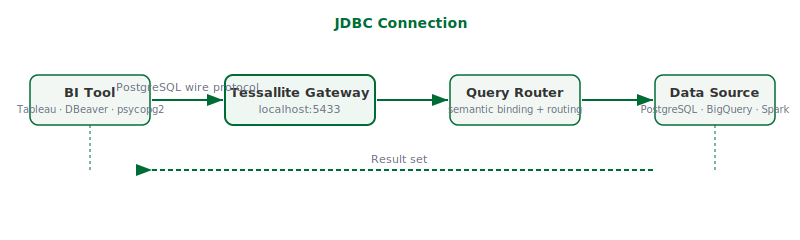

## What this covers

Connecting a JDBC-compatible BI tool — Tableau, Power BI, DBeaver, or any PostgreSQL-compatible client — to a Tessallite workspace using the JDBC endpoint on port 5433.

---

## Before you start

- Role required: Analyst (Viewer) or higher.
- You will need: the workspace slug, your email address, and your password.
- You will also need: the host address and port of the Tessallite gateway, obtained from your system administrator.
- The gateway JDBC port is `5433`. For local installs, the host is `localhost`. For cloud installs, your system administrator provides the hostname.
- On GCP, JDBC requires a TCP load balancer. If your system administrator has not configured one, use the XMLA connection (Excel or Power BI) instead.

---

## Connection details

| Setting  | Value |
|---|---|
| Host | `localhost` (local install) or the hostname provided by your system administrator (GCP) |
| Port | `5433` |
| Database | Your workspace slug (e.g. `acme`) |
| Username | Your email address (e.g. `analyst@acme.com`) |
| Password | Your Tessallite password |
| SSL | Not required for local installs |

The workspace slug is the identifier for your tenant. It is case-sensitive. If you are uncertain of the slug, ask your system administrator.

---

## Connecting with DBeaver

1. Open DBeaver.
2. Click **New Database Connection** (the plug icon in the toolbar).
3. In the connection type list, select **PostgreSQL**.
4. Enter the **Host**, **Port**, **Database**, **Username**, and **Password** using the values from the table above.
5. Click **Test Connection**. A confirmation dialog should appear.
6. Click **Finish**.
7. The connection appears in the left panel. Expand it to see the available tables. Each model published in the workspace appears as a schema.


---

## Connecting with Tableau

1. Open Tableau Desktop.
2. In the **Connect** pane on the left, select **PostgreSQL**.
3. Enter the server address in the **Server** field.
4. Enter `5433` in the **Port** field.
5. Enter the workspace slug in the **Database** field.
6. Enter your email address in the **Username** field and your password in the **Password** field.
7. Click **Sign In**.
8. The tables for the selected workspace are available in the data source pane.

---

## Connecting with psycopg2 or other drivers

Pass the following connection parameters to your driver:

```
host=<hostname>
port=5433
dbname=<workspace-slug>
user=<your-email>
password=<your-password>
```

Any PostgreSQL-compatible driver accepts these parameters directly.

---

## What you see after connecting

Each model published in the workspace appears as a schema. Within each schema, the dimensions and measures defined in the model are listed as columns. Querying them returns results immediately. Tessallite routes the query to the fastest available source — a pre-aggregated summary if one exists, or the raw data source otherwise.



---

## Troubleshooting

| Symptom | Likely cause | What to do |
|---|---|---|
| Connection refused on port 5433 | Gateway is not running | Ask your system administrator to check the gateway service |
| Authentication failed | Wrong slug, email, or password | Check all three fields exactly — the slug is case-sensitive |
| No tables visible | No models exist in the workspace | A modeller must publish at least one model before tables are visible |
| Timeout on GCP | No TCP load balancer configured | Use the XMLA connection for Excel or Power BI, or ask your administrator to add a load balancer |

---

## Related

- [Connect Excel via XMLA](connect-excel.md)
- [What is Tessallite](what-is-tessallite.md)
- [JDBC connection guide](../integrations/jdbc-connection-guide.md)

---

← [First-Time Setup](first-time-setup.md) | [Home](../index.md) | [Connect Excel →](connect-excel.md)
