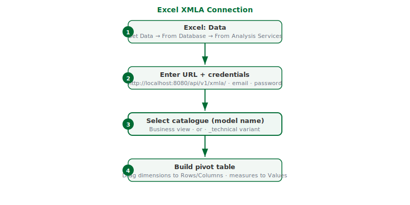

## What this covers

Connecting Microsoft Excel to a Tessallite workspace via the XMLA endpoint, selecting a model catalogue, and building a pivot table from the model's dimensions and measures.

---

## Before you start

- Role required: Analyst (Viewer) or higher.
- You will need: Microsoft Excel for Windows with the **Data** tab available, your email address, and your Tessallite password.
- You will also need: the XMLA endpoint URL. For a local install, this is `http://localhost:8080/api/v1/xmla/`. For a cloud install, your system administrator provides the URL.
- The trailing slash in the URL is required. The connection wizard does not accept the URL without it.
- Windows Authentication is not supported. You must enter your email address and password manually.

---

## Step 1: Open the connection wizard

1. Open Excel.
2. Click the **Data** tab in the ribbon.
3. Click **Get Data**.
4. From the menu, select **From Database**.
5. From the submenu, select **From Analysis Services**.
6. The Data Connection Wizard opens.

---

## Step 2: Enter the server address

1. In the **Server name** field, enter the XMLA endpoint URL: `http://localhost:8080/api/v1/xmla/`
2. Under **Log on credentials**, select **Use the following User Name and Password**.
3. In the **User Name** field, enter your email address.
4. In the **Password** field, enter your Tessallite password.
5. Click **Next**.

---

## Step 3: Select a catalogue

1. Excel connects to the gateway and retrieves a list of available catalogues.
2. Each model appears twice in the list:
   - The plain model name (e.g. `orders`) — this is the business view, with curated fields and calculated measures.
   - The model name with `_technical` appended (e.g. `orders_technical`) — this is the unfiltered view, intended for modellers and power users.
3. Select the catalogue you want to connect to. For most purposes, select the plain name.
4. Click **Next**, then click **Finish**.

---

## Step 4: Build a pivot table

1. Excel asks where to place the data. Select a cell in your worksheet and click **OK**.
2. The PivotTable Field List opens on the right side. It shows the dimensions and measures from the selected model.
3. Drag dimension fields to the **Rows** or **Columns** area.
4. Drag measure fields to the **Values** area.
5. Excel queries Tessallite and populates the pivot table with results.

---

## Refreshing the data

Right-click anywhere in the pivot table and select **Refresh** to retrieve the latest data from Tessallite.

---

## Tenant-specific URL

If your system administrator has set up per-tenant XMLA endpoints, the URL format is:

`http://<hostname>:8080/api/v1/xmla/<workspace-slug>`

Replace `<hostname>` with the gateway host and `<workspace-slug>` with your workspace identifier. This form does not require a trailing slash.

---

## Troubleshooting

| Symptom | Likely cause | What to do |
|---|---|---|
| "Unable to connect to data source" | Wrong URL format or gateway not running | Confirm the URL includes the trailing slash. Confirm the gateway service is running. |
| No catalogues appear after entering credentials | Authentication failed | Re-enter your email address and password. Do not select Windows Authentication. |
| Pivot table shows no data | No data in the model's source | Verify with the modeller that the source connection is active and data is present. |
| Pivot table figures appear incorrect | Wrong catalogue selected | Disconnect and reconnect using the plain catalogue name (business view), not the `_technical` variant. |

---

## Related

- [Excel XMLA connection guide](../integrations/excel-xmla-connection-guide.md)
- [Excel connection problems](../troubleshooting/excel-connection-problems.md)
- [Connect a BI tool via JDBC](connect-a-bi-tool.md)

---

← [Connect a BI Tool](connect-a-bi-tool.md) | [Home](../index.md) | [Demo tenant: acme-demo →](acme-demo-tenant.md)
