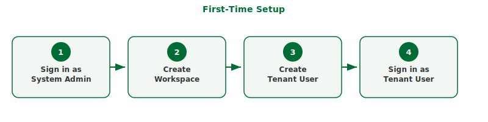

## What this covers

The steps to take immediately after installation — signing in as system admin, creating a workspace, and signing in as a tenant user.

## Before you start

- Tessallite must be installed. See [Install locally](install-local.md) or [Install on GCP](install-gcp.md).
- If the deploy script was used, the first workspace and admin user may already exist. The script reports their credentials when it completes.

## Part 1: Sign in as System Admin

A System Admin manages the platform itself. The System Admin creates workspaces and bootstraps user accounts. The System Admin's credentials are set during deployment and are not stored in the application database.

1. Open a browser and navigate to the Tessallite frontend. For local installs, this is `http://localhost:3000`. For GCP installs, use the Cloud Run URL printed at the end of the deploy script.
2. The sign-in form appears. Below the main sign-in fields, find the link labelled **System admin login** and click it.
3. Enter the system admin email and password that were set during deployment.
4. Click **Sign in**. The System Administration screen opens.

## Part 2: Create a workspace

A workspace is an isolated environment for a team or organisation. Each workspace has its own users, projects, models, and data sources.

1. On the System Administration screen, click **New Tenant**.
2. Enter a **Slug** — a short, URL-safe identifier for the workspace. Use lowercase letters, numbers, and hyphens only (for example, `acme`). The slug cannot be changed after creation. It becomes the database name that BI tools use when connecting via JDBC.
3. Enter a **Display name** — a human-readable name for the workspace (for example, `Acme Corp`).
4. Click **Create**. The workspace appears in the tenant list.

## Part 3: Create the first tenant user

Skip this part if the deploy script already created a tenant user — the script reports whether it did.

1. On the System Administration screen, click on the workspace you just created.
2. Click **Add user**.
3. Enter the user's email address, username, and a temporary password.
4. Click **Create user**.

## Part 4: Sign in as a tenant user

1. Click **Sign out** in the top-right corner to leave the system admin session.
2. On the sign-in form, enter the workspace slug, the user's email address, and the password.
3. Click **Sign in**. The Explorer screen opens. This is the main workspace for modellers and analysts.

## Troubleshooting

| Symptom | Likely cause | What to do |
|---|---|---|
| System admin login link not visible | Page did not load completely | Scroll to the bottom of the sign-in form |
| Invalid credentials for system admin | Wrong email or password | Use the credentials from the deploy script output or from your .env file |
| Slug already taken | A workspace with this slug exists | Choose a different slug |
| Sign-in fails as tenant user | Wrong workspace slug | Check the slug in the System Administration screen |

## Related

- [Install locally](install-local.md)
- [Install on GCP](install-gcp.md)
- [Create a workspace](../admin/create-a-workspace.md)
- [Manage users](../admin/manage-users.md)
