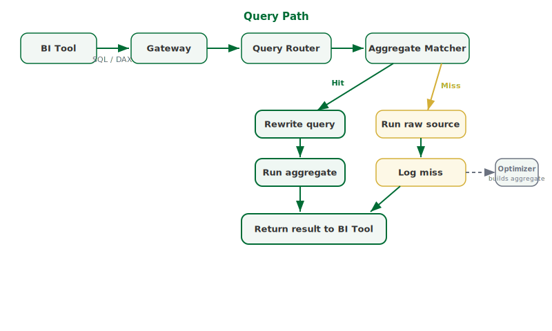

## What this covers

This article describes what Tessallite does with a query from the moment the BI tool sends it to the moment the result is returned. It also describes how the system builds and maintains pre-computed summaries over time.

---

## Overview

Tessallite sits between a BI tool and one or more data sources. It receives SQL or DAX queries, decides how to answer them, and returns results. To the BI tool, Tessallite looks like a single database. The BI tool does not need to know where the data came from.

When Tessallite can answer a query from a pre-computed summary table, it does. When no suitable summary exists, it runs the query against the raw source. In both cases the result is identical.

---

## The query path

1. The BI tool sends a query — SQL or DAX — to the Gateway. The Gateway listens on port 5433 for JDBC connections and port 8080 for XMLA connections.
2. The Gateway authenticates the request and forwards it to the Query Router.
3. The Query Router parses the query and maps its columns to the semantic model. The semantic model contains the definitions of dimensions, measures, and joins set up by the modeller. This step confirms that every column referenced in the query has a known meaning.
4. The aggregate matcher checks whether a pre-computed summary exists that can answer the query. It checks three conditions: the summary's grain covers the query's grain, all requested measures are present in the summary, and any column used to filter is part of the summary's grain.
5. If a match is found — a hit — the Query Router rewrites the query to run against the summary table. The rewritten query executes and the result is returned to the BI tool.
6. If no match is found — a miss — the query runs against the raw source table. The miss is recorded with the query's grain and measure pattern.

---

## How aggregates are built

The Optimizer reads the miss log. When the same query pattern appears frequently enough, the Optimizer scores the candidate summary for likely value and then creates the summary table. The Scheduler runs on a schedule and refreshes existing summaries as the underlying data changes. Once a summary exists, all future queries that match its pattern are routed to it automatically. No manual action is required.

---

## What the analyst sees

The analyst's query always returns the same numbers. Whether the result came from a summary table or the raw source makes no difference to the values returned. The BI tool does not change. The query does not change.

---

## The semantic model

A modeller defines dimensions — the ways data can be sliced — and measures — the numbers being computed — along with the joins that describe how tables relate. These definitions are stored once in the Model Service. Every BI tool that connects to Tessallite sees the same definitions. Results are consistent across tools.

---

## Related

- [What is Tessallite](what-is-tessallite.md)
- [Query routing](../concepts/query-routing.md)
- [Dimensions and measures](../concepts/dimensions-and-measures.md)

---

← [What is Tessallite](what-is-tessallite.md) | [Home](../index.md) | [Install Locally →](install-local.md)
