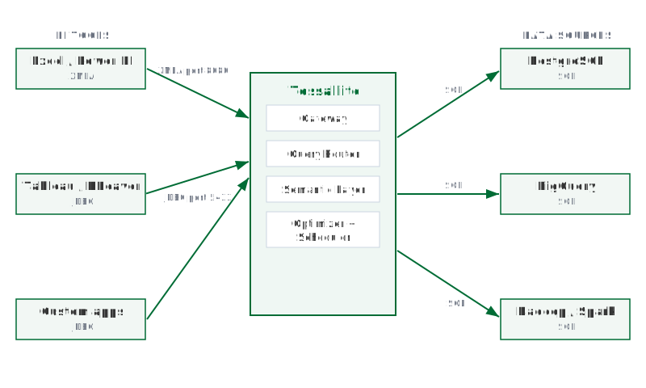

## What this covers

This article explains what Tessallite does, what problem it addresses, and what the analyst sees when using it. It also lists the supported BI tools and data sources.

---

## What Tessallite does

Tessallite sits between BI tools and the data warehouse.

When a BI tool sends a SQL or DAX query, Tessallite intercepts it. Tessallite checks whether a pre-aggregated summary table exists that can answer the query. If one exists, Tessallite rewrites the query to run against the summary. If no suitable summary exists, Tessallite forwards the query to the raw data source.

The BI tool requires no changes. The query results are identical regardless of which path was taken.

---

## What problem it solves

Large fact tables accumulate rows over time. Queries that aggregate millions of rows are slow. Running the same aggregation query repeatedly against the same raw data produces the same result each time, at full cost each time.

Tessallite observes which queries recur. It builds pre-aggregated summary tables for those queries automatically. When an identical or compatible query arrives, Tessallite routes it to the summary. The summary contains far fewer rows than the raw table. The query returns faster and consumes fewer warehouse resources.

This happens without analyst involvement. The analyst continues to write queries as normal.

---

## What the analyst sees

To the analyst, Tessallite appears as a database.

The analyst connects using the same credentials and client they use for any other database. They write queries in SQL or DAX. Tessallite returns results.

There is no indicator in the query result that shows whether the result came from a summary or the raw source. The values are the same either way.

If a query returns faster than expected, it likely hit a pre-aggregated summary. If a query takes longer than expected, it likely fell back to the raw source because no suitable summary existed yet.

---

## Supported BI tools

Tessallite exposes two connection endpoints.

**JDBC endpoint — port 5433**

Any PostgreSQL-compatible client can connect to port 5433. Supported tools include:

- Tableau
- DBeaver
- Power BI (via PostgreSQL connector)
- Excel (via PostgreSQL ODBC or JDBC bridge)
- Custom applications using psycopg2 or any PostgreSQL driver

**XMLA/DAX endpoint — port 8080**

Excel and Power BI can connect to port 8080 using the XMLA protocol. This endpoint accepts DAX queries in addition to SQL.

---

## Supported data sources

Tessallite can connect to the following data warehouses and query engines as its backend source:

- **PostgreSQL** — any version supported by the JDBC PostgreSQL driver
- **BigQuery** — via the BigQuery JDBC driver
- **Hadoop / Spark Thrift Server** — via the Hive JDBC driver

A single Tessallite installation can connect to multiple data sources. Each project within a workspace connects to one data source.

---

## The semantic model

A modeller defines a semantic model for each project. The model describes dimensions, measures, and joins in terms of the underlying tables.

Every BI tool that connects to that project sees the same model. There is no per-tool configuration. A dimension defined once appears in Tableau, Power BI, and DBeaver without additional setup.

The model also controls how Tessallite builds summaries. Tessallite uses the model's aggregation rules to determine which pre-aggregated tables to create and maintain.

---

## Related

- [How Tessallite works](how-tessallite-works.md)
- [Workspaces and tenants](../concepts/workspaces-and-tenants.md)
- [Connect a BI tool](connect-a-bi-tool.md)
