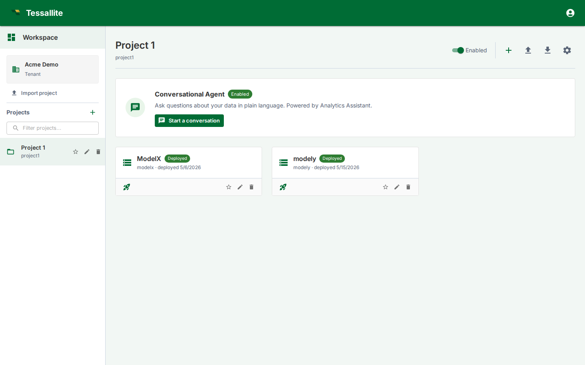

## What this covers

The Workspace Explorer is the first operational screen for tenant users. It is where you choose a project, create or import models, open the conversational agent, manage project settings, and see which models are deployed. Treat it as the project control room rather than a landing page.

## What you see

The left side is the project list for the current workspace. The tenant card shows the workspace you are signed into, and the project list lets you switch between business domains. Use **Import project** when you have a project export bundle from another tenant or environment.

The main area shows the selected project. At the top are project-level controls: enable/disable, add model, import model, export project, agent chat, agent log, and project settings. Below that, each model appears as a card with its display name, slug, deployed state, and quick actions.

## Model card states

| State | Meaning | What to do |
|---|---|---|
| `Deployed` | A saved model version is active for JDBC, XMLA, the query router, scheduler, and optimizer. | Open it to inspect or edit; deploy again after saving a new version. |
| `Ready` | The model has saved metadata but no active deployed version. BI tools cannot query it yet. | Open the model, validate it, then deploy. |
| `Invalid` or warning indicators | One or more objects, schema bindings, joins, or aggregates require attention. | Open Model Builder and check Model Health, Diagnostics, or Schema Changes. |

## Main actions

- **Open a model** to enter Model Builder.
- **Deploy/undeploy** from the model card when you need to publish or withdraw the latest saved version.
- **Import model** to bring in a JSON model bundle. Credentials are not imported; source and target connections must be rebound.
- **Export project** to move a whole project between tenants or environments.
- **Project settings** opens the drawer for agent configuration, LLM providers, users, audit settings, webhooks, and SSO mappings.
- **Start a conversation** opens the project agent, scoped to models enabled for the agent.

## How to use it well

Create one project per business domain, not one project per table. A project can contain multiple one-fact models, such as payments, settlements, and chargebacks. Keep model display names business-readable because they surface in the Explorer, BI catalogues, and agent context.

Before deleting or renaming a model, check whether it is deployed and whether downstream assets reference it. Use [Impact Analysis](../modelling/impact-analysis.md) for column-level dependencies and [Audit Log](../admin/audit-log.md) for recent administrative changes.

## Related

- [Create a project](../modelling/create-a-project.md)
- [Create and build a model](../modelling/add-tables-to-a-model.md)
- [Deploy a model](../modelling/deploy-a-model.md)
- [Configure your project agent](../agent/configure-agent.md)

---

← [Welcome Wizard](welcome-wizard.md) | [Home](../index.md) | [Demo tenant: acme-demo →](acme-demo-tenant.md)
