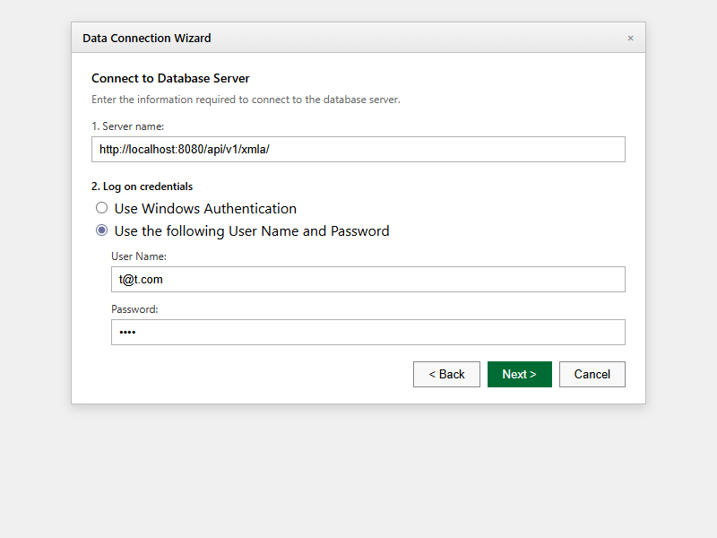

## What this covers

Detailed connection reference for Microsoft Excel connecting to Tessallite via the XMLA endpoint on port 8080. For a shorter introduction, see [Connect Excel via XMLA](../getting-started/connect-excel.md).

---

## XMLA endpoint details

| Parameter | Value | Notes |
|-----------|-------|-------|
| URL | `http://HOST:8080/xmla` | Must include the `/xmla` path segment. |
| Authentication | HTTP Basic | Tessallite username and password. |
| Catalog | Workspace slug (e.g., `acme`) | Case-sensitive. Obtain from your Tenant Admin. |
| Protocol | XMLA 1.1 | Standard Analysis Services protocol. |
| Cube / Perspective | Model name | Selected from the catalog browser after connecting. |

---

## Connect Excel to Tessallite

1. Open Excel.
2. Go to **Data** → **Get Data** → **From Other Sources** → **From Analysis Services**.
3. In **Server name**, enter: `http://HOST:8080/xmla`
4. Under **Log on credentials**, select **Use the following User Name and Password**.
5. Enter your Tessallite username (email) and password.
6. Click **Next**.
7. Select your workspace slug from the **database** dropdown.
8. Select the model name from the cube list.
9. Click **Next**, then **Finish**.
10. In **Import Data**, select **PivotTable Report** and click **OK**.

A PivotTable is inserted. The field list on the right shows the model's dimensions and measures.

---

## Create a PivotTable

Drag dimensions to Rows or Columns and measures to Values. Excel sends MDX queries to Tessallite, which routes them to the fastest available source.

---

## Refresh data

Right-click anywhere in the PivotTable and select **Refresh** to re-query Tessallite.

To set automatic refresh: **Data** → **Queries & Connections** → right-click the connection → **Properties** → **Usage** tab → enable **Refresh every N minutes**.

---

## Manage connection properties

1. Go to **Data** → **Queries & Connections**.
2. Right-click the Tessallite connection → **Properties**.
3. **Definition** tab: modify connection string and command text.
4. **Usage** tab: set refresh intervals and open-file behavior.

---

## Troubleshooting

| Problem | Likely cause | Fix |
|---------|-------------|-----|
| Cannot connect / "Unable to connect" | Wrong URL format or port blocked | Verify URL is exactly `http://HOST:8080/xmla`. Test with `curl -v http://HOST:8080/xmla`. |
| "Catalog not found" | Wrong workspace slug | Check slug with Tenant Admin (case-sensitive). |
| "Authentication failed" | Wrong credentials | Reset Tessallite password via Admin panel. |
| "No cubes found" | No published model | Ask Modeller to save and publish the model in Model Builder. |
| Excel cached a bad connection | Stale connection | Data → Queries & Connections → Delete connection → reconnect from scratch. |

---

## Related

- [Connect Excel via XMLA](../getting-started/connect-excel.md)
- [JDBC Connection Guide](jdbc-connection-guide.md)
- [Power BI Connection Guide](powerbi-connection-guide.md)
- [Excel Connection Problems](../troubleshooting/excel-connection-problems.md)

---

← [JDBC Connection Guide](jdbc-connection-guide.md) | [Home](../index.md) | [Power BI Connection Guide →](powerbi-connection-guide.md)
