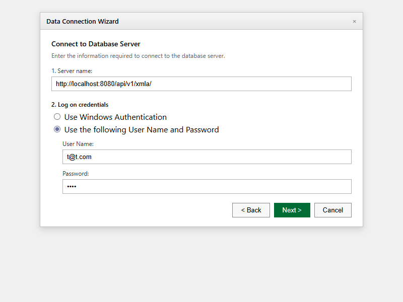

## What this covers

Detailed connection reference for Microsoft Excel connecting to Tessallite via the XMLA endpoint on port 8080. For a shorter introduction, see [Connect Excel via XMLA](../getting-started/connect-excel.md).

---

## Prerequisites

Native Excel PivotTables connect to Tessallite's XMLA endpoint using the **OLE DB Provider for Analysis Services** (MSOLAP) — a Microsoft component, not part of Tessallite. Most machines with a full Office/Excel installation already have it, but it is not guaranteed on every machine or every Office channel.

Before connecting, confirm the provider is present: **Data** → **Get Data** → **From Other Sources** → **From Analysis Services** should show the connection wizard without any "provider not found" error at the very first step. If it does not, download and install the current **OLE DB Driver for Analysis Services** from Microsoft (search "OLE DB Driver for Analysis Services download"), matching your Excel's bitness (64-bit Excel needs the x64 driver). Run the installer as Administrator, and reboot if one is pending — a partial or non-elevated install is the most common cause of the driver appearing to install but the connection still failing (see Troubleshooting below).

---

## XMLA endpoint details

| Parameter | Value | Notes |
|-----------|-------|-------|
| URL | `http://HOST:8080/api/v1/xmla/` | Must include the `/api/v1/xmla/` path and the trailing slash — the connection wizard does not accept the URL without it. |
| Authentication | HTTP Basic | Tessallite username and password. |
| Catalog | Workspace slug (e.g., `acme`) | Case-sensitive. Obtain from your Tenant Admin. |
| Protocol | XMLA 1.1 | Standard Analysis Services protocol. |
| Cube / Persona | Model name | Selected from the catalog browser after connecting. |

---

## Connect Excel to Tessallite

1. Open Excel.
2. Go to **Data** → **Get Data** → **From Other Sources** → **From Analysis Services**.
3. In **Server name**, enter: `http://HOST:8080/api/v1/xmla/` (the trailing slash is required).
4. Under **Log on credentials**, select **Use the following User Name and Password**.
5. Enter your Tessallite username (email) and password.
6. Click **Next**.
7. Select your workspace slug from the **database** dropdown.
8. Select the model name from the cube list.
9. Click **Next**, then **Finish**.
10. In **Import Data**, select **PivotTable Report** and click **OK**.

A PivotTable is inserted. The field list on the right shows the model's dimensions and measures.

---

## Create a PivotTable

Drag dimensions to Rows or Columns and measures to Values. Excel sends MDX queries to Tessallite, which routes them to the fastest available source.

---

## Supported PivotTable features

| Feature | Status | Notes |
|---------|--------|-------|
| Expand / collapse hierarchies | Supported | Click +/- on row/column headers. Works with all hierarchy types. |
| Subtotals and grand totals | Supported | SUM, COUNT, DISTINCT COUNT, MIN, MAX, AVG aggregations all render correct subtotals. |
| Show Values As | Supported | % of Grand Total, % of Parent, Difference From, % Difference From, Running Total, Rank (Largest/Smallest), Index. |
| Calculated Fields | Supported | Insert Calculated Field for arithmetic expressions, ratios, and IIF conditionals. |
| Value Filters (Top 10, >=, etc.) | Supported | Right-click a field > Value Filters. Top N, Bottom N, and comparison operators. |
| Label Filters (Contains, etc.) | Supported | Subselect-based member filtering. |
| Date Grouping | Supported | Right-click a date field > Group. Groups by Year, Quarter, Month via hierarchy levels. |
| GETPIVOTDATA | Supported | Cell formulas that reference specific PivotTable intersections. |
| Number Formatting | Supported | FORMAT_STRING from model definitions flows through to all cells including subtotals and calculated members. |
| Manual Member Selection | Supported | Filter dropdowns on row/column fields. |
| Custom Grouping | Not supported | Right-click > Group on non-date members. Requires MDX Aggregate() over member sets. |
| Calculated Items | Not supported | Insert Calculated Item on a dimension. Requires dimension-level member aggregation. |

---

## Refresh data

Right-click anywhere in the PivotTable and select **Refresh** to re-query Tessallite.

To set automatic refresh: **Data** → **Queries & Connections** → right-click the connection → **Properties** → **Usage** tab → enable **Refresh every N minutes**.

### Saved workbooks and credentials

Excel does **not** store your password inside the `.xlsx` file — only the username and server URL are saved. When you reopen a saved workbook (especially after **Enable Content**), Excel may prompt again for password and catalog via **Microsoft's native MSOLAP connection dialog** (this is Excel/OLE DB UI, not Tessallite).

On some Windows setups that dialog opens **minimised or behind the Excel window**. If Refresh appears to hang with an hourglass and no error:

1. **Alt+Tab** or **minimise Excel** to find the hidden credential dialog.
2. Re-enter password and catalog, then click OK.
3. On first connect, save the password if Excel offers it (Windows Credential Manager), so reopen skips the prompt.

---

## Manage connection properties

1. Go to **Data** → **Queries & Connections**.
2. Right-click the Tessallite connection → **Properties**.
3. **Definition** tab: modify connection string and command text.
4. **Usage** tab: set refresh intervals and open-file behavior.

---

## Troubleshooting

| Problem | Likely cause | Fix |
|---------|-------------|-----|
| Cannot connect / "Unable to connect" | Wrong URL format or port blocked | Verify URL is exactly `http://HOST:8080/api/v1/xmla/` (trailing slash included). Test with `curl -v http://HOST:8080/api/v1/xmla/`. |
| "Catalog not found" | Wrong workspace slug | Check slug with Tenant Admin (case-sensitive). |
| "Authentication failed" | Wrong credentials | Reset Tessallite password via Admin panel. |
| "No cubes found" | No published model | Ask Modeller to save and publish the model in Model Builder. |
| Excel cached a bad connection | Stale connection | Data → Queries & Connections → Delete connection → reconnect from scratch. |
| "Provider cannot be found. It may not be properly installed." | The MSOLAP OLE DB provider (see Prerequisites above) is missing or only partially registered | Reinstall the OLE DB Driver for Analysis Services as Administrator (use the installer's Repair option if it is already listed in Programs and Features), matching your Excel's bitness, then reboot if a restart is pending before retrying. |
| Refresh spins (hourglass) after reopening a saved workbook | Excel's native MSOLAP credential dialog opened minimised or behind the workbook, waiting for password/catalog input | Alt+Tab or minimise Excel to find Microsoft's connection dialog (not Tessallite). Re-enter credentials. Save password on first connect if offered. |

---

## Related

- [Connect Excel via XMLA](../getting-started/connect-excel.md)
- [JDBC Connection Guide](jdbc-connection-guide.md)
- [Power BI Connection Guide](powerbi-connection-guide.md)
- [Excel Connection Problems](../troubleshooting/excel-connection-problems.md)

---

← [JDBC Connection Guide](jdbc-connection-guide.md) | [Home](../index.md) | [Excel PivotTable Features →](excel-pivottable-features.md)
