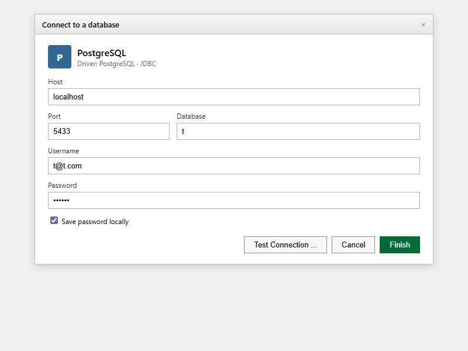

## What this covers

Tessallite exposes a PostgreSQL wire-protocol endpoint on port 5433. Any JDBC client that supports the standard PostgreSQL driver can connect — including DBeaver, Tableau, and any tool using psycopg2 or the JDBC PostgreSQL driver. No Tessallite-specific driver is required.

This article is a detailed connection reference. For a shorter walkthrough, see [Connect a BI Tool via JDBC](../getting-started/connect-a-bi-tool.md).

---

## Connection parameters

| Parameter | Value | Notes |
|-----------|-------|-------|
| Host | Hostname or IP of the Tessallite Gateway | Use `localhost` for local installs. Obtain from your System Admin for cloud deployments. |
| Port | `5433` | Fixed. Not the standard PostgreSQL port (5432). |
| Database | Workspace slug (e.g., `acme`) | Case-sensitive. This is not a real database name — it routes to the correct workspace. |
| Username | Your Tessallite email address | |
| Password | Your Tessallite password | |
| SSL | Optional | Add `?sslmode=require` to the JDBC URL if the server requires SSL. |
| Driver class | `org.postgresql.Driver` | Standard PostgreSQL JDBC driver. No Tessallite-specific driver needed. |

---

## JDBC URL format

```
jdbc:postgresql://HOST:5433/WORKSPACE_SLUG
```

Example:

```
jdbc:postgresql://analytics.example.com:5433/acme
```

With SSL:

```
jdbc:postgresql://analytics.example.com:5433/acme?sslmode=require
```

> The "database" field must contain the workspace slug, not a real database name. Entering anything else returns `FATAL: database "X" does not exist`.

---

## Connect with DBeaver

1. Open DBeaver.
2. Click **New Database Connection** (plug icon in toolbar).
3. Select **PostgreSQL** and click **Next**.
4. Fill in Host, Port (`5433`), Database (workspace slug), Username, and Password.
5. Click **Test Connection**. A "Connected" dialog confirms success.
6. Click **Finish**.
7. Expand the connection in the left panel to see schemas and columns.

---

## Connect with Tableau

1. Open Tableau Desktop.
2. In the **Connect** pane, under **To a Server**, select **PostgreSQL**.
3. Enter the Gateway hostname in **Server**.
4. Enter `5433` in **Port**.
5. Enter the workspace slug in **Database**.
6. Enter your credentials and click **Sign In**.

---

## Driver note

Tessallite uses the PostgreSQL wire protocol. Use the standard `org.postgresql.Driver` (JDBC) or `psycopg2` (Python). No special driver is required.

---

## Troubleshooting

| Symptom | Likely cause | Resolution |
|---------|-------------|------------|
| Connection refused on port 5433 | Gateway not running or wrong host | Verify Gateway service is up with your System Admin |
| `FATAL: database "X" does not exist` | Wrong workspace slug | Verify slug with Tenant Admin (case-sensitive) |
| Authentication failed | Wrong username or password | Use Tessallite email and password, not source DB credentials |
| SSL error | Server requires SSL | Append `?sslmode=require` to the JDBC URL |
| No tables visible | No published models | A Modeller must publish at least one model |

---

## Related

- [Connect a BI Tool via JDBC](../getting-started/connect-a-bi-tool.md)
- [Excel XMLA Connection Guide](excel-xmla-connection-guide.md)
- [Power BI Connection Guide](powerbi-connection-guide.md)
- [Common Errors](../troubleshooting/common-errors.md)

---

← [Upgrade](../system-admin/upgrade.md) | [Home](../index.md) | [Excel XMLA Connection Guide →](excel-xmla-connection-guide.md)
