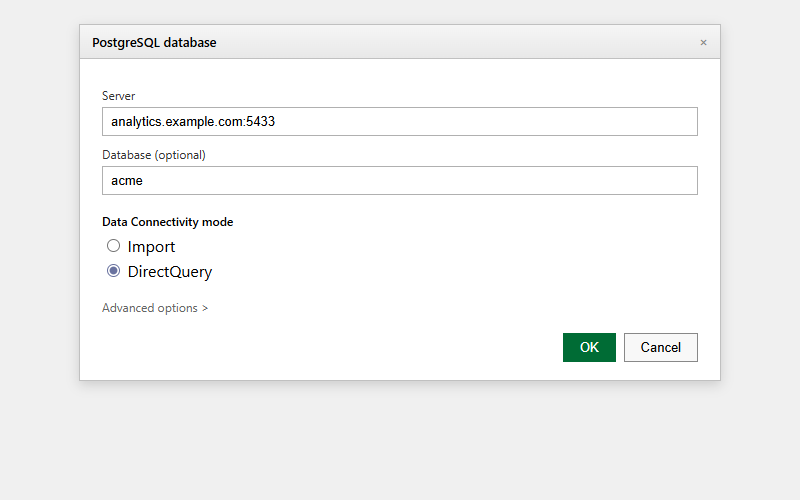

## What this covers

Power BI Desktop can connect to Tessallite using two methods: the PostgreSQL connector (port 5433) or the Analysis Services XMLA connector (port 8080). DirectQuery mode is recommended for both.

---

## Method 1 — PostgreSQL connector (port 5433)

1. Open Power BI Desktop.
2. Click **Get Data** → **Database** → **PostgreSQL database** → **Connect**.
3. **Server**: `HOST:5433` (include the port).
4. **Database**: workspace slug (e.g., `acme`).
5. **Data Connectivity mode**: **DirectQuery**.
6. Click **OK**.
7. Select **Database** authentication → enter Tessallite username and password.
8. Click **Connect**.
9. In the Navigator, select tables/views → click **Load** or **Transform Data**.

---

## Method 2 — XMLA / Analysis Services connector (port 8080)

1. Open Power BI Desktop.
2. Click **Get Data** → **Online Services** → **Analysis Services** → **Connect**.
3. **Server**: `http://HOST:8080/xmla`
4. Select **Connect live** (recommended).
5. Click **OK**.
6. Select **Basic** authentication → enter Tessallite username and password.
7. Select catalog (workspace slug) from the dropdown.
8. Select the model name → click **OK**.

---

## DirectQuery vs Import mode

| Mode | How it works | Recommendation |
|------|-------------|----------------|
| DirectQuery | Power BI queries Tessallite at report refresh time. Tessallite routes to the optimal source. | Recommended. Retains all acceleration benefits. |
| Import | Downloads the full result set and caches locally. Queries run against the cache, not Tessallite. | For small, infrequently changing datasets only. Loses live acceleration. |

DirectQuery mode is required to benefit from Tessallite's aggregate routing. In Import mode, acceleration only applies during the import step.

---

## Power BI Gateway for scheduled refresh

If Tessallite is on a private network, Power BI Service cannot reach it for scheduled refresh. Install an on-premises data gateway on a machine with network access to the Tessallite host, then associate the dataset with the gateway in Power BI Service.

---

## Troubleshooting

| Symptom | Likely cause | Resolution |
|---------|-------------|------------|
| Cannot connect (PostgreSQL method) | Wrong host or port | Confirm Server field is `HOST:5433` |
| Authentication failed | Wrong credentials or auth type | Use Database auth with Tessallite email and password |
| Cannot connect (XMLA method) | Wrong URL or port 8080 blocked | Verify URL is `http://HOST:8080/xmla` |
| Scheduled refresh fails in Power BI Service | Private network | Install and configure on-premises data gateway |

---

## Related

- [JDBC Connection Guide](jdbc-connection-guide.md)
- [Excel XMLA Connection Guide](excel-xmla-connection-guide.md)
- [Supported Data Sources](supported-data-sources.md)
- [Common Errors](../troubleshooting/common-errors.md)

---

← [Excel XMLA Connection Guide](excel-xmla-connection-guide.md) | [Home](../index.md) | [Supported Data Sources →](supported-data-sources.md)
