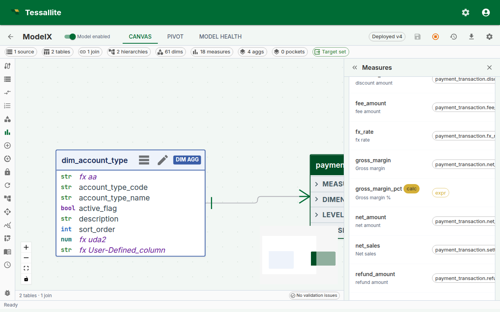
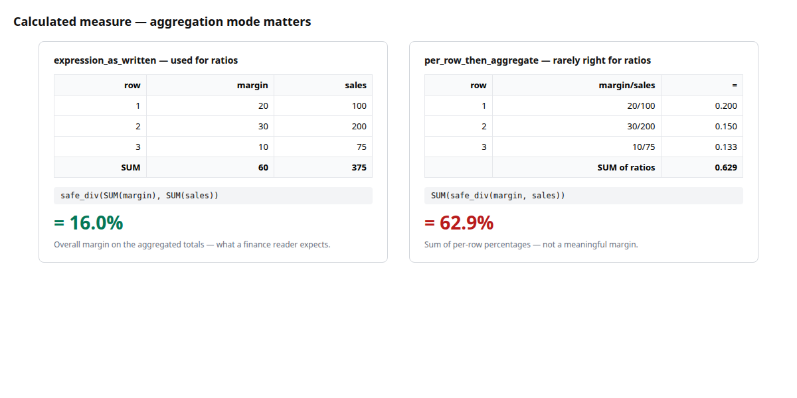
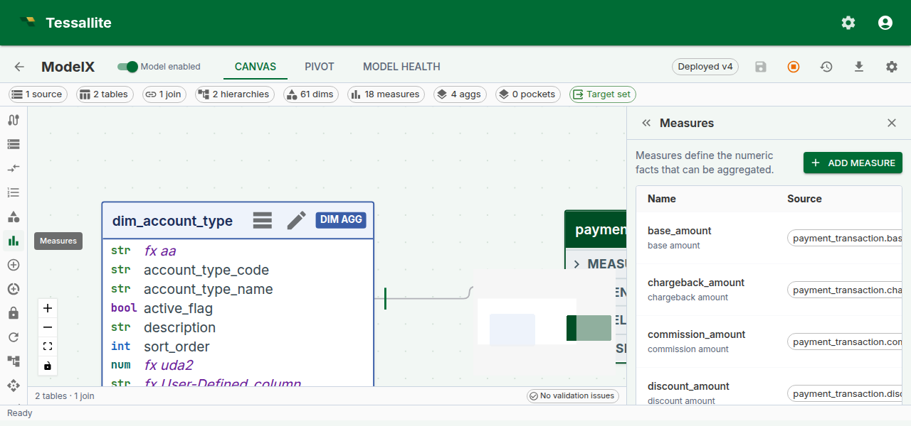

## Why calculated measures exist

Business reports are full of numbers that are not stored anywhere — gross margin percent, year-on-year growth, average order value, sell-through rate. Each one is built from two or three measures that *are* stored. When every BI tool computes these on its own, every tool gets a slightly different answer, and the analyst ends up policing definitions in spreadsheets instead of answering questions.

A **calculated measure** is Tessallite's way of defining those derived numbers **once, in the model**, so every tool — dashboards, notebooks, pivot tables, agents — reads the same definition. If finance renames "gross margin percent" from a SUM to a safe-division ratio, they change it in one place and the next query everywhere reflects it.

This page walks through: what a calculated measure is, the small expression language, the aggregation-mode choice (the decision most new users get wrong the first time), validation behaviour, and a worked example you can copy.

---

## A calculated measure, in one sentence

> A calculated measure is a named expression over other measures, stored on the model, that the Query Router evaluates on every query.

It has no source column of its own. It borrows the values of the measures it references, combines them with arithmetic and a small set of safe functions, and returns a single number per cell — just like a standard measure.

*Figure 1 — Creating a calculated measure. The green chips under the expression confirm both referenced measures were found; the validation pill confirms the expression parsed cleanly. Full description: [calculated-measure-form.txt](../assets/screencaps/calculated-measure-form.txt).*

---

## Before you start

- The model must already contain the **base measures** you want to combine. Calculated measures reference other measures by `name` — if you plan to write `safe_div(measure("margin"), measure("sales"))`, both `margin` and `sales` must exist first. See [Define Measures](define-measures.md).
- Decide the **aggregation mode** in advance. This is the "think about this for a minute" decision — the same expression in the two modes typically produces different numbers. Skip ahead to [Aggregation mode](#aggregation-mode) if you are unsure.
- If the business question is truly row-level (for example, "profit per order where order is a row on the fact table"), a calculated measure may be the wrong tool — consider whether a plain measure over a derived column is simpler.

---

## Expression language

The expression is **not SQL**. It is a small, deliberately restricted language whose job is to combine existing measures safely. Keeping it small means we can validate it at save time, rewrite it predictably for every warehouse, and refuse ambiguous constructs before they cause wrong numbers in a report.

| Construct | Example | When to use it |
|---|---|---|
| Reference another measure | `measure("sales")` | Pulls the value of another measure in the same model. Use the measure's `name`, not its `display_name`. |
| Safe division | `safe_div(measure("margin"), measure("sales"))` | Division that returns `NULL` when the denominator is zero, so a ratio on a row with no sales does not blow up the whole query. |
| Safe ratio | `safe_ratio(measure("a"), measure("b"))` | Alias for `safe_div`. Use whichever reads more naturally. |
| Arithmetic | `measure("a") + measure("b")`, `measure("a") * 1.1` | Standard operators: `+`, `-`, `*`, `/`, unary minus, parentheses. |
| Numeric literals | `0.5`, `100`, `1e-3` | Only numeric literals are accepted. No string, no date, no boolean literals. |

Things the expression language deliberately does **not** support:

- Column references. You cannot write `orders.price * 0.9` — wrap `price` in a plain measure first.
- SQL functions (`COALESCE`, `CASE`, `DATE_TRUNC`, `CAST`, etc.). The language is the same across PostgreSQL, BigQuery, and future connectors; SQL-specific functions would break that portability.
- Dimension references. Calculated measures are measure-over-measure; slicing by dimension happens at query time, not in the expression.

If you find yourself wanting any of these, the solution is almost always a new base measure or a new column in the source, not a bigger expression.

---

## Aggregation mode

Every calculated measure carries a `calc_agg_mode` flag. It controls **when** the expression is evaluated relative to the `GROUP BY`. The choice is small on paper and enormous in practice.

*Figure 2 — Why aggregation mode matters. Same expression, same rows, dramatically different answers. Full description: [calculated-measure-agg-mode-compare.txt](../assets/screencaps/calculated-measure-agg-mode-compare.txt).*

| Mode | How it evaluates | Reads as |
|---|---|---|
| `expression_as_written` | Aggregate **first**, then apply the expression once on the aggregated values. | `safe_div(SUM(margin), SUM(sales))` — **overall** margin percent for whatever is being sliced. |
| `per_row_then_aggregate` | Apply the expression **per input row**, then aggregate the result with the default aggregation (usually SUM). | `SUM(margin / sales)` — a sum of per-row ratios, which is almost never what the business wants for a percentage. |

**Rule of thumb for ratios and percentages:** use `expression_as_written`. It gives the overall ratio, which is what a finance or marketing reader expects when they see "Gross Margin %" in a report.

**When `per_row_then_aggregate` is right:** when the expression truly is an additive quantity per row — for example, `measure("base_price") - measure("discount")` expressed as a calculated measure rather than a column. The per-row subtraction followed by a SUM gives net revenue; evaluating SUM(base_price) - SUM(discount) happens to give the same number, so the mode does not matter for simple addition and subtraction. The modes only diverge on division, multiplication, and non-linear operations.

The mode is stored on the measure. The rewriter always applies the same mode, so the answer is deterministic across the canvas pivot, BI tools, and drill-through.

---

## Validation and what happens when things break

The expression is parsed at save time. Errors are reported inline, next to the expression editor, so the measure cannot be saved in a broken state. There are three common failure shapes:

1. **Syntax error** — a mistyped function name, an unbalanced parenthesis. The editor underlines the position and offers a message like `Unexpected token at position 23`.
2. **Unknown reference** — `measure("gross_margin")` where no measure named `gross_margin` exists. The editor flags the chip red and offers a "did you mean" suggestion if a close name exists.
3. **Cycle** — a chain like `A → B → A`, where `B` references `A` which references `B`. Caught at save time. The validator names both measures in the error so the loop is obvious.

**Deleting or renaming a base measure** that a calculated measure depends on marks the calculated measure as `invalid` rather than deleting it. Invalid measures:

- Are hidden from the BI catalogue, so a downstream dashboard will not silently show zeros.
- Keep their expression so you can see what they were trying to do.
- Re-enable automatically the moment the reference is fixed — either edit the expression to point at the new name, or rename the base measure back.

*Figure 3 — An invalid calculated measure. No data has been lost; the expression still parses, but one reference no longer resolves. Fixing the name re-enables the measure. Full description: [calculated-measure-invalid-chip.txt](../assets/screencaps/calculated-measure-invalid-chip.txt).*

---

## Drill-through on calculated measures

A calculated measure has no single source column, so it cannot drill to a single fact-table query. Since Phase 6, the [Measure Query Panel](measure-query-panel.md) handles this by opening a **decomposed drill drawer** that runs one drill-through per referenced base measure and shows the mini-panels stacked. The calculated value sits read-only at the top of the drawer, and each base-measure panel paginates independently.

This means a cell like "Gross margin % = 31.4%" drills into "the rows behind `margin`" and "the rows behind `net_sales`" side by side — the analyst can see both the numerator and the denominator behind the ratio without leaving the page.

---

## Worked example — Gross margin percent

A minimal, copyable recipe for the single most-requested calculated measure.

**Context.** The model already has two base measures: `gross_margin` (SUM of the `margin` column on the `orders` fact) and `net_sales` (SUM of `net_sales` on the same fact).

**Goal.** Add a calculated measure `gross_margin_pct` that reads as a percentage and always shows the overall margin at whatever grain the report asks for — by month, by region, by product, or overall.

**Steps.**

1. Open the model in **Model Builder** → **Measures**.
2. Click **Add Measure**. Switch **Measure type** to **Calculated**.
3. Fill the form:
   - **Name:** `gross_margin_pct`
   - **Display name:** `Gross margin %`
   - **Expression:** `safe_div(measure("gross_margin"), measure("net_sales"))`
   - **Calc aggregation mode:** `expression_as_written`
   - **Format:** `percent_2dp`
4. Confirm both referenced-measure chips under the expression are green. If one is red, the name is misspelled — fix it before saving.
5. Click **Save**. The measure is available to the Query Router immediately — no redeploy.
6. Open the [Measure Query Panel](measure-query-panel.md), pick `Gross margin %` as the measure and `region` as the row dimension, and click **Run**. You should see one row per region with a percent value in the 20-40% band for a typical retail model.
7. Click any cell to open the decomposed drill drawer. You will see two mini drill-through panels — one for the numerator rows, one for the denominator rows — each paginating at 50 rows per page.

---

## Steps (reference)

1. Open a model in Model Builder and click **Measures** in the Toolbelt.
2. Click **Add Measure** and set **Measure type** to **Calculated**.
3. Enter a **Name** and **Display name**.
4. Write the expression in the **Expression** field. The form validates as you type; referenced measures are shown as chips below the editor.
5. Choose a **Calc aggregation mode** — see the table above.
6. Optionally set a **Format** (for example `percent_2dp` for a ratio).
7. Click **Save**.

---

## Troubleshooting

| Symptom | Likely cause | Fix |
|---|---|---|
| Red chip under the expression | Typed the `display_name` instead of `name` | Use the measure's `name` (lowercase, underscore) |
| Measure saves but the pivot shows `NULL` everywhere | Denominator is always zero at the chosen grain | Check the base measure; `safe_div` intentionally returns `NULL` on zero |
| Mode switch changes every cell's value | Expected — the two modes are not interchangeable for ratios | Pick `expression_as_written` for percentages and ratios |
| "Invalid" badge appears after someone renamed a base measure | Reference no longer resolves | Edit the expression to use the new name, or rename the base measure back |

---

## Related

- [Define Measures](define-measures.md)
- [Measure Query Panel](measure-query-panel.md)
- [Drill-through](drill-through.md)

---

← [Configure Calendar Table](configure-calendar-table.md) | [Home](../index.md) | [Model Canvas Tour →](model-canvas-tour.md)
