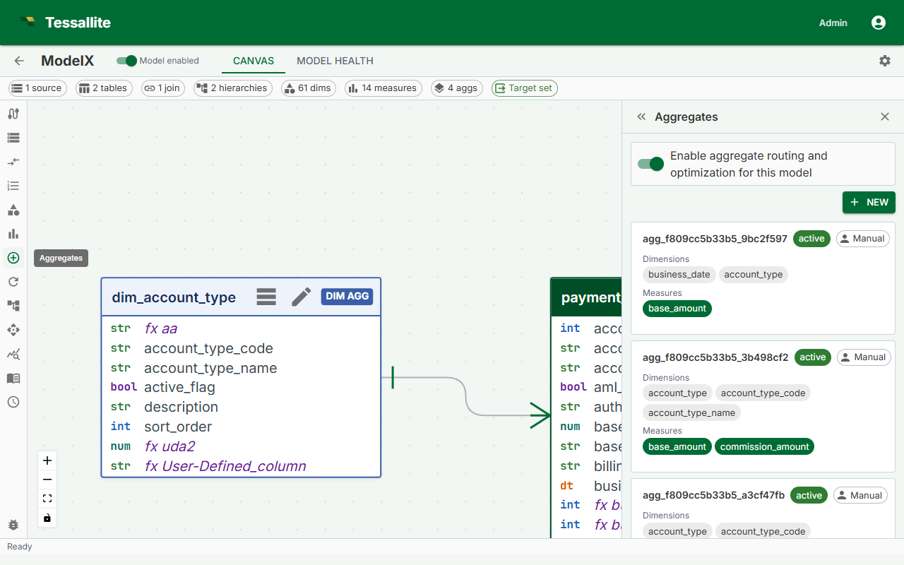

## What this covers

An aggregate is a pre-computed summary table stored in the query target. When a BI query matches an available aggregate, Tessallite reads from the summary instead of scanning the full fact table. This article covers the two ways aggregates are created, the manual configuration workflow, aggregate properties, and how the grain controls which queries an aggregate can serve.

---

## Two ways aggregates are created

- **Manual configuration** — You define the aggregate explicitly: you choose the name, grain, measures, and refresh schedule. Manual aggregates persist until you delete them.
- **AI Optimizer auto-creation** — The Optimizer analyses query patterns observed by the Gateway and creates aggregates automatically at grains it calculates will reduce the most query cost. Auto-created aggregates can be retired by the Optimizer if query patterns change. They are visible in the Canvas alongside manual aggregates.

Both types coexist in the same model. Manual aggregates give you explicit control over high-priority query patterns; auto-created aggregates fill in the gaps based on actual usage.

---

## Aggregate properties

| Property | Description |
|---|---|
| Name | Internal identifier for the aggregate. Used as the summary table name in the query target schema. |
| Grain (dimensions) | The set of dimensions that define the level of detail in the summary. Every distinct combination of dimension values becomes one row in the summary table. |
| Measures | The measures to include in the summary. Only measures defined in the model can be selected. |
| Refresh schedule | A cron expression or preset that controls when the Scheduler re-queries the source and overwrites the summary. |

---

## How the grain controls query matching

The Query Router matches an incoming query to an aggregate when the query's requested dimensions are a subset of the aggregate's grain and the requested measures are all present in the aggregate. A query asking for revenue by country and month matches an aggregate whose grain includes country and month — even if the aggregate also includes a region dimension that the query does not use. The router selects the aggregate with the smallest grain that still covers the query.

For additive measures (SUM, COUNT, AVG, MAX, MIN), the router can re-aggregate from coarser summaries. For COUNT DISTINCT, the grain must match exactly.

---

## Cron schedule presets

| Preset | Cron expression | When it runs |
|---|---|---|
| Every hour | `0 * * * *` | At the start of every hour |
| Every 6 hours | `0 */6 * * *` | At 00:00, 06:00, 12:00, 18:00 UTC |
| Daily at 02:00 | `0 2 * * *` | Once per day at 02:00 UTC |
| Weekly (Sunday 03:00) | `0 3 * * 0` | Every Sunday at 03:00 UTC |

You can enter any valid cron expression in the schedule field if none of the presets match your requirements. All times are interpreted as UTC.

---

## Steps — manual aggregate configuration

1. Open the model in Model Builder. Confirm that a query target is set under **Settings** before proceeding. Aggregates cannot be built without a target.
2. Click **Aggregates** in the Toolbelt (left sidebar).
3. Click **Add Aggregate**. The Drawer (right panel) opens with a blank aggregate form.
4. Enter a **Name**. The name becomes the summary table name in the query target schema. Use something that reflects the grain — for example, `daily_revenue_by_country`.
5. Select the **Dimensions** that define the grain. These are the columns by which the source data will be grouped. Every dimension selected here is a column in the summary table.
6. Select the **Measures** to include. You can select multiple measures. All selected measures will be computed and stored at the chosen grain.
7. Set the **Refresh schedule** using a preset or a custom cron expression.
8. Click **Save**. The aggregate is queued for an initial build by the Scheduler. It appears as a dashed node in the Canvas with a status of **Building**.

> **Note:** The first build runs as soon as the Scheduler picks up the job, typically within one minute. If the node remains in Building state for more than five minutes, check the Health tab for Scheduler errors.

---

## Manual versus auto-created aggregates

Manual aggregates are displayed in the Canvas with a solid border on their dashed outline. Auto-created aggregates show an Optimizer badge. Both respond to the same status indicators (Ready, Stale, Refreshing, Error). Manual aggregates are permanent — the Optimizer will not retire them. Auto-created aggregates may be removed by the Optimizer if the query patterns they serve drop off; you receive a notification in the Health tab when this occurs.

---

## Related

- [Set a Query Target](set-a-query-target.md)
- [Run a Refresh](run-a-refresh.md)
- [Aggregates (concept)](../concepts/aggregates.md)
- [Use the AI Optimiser](use-the-ai-optimiser.md)
- [Manage Aggregate Schedules](manage-aggregate-schedules.md)

---

← [Set a Query Target](set-a-query-target.md) | [Home](../index.md) | [Run a Refresh →](run-a-refresh.md)
