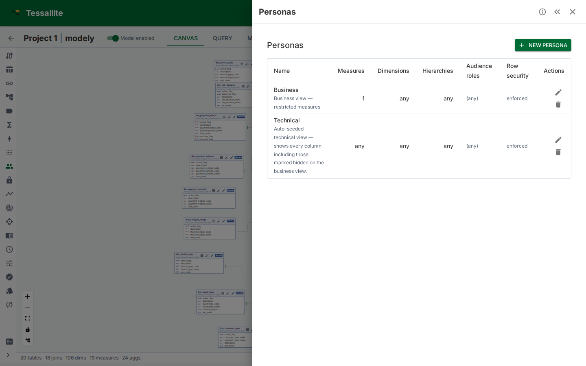
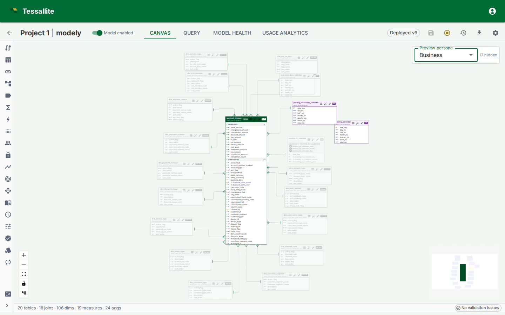

## What a persona is

A **persona** is a named subset of a model. It lists the measures, dimensions, and hierarchies that a given audience is allowed to query, and — optionally — a set of default filters that are merged into every query from that audience.

Row security decides **which rows** a caller sees. A persona decides **which measures and dimensions** they can even ask about. The two are orthogonal and compose: every rule from both layers fires on every query, in that order (persona first, then row security).

Use a persona when one model serves several audiences that should see different parts of the catalogue. Typical cases:

- **Finance vs. Ops.** Both share the same fact, but Finance needs the margin and EBITDA measures; Ops needs utilisation and throughput. A Finance persona includes the finance measures; an Ops persona includes the ops ones. Nobody copies the model.
- **External partner feed.** A partner can see shipment counts and dates but not margins, costs, or internal customer names. A `partner` persona strips the sensitive measures and dimensions out of every query.
- **Compliance-sensitive pilot.** A new calculated measure is under legal review. It lives in the model but is gated behind a `legal_review` persona until sign-off. Regular users never see it.

A model can carry any number of personas. Each is independent. They are never ORed together — a caller is tied to at most one persona, which is chosen by **connecting to that persona's virtual catalog**. The gateway emits one catalog per persona named `<model.slug>_<persona.slug>` alongside the base `<model.slug>` catalog. A seeded `technical` persona per model exposes every column (including hidden ones) as `<model.slug>_technical`, which is the classic modeller view.

---

## The four fields

| Field | Meaning |
|---|---|
| `name` | Human label. Shown in the picker. |
| `description` | Optional free text. Shown as tooltip in the picker. |
| `included_measure_ids` | Allow list of measure IDs. An **empty list means no restriction** — every measure is visible. A non-empty list means **only** those measures are visible. |
| `included_dimension_ids` | Allow list of dimension IDs. Same empty-means-unrestricted rule. |
| `included_hierarchy_ids` | Allow list of hierarchy IDs. Same rule. |
| `default_filters` | A small dictionary of `dimension_path → value` (or `dimension_path → {operator: value}`) applied to every query unless the caller has authored their own filter on the same dimension. |
| `audience_roles` | List of role names. A caller whose JWT carries one of these roles sees this persona listed in the picker. |

Empty allow lists are the **default** and the most common setting for personas that exist only to attach default filters. Non-empty lists switch that axis into restrictive mode.

*Figure 1 — The Personas panel. Each row shows the persona's name, description, and a one-glance summary of its allow lists and default filters. The preview-on-canvas action opens the model canvas with this persona pre-selected as a dimmed overlay.*

---

## How the Router applies a persona

Every query that reaches `/execute`, `/explain`, or `/validate` runs through the persona gate **before** row security and before route selection. The gate runs this four-step procedure:

1. **Resolve the persona.** The gateway parses the connecting catalog name. If it matches `<model.slug>_<persona.slug>`, the persona is resolved and sent to the router in the request body as `persona_id`. If the caller is on the base `<model.slug>` catalog, no persona is bound and the gate short-circuits.
2. **Check the allow lists.** For each measure in the bound query, confirm its ID is in `included_measure_ids` (or the list is empty). Same for each dimension and hierarchy. The **first** object that falls outside triggers a 403 `PERSONA_OBJECT_NOT_INCLUDED` with the object kind and name in the error detail.
3. **Merge default filters.** Each `(dimension_path, value)` pair in `default_filters` is added to the query's `WHERE` — unless the caller has already authored their own filter on that dimension, in which case the user's filter wins.
4. **Proceed to row security.** The persona step does not touch the generated SQL beyond adding filters. Row-security then wraps the plan as usual, and the aggregate/pocket fast paths remain available if neither layer blocks them.

The gate runs the same logic for every read path — REST, XMLA, JDBC, MCP — so swapping tool is not a way around it.

---

## Default filters

`default_filters` is a small dictionary keyed by dimension name. Each value is either:

- A **scalar**, e.g. `"fiscal_year": 2026`, which is converted to `dim = 2026`.
- A **list**, e.g. `"region": ["EMEA", "APAC"]`, which is converted to `dim IN (...)`.
- A **dict** with a single operator key, e.g. `{"gte": 100}`, which is converted to `dim >= 100`. Supported operators: `eq`, `neq`, `gt`, `gte`, `lt`, `lte`, `in`, `between`, `like`, `is_null`, `is_not_null`.

Conflict rule: if the caller's query already has any filter on the same dimension, the persona's default is **skipped**. The user's filter wins. This lets a partner narrow a default filter without having their session collapse to zero rows because of a hidden default they cannot override.

Unknown operators are ignored silently; the rest of the dictionary still merges. This is deliberate — authoring errors should not block every query from an audience.

---

## Canvas preview overlay

The model canvas has a **Preview persona** picker in the top-right corner (visible only when at least one persona exists). Selecting a persona:

- Dims every table whose measures, dimensions, or hierarchies all fall **outside** that persona's allow lists. Dimmed tables render at 35% opacity in greyscale.
- Dashes every join whose endpoints include a dimmed table.
- Suppresses clicks on dimmed tables and edges. The preview is read-only — the canvas does not change what the model **is**, only what the selected audience would see.

The overlay is the single best way to catch mistakes before publishing. Select each persona in turn and scan for "I didn't mean to hide that".

*Figure 2 — Preview persona overlay. Dimmed tables and dashed joins show exactly what the selected audience cannot reach.*

---

## Audience roles

A persona advertises itself to a caller via its `audience_roles` list. The Query Panel and Measure Query Panel each show a **Persona** picker that lists personas whose `audience_roles` intersect the caller's JWT roles. A picker that would be empty auto-hides, so users without a persona see no extra chrome.

Selecting a persona in the picker binds every query from that panel to that persona via the `persona_id` field on the request body. External BI clients (Excel, Power BI, Tableau) pick a persona by **connecting to its virtual catalog** — the XMLA and JDBC catalog lists include one entry per persona (`<model.slug>_<persona.slug>`) alongside the base model catalog. Admins and modellers see every persona catalog regardless of `audience_roles` (persona impersonation); regular viewers only see personas whose audience roles intersect theirs.

The `audience_roles` list **does not grant access**. It is purely a UI hint. Access is enforced by the allow lists and by the underlying RBAC of the model. A user whose JWT carries a role matching `audience_roles` still needs to be a member of the project to read the model at all.

---

## Worked example — Finance, Ops, Partner

**Context.** One wholesale-orders model serves three audiences: the internal Finance team needs margin measures and access to every dimension; the internal Ops team needs utilisation and lead-time measures plus the operational dimensions; the external Partner integration can see shipment counts and dates but none of the cost or customer-identity columns.

**Steps.**

1. Open the model in **Model Builder** → **Personas**.
2. Click **New**. Fill in:
   - **Name:** `Finance`
   - **Description:** `Margin, EBITDA, cost variance — full dimension catalogue.`
   - **Measure allow list:** select `revenue`, `cost`, `margin`, `ebitda`.
   - **Dimension allow list:** leave empty (everything visible).
   - **Default filters:** `{"fiscal_year": 2026}` to scope to the current year by default.
   - **Audience roles:** add `finance_analyst`.
3. Repeat for `Ops` — measures `utilisation`, `throughput`, `lead_time_days`; dimension list empty; audience `ops_manager`.
4. Repeat for `Partner` — measures `shipments_count`, `delivered_on_time_pct`; dimension allow list excludes `customer.internal_id`, `customer.credit_score`, and the margin-only dimensions; no default filter; audience `partner_integration`.
5. Select each persona in the **Preview persona** picker on the canvas and confirm that only the intended tables stay in colour.
6. Issue a test query from the Query Panel as a `partner_integration` user — the Persona picker should show `Partner`, and any attempt to reference a blocked measure should return a 403 with the measure name in the detail.

---

## Interaction with row security

When both layers are configured:

1. **Persona runs first.** If it denies the object, the query returns 403 before row security is touched.
2. **Persona default filters are added.** These become part of the user's WHERE.
3. **Row security wraps the plan.** The wrap intersects with the persona defaults — the caller sees rows that satisfy **both**.
4. **Fast paths are disabled only if row security fires.** A persona that only trims the catalogue and adds a default filter does **not** disable aggregates or pockets; a row-security rule does.

In practice: personas are cheap, row security is expensive. Use a persona first to trim the catalogue; add row security only when row-level filtering is also needed.

### Bypass row security (Phase 8.C.1)

A persona carries a **Bypass row security** flag. When enabled:

- The Router **skips the row-security wrap** for any query bound to this persona.
- The allow list and audience-role gating **still run**. Per-connection binding still applies.
- Aggregate and pocket fast paths are **re-enabled** (they are normally disabled whenever a row-security rule fires).
- Every bypassed execution is tagged with `persona_bypass_row_security=true` in the structured request log for audit. There is no dedicated audit table; existing request logs are the audit surface.

Use this only for internal dashboards that are already scoped through persona allow lists and that need the performance of the aggregate/pocket layer. A red warning appears in the editor while bypass is on, and saving with bypass newly enabled requires an explicit confirmation.

### Per-persona aggregates and pockets (Phase 8.C.2 scaffolding)

Aggregates and pockets carry a nullable `persona_id`:

- **NULL** (global) — serves any query, with or without a persona bound.
- **Populated** — serves only queries bound to the same persona.

When a query is bound to persona `X` (through the catalog name), the router prefers a matching aggregate or pocket scoped to `X` over a global one of the same grain. This makes persona-specific workloads (e.g. a partner feed that only ever filters on a narrow slice) a first-class tuning target: the optimizer can build aggregates that are tight to that slice without poisoning global queries with a too-narrow cache.

`query_logs` and `query_miss_logs` now carry `persona_id` as well, so the optimizer can partition its workload scan when building candidates. The matcher precedence rule ships in v1; the optimizer-side scoping that populates per-persona aggregates ships in a follow-on slice.

---

## v1 limitations

| Limitation | Impact | Workaround |
|---|---|---|
| **Empty allow list means "no restriction".** | An editor who intends "nothing is allowed" must explicitly list every object they want hidden, or author the persona as an include list for the single measure that is allowed. | Treat the empty-list case as documentation only. Use non-empty lists to express scope. |
| **Default filters match on dimension name, not ID.** | Renaming a dimension breaks every default filter that references it. | Keep a team-wide convention for dimension names; audit `default_filters` when renaming. |
| **Audience-role matching is union-based.** | A user carrying multiple roles sees every persona that any of their roles advertises. | Keep role strings narrow; avoid multi-audience superuser JWTs. |
| **Per-connection binding ships via catalog name.** | Each persona is a separate virtual catalog (`<model.slug>_<persona.slug>`). External BI tools (Excel, Power BI, JDBC clients) pick a persona by connecting to the matching catalog, not by sending a header. | Point each audience's connection string at the persona catalog intended for it. |
| **No UI for `default_filters` yet.** | The panel shows the dictionary; edits happen through the JSON field or the API. | A full editor ships in Phase 8.B.8+. |

---

## Troubleshooting

| Symptom | Likely cause | Fix |
|---|---|---|
| Persona picker is empty for a user who should see one | JWT has no role in the persona's `audience_roles` | Add the role, or edit the persona's audience list |
| Query returns `PERSONA_OBJECT_NOT_INCLUDED` unexpectedly | A measure/dimension is not in the allow list, but the audience needs it | Add the object's ID to the list, or remove the list to make that axis unrestricted |
| Default filter does not fire | The caller already has a filter on that dimension | Expected — user-authored filters win. Remove the user filter or change the default's scope |
| 404 `PERSONA_NOT_FOUND` on every query | The request body carries a `persona_id` that belongs to another model, or the persona was deleted | Check the ID; the router checks `persona.model_id == request.model_id` |
| Persona catalog missing from Excel's database list | Caller's JWT roles do not intersect the persona's `audience_roles`, and the caller is not an admin or modeller | Add the caller's role to `audience_roles`, or grant admin/modeller to allow impersonation |
| Canvas preview shows every table dimmed | The persona's allow lists are non-empty but the model's measure/dim IDs do not match | Re-select measures and dimensions from the canvas-side picker; IDs changed |

---

## Related

- [Configure row security](configure-row-security.md)
- [Define dimensions](define-dimensions.md)
- [Define measures](define-measures.md)
- [Measure query panel](measure-query-panel.md)

---

← [Configure Row Security](configure-row-security.md) | [Home](../index.md) | [Run a Refresh →](run-a-refresh.md)
