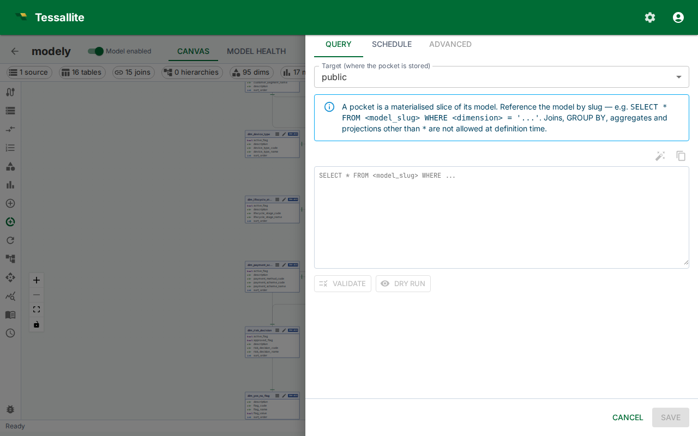
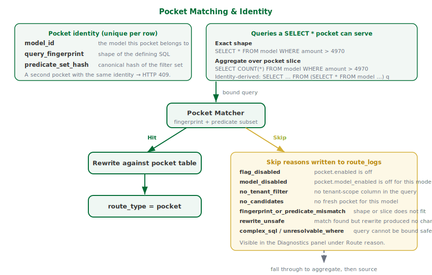

## What this covers

A pocket table is a cached, filtered **slice of a model** — not free SQL over the model's tables. The Query Router redirects matching reads to the pocket instead of running them against the source. This article covers the model-subset contract, how to author the defining SQL, validate it, measure it with a dry-run, schedule refreshes, handle drift when the model changes, and understand when the Router will and will not use a pocket.



---

## When to use a pocket table

Use a pocket table when a narrow filter on a large source table is scanned repeatedly, and the result set is small enough to cache. Aggregates cover rolled-up summaries; pocket tables cover row-level slices. Both live in the same query target and are selected independently by the Router — when both can answer a query, the pocket wins.

---

## Pocket identity

A pocket is uniquely identified by three values:

| Part | Meaning |
|---|---|
| `model_id` | The model the pocket belongs to. |
| `query_fingerprint` | A stable hash of the defining SQL's shape (projection, measures, grain). |
| `predicate_set_hash` | A stable hash of the sorted canonical form of the pocket's predicates (column, operator, value). |

Two pockets on the same model with the same query shape but **different filter values** are distinct rows. An attempt to create a second pocket with the same identity returns HTTP 409 and no row is inserted — the existing pocket is left alone. The automated optimiser follows the same rule silently, so duplicate candidates do not pile up errors.

The pocket's source table list is not a stored field. It is parsed from the defining SQL each time it is needed, so the SQL is the single source of truth.

---

## Pocket table properties

| Property | Description |
|---|---|
| Target | The data target where the pocket is stored. A target is required. |
| Defining SQL | A model-subset SELECT of the form `SELECT * FROM <model_slug> [WHERE ...] [ORDER BY ...] [LIMIT ...]`. No trailing semicolon. |
| Schedule | Cron expression controlling when the Scheduler rebuilds the pocket. |
| Schedule enabled | When off, no automatic refreshes run. Manual refresh still works. |

The default refresh strategy is **full refresh** — the pocket is rebuilt from scratch on each run. Optional incremental mode kicks in when `incremental_column` is set on the pocket.

---

## The model-subset contract

A pocket is a horizontal **slice of its model**, expanded to physical SQL at refresh time by the same join pipeline the gateway uses for ad-hoc model queries. The defining SQL must therefore stay inside a small, predictable shape:

```sql
SELECT * FROM <model_slug> [WHERE ...] [ORDER BY ...] [LIMIT ...]
```

The following are rejected at create / validate / refresh time and reported as a structured violation list (each with a code, a message and a one-line suggestion):

| Code | What it means |
|---|---|
| `FROM_NOT_MODEL` | FROM references a physical table or unknown name instead of the model slug. |
| `MULTIPLE_FROM_TABLES` | More than one table in FROM. |
| `JOIN_NOT_ALLOWED` | A JOIN was used. Pockets cache the model's join output, not their own. |
| `GROUP_BY_NOT_ALLOWED` / `HAVING_NOT_ALLOWED` / `DISTINCT_NOT_ALLOWED` | Aggregation keywords. Use an aggregate, not a pocket. |
| `AGGREGATE_NOT_ALLOWED` / `WINDOW_NOT_ALLOWED` | SUM/COUNT/AVG/etc. or window functions. |
| `SUBQUERY_NOT_ALLOWED` / `SET_OP_NOT_ALLOWED` / `CTE_NOT_ALLOWED` | Subqueries, UNION/INTERSECT/EXCEPT, or WITH clauses. |
| `SELECT_MUST_BE_STAR` | An explicit projection list. Pockets must `SELECT *` so the matcher can serve any sub-projection. |
| `WHERE_UNKNOWN_COLUMN` / `ORDER_BY_UNKNOWN_COLUMN` | A column reference that does not resolve to a model dimension or measure. |
| `EMPTY_SQL` / `PARSE_ERROR` / `NOT_SELECT` / `MODEL_MISSING` | Trivial shape failures. |

---

## Authoring workflow

1. Open the model in Model Builder.
2. Click **Pocket Tables** in the Toolbelt.
3. Click **New Pocket**. The drawer opens on the **Query** tab.
4. Pick a **Target** and type the **Defining SQL** into the editor. No separate source-table input is needed — the source is read from the SQL.
5. Click **Validate**. The service parses the SQL and checks the model-subset contract. The result banner reports the stage (`parse` or `subset`) and, on failure, lists the violation codes and suggestions.
6. Click **Dry run** to execute `COUNT(*)` against the defining SQL. The banner shows row count and elapsed milliseconds. Dry run requires a target connection; the statement timeout is capped by the system setting `gateway.router_client_timeout_xlong`.
7. Switch to the **Schedule** tab. Turn the **Schedule enabled** switch on, pick a cron expression with the picker, and review the recent run history.
8. Click **Save**. Create-mode saves the pocket and its refresh policy in one step. The Scheduler queues the first build as soon as the policy is enabled. If a pocket with the same identity already exists, the drawer surfaces an error banner and no duplicate is created.

Closing the drawer with the **X**, **Cancel**, or a click outside after you have edited the target, SQL, cron, or enabled switch prompts for confirmation before discarding your changes.

---

## Edit mode

Editing an existing pocket is scoped to scheduling. The target and defining SQL are read-only after creation — delete and recreate the pocket if the SQL needs to change. The drawer exposes a **Refresh now** button in the header to trigger an immediate full rebuild without waiting for the scheduled window.

---

## Drift handling

When the underlying model changes — a referenced dimension is removed, the slug is renamed, a JOIN is taken out — the next refresh re-runs the model-subset validator before touching the target. If the pocket no longer fits the model, it is flagged `status='invalid'` with a `failure_reason` carrying the structured violation list. Invalid pockets are no longer routed to. Once the model is fixed, the next refresh clears the flag back to `stale` and rebuilds the materialised table. No manual intervention is required.

The Pocket Tables list shows the `invalid` status alongside `stale` so you can see drifted pockets at a glance and either fix the model or delete the pocket.

---

## Schedule semantics

The Scheduler evaluates enabled pockets on each tick. A pocket is due when the previous cron-scheduled fire time is newer than the pocket's `last_refresh_at`. Manual refreshes (via **Refresh now** or the API) do not interfere with the cron cadence — they rebuild immediately and update `last_refresh_at`.

| Preset | Cron | When it runs |
|---|---|---|
| Every hour | `0 * * * *` | At the top of every hour |
| Every 6 hours | `0 */6 * * *` | 00:00, 06:00, 12:00, 18:00 UTC |
| Daily at 02:00 | `0 2 * * *` | Once per day at 02:00 UTC |
| Weekly (Sunday 03:00) | `0 3 * * 0` | Sundays at 03:00 UTC |

Pickers accept any valid five-field cron expression. All times are UTC.

---

## How matching works

The Router prefers a pocket when one fits before it considers an aggregate. A pocket fits a query when:

- **Shape** matches. Either the exact defining-SQL fingerprint, or the filter-only fingerprint — so a `SELECT *` pocket can also serve aggregate queries (`SELECT COUNT(*)`, `SELECT SUM(amount)`) and identity-derived-table queries (`SELECT … FROM (SELECT * FROM model WHERE …) q`) over the same filter slice.
- **Slice** matches. Every pocket predicate is implied by the query's predicates on the same column — the query's slice is contained in the pocket's slice. The query may add extra predicates to narrow further; it may not broaden beyond the pocket.

When the Router passes over a pocket, the reason is written to the route log and shown in the Diagnostics panel. The reasons are:

| Reason | Meaning |
|---|---|
| `flag_disabled` | `pocket.enabled` is off at the system level. |
| `model_disabled` | `pocket.model_enabled` is off for this model. |
| `no_tenant_filter` | `pocket.require_tenant_filter` is on and the query has no tenant-scope column. Set `pocket.tenant_scope_from_context` to accept the authenticated session's tenant in place of an explicit filter. |
| `no_candidates` | No fresh pocket exists for this model. |
| `fingerprint_or_predicate_mismatch` | A pocket exists but its shape or slice does not fit this query. |
| `rewrite_unsafe` | A pocket matched but rewriting did not change the query, so the source was used instead. |
| `complex_sql` / `unresolvable_where` | The query could not be bound into an intermediate representation safely. |
| `from_outside_model` | A defensive guard caught a pocket whose defining SQL points outside the model. With the model-subset contract enforced at create time this should not occur in practice. |

---

## Advanced tab

The **Advanced** tab (edit mode only) is read-only metadata: physical table name, status, created timestamp, last refresh, row count, storage bytes, and hit count. Use it to confirm the pocket is being consumed by the Router and to diagnose storage pressure.

---

## Related

- [Configure Aggregates](configure-aggregates.md)
- [Run a Refresh](run-a-refresh.md)
- [Set a Query Target](set-a-query-target.md)
- [Manage Aggregate Schedules](manage-aggregate-schedules.md)
- [View Diagnostics](view-diagnostics.md)

---

← [Configure Aggregates](configure-aggregates.md) | [Home](../index.md) | [Configure Row Security →](configure-row-security.md)
