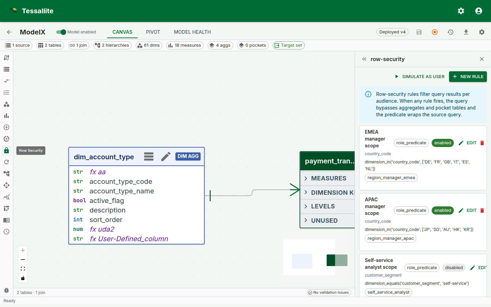
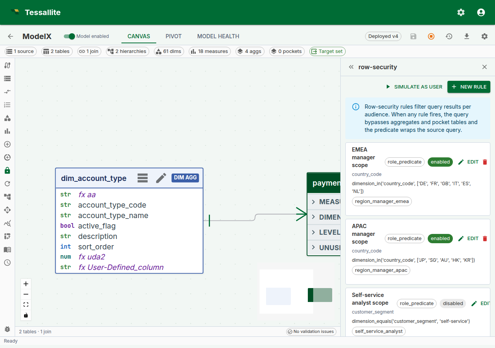
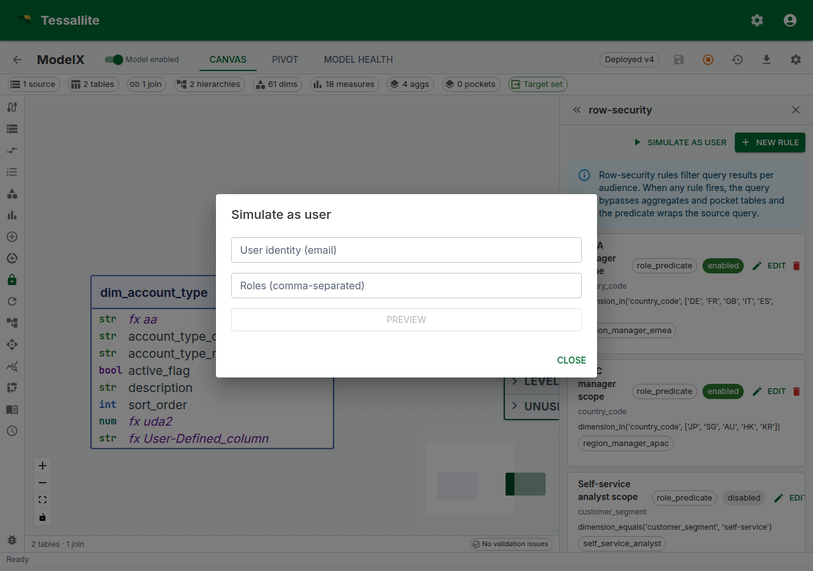

## Why row security matters

The most dangerous numbers in a business are the ones the wrong person sees. A regional sales manager seeing another region's revenue is a compliance incident. A customer-success account manager seeing a colleague's accounts is an HR incident. A "self-service" dashboard that shows every user every other user's data — even once — can cost a contract.

Traditional BI tools solve this by copying the model per audience. Finance gets one cube. Sales Europe gets another. Sales APAC gets a third. Every rename, every new measure, every join change has to be repeated across each copy, and drift between copies is the norm. One model a quarter gets out of step and a region sees something it should not.

**Row security in Tessallite** keeps a single model and filters it at query time per caller. One model, many audiences. The Query Router enforces the filter before any row crosses the network. The filter applies to every read path — JDBC for Tableau, XMLA for Excel, REST for a notebook, MCP for an agent — and cannot be bypassed by switching tool.

This page covers the two rule shapes, the tiny restricted DSL used to author role predicates, how rules combine, how the Router injects the filter at runtime, and the v1 limits every modeller must know before trusting a rule.

---

## When to use row security

The typical cases:

- **Regional sales model shared by regional managers.** Each manager sees only their region.
- **Customer-success model where every account-manager sees their assigned accounts.** Needs per-user scoping, not per-role scoping.
- **Self-service model where the caller should only see rows tagged with their own user identity.** Typical for a HR/performance or personal-finance model.
- **Multi-tenant model inside one workspace**, where the "tenant" is a column on the fact table and the user is a member of exactly one tenant.

When **not** to use row security:

- When two audiences need two genuinely different models (different facts, different grain, different semantics). Copy the model.
- When the visibility rule is based on measure value, not dimension (for example, "hide rows whose revenue is below $X"). Row security filters on dimensions, not on computed values. Use a separate model, or a pre-filtered pocket.
- When the rule is time-varying and changes every query (for example, "only rows older than 30 days"). Row security rules are static predicates; time-relative behaviour lives in the calendar/time-intelligence layer, not the security layer.



*Figure 1 — The Row Security panel. Rules are listed top-down; enabled rules are green-ringed; the protected-dimensions chip row gives the modeller a one-glance audit of what is and is not covered. Full description: [row-security-panel-overview.txt](../assets/screencaps/row-security-panel-overview.txt).*

---

## The two rule shapes

A rule is one of two shapes. A model can mix shapes freely; every enabled rule that matches the caller is AND'd together at query time.

### 1. Role predicate

A rule authored in a small restricted DSL, scoped to one or more named roles. Use this when the visibility rule is **the same for everyone in a role**.

| Field | Meaning |
|---|---|
| `name` | Human label for the rule. |
| `dimension_path` | The model dimension the rule filters on, e.g. `region.region_code`. |
| `rule_type` | `role_predicate`. |
| `predicate_expression` | A DSL string, e.g. `dimension_equals('region.region_code', 'NORTH')`. |
| `applies_to_roles` | List of role names. The rule fires only for callers whose JWT carries a matching `role` claim. |
| `is_enabled` | On/off switch. Disabled rules are ignored at query time; they are not deleted. |

The DSL is deliberately tiny so every rule can be reasoned about without running it. Supported forms:

| Form | Meaning | Example |
|---|---|---|
| `dimension_equals(path, value)` | Equality against one dimension column. | `dimension_equals('region.region_code', 'EMEA')` |
| `in(path, v1, v2, …)` | Set membership on one dimension column. | `in('region.region_code', 'EMEA', 'APAC')` |
| `and(expr1, expr2, …)` | All children must hold. | `and(in('region.region_code', 'EMEA', 'APAC'), dimension_equals('year', '2024'))` |
| `or(expr1, expr2, …)` | Any child must hold. | `or(dimension_equals('region.region_code', 'EMEA'), dimension_equals('region.region_code', 'APAC'))` |
| `not(expr)` | Negation. | `not(dimension_equals('region.region_code', 'RESTRICTED'))` |

Anything outside this grammar is rejected at save time with a structured validation error. This is intentional — it means a rule cannot be a back door for arbitrary SQL, and the DSL is identical across PostgreSQL, BigQuery, and future connectors.

String literals are single-quoted. Escape a single quote by doubling it (`'O''Brien'`).



*Figure 2 — Authoring a role predicate. The editor validates as you type and the form adapts to the selected rule type. Full description: [row-security-rule-drawer.txt](../assets/screencaps/row-security-rule-drawer.txt).*

### 2. User mapping

A rule backed by a mapping table in the same model. Use this when **the visibility rule is per user and the allowed values are stored as data**.

| Field | Meaning |
|---|---|
| `name` | Human label for the rule. |
| `dimension_path` | The model dimension the rule filters on. |
| `rule_type` | `user_mapping`. |
| `mapping_table_id` | A `ModelTable` in the same model holding `(user_identity, allowed_value)` rows. |
| `mapping_user_column` | Physical column on the mapping table that stores the user identity. |
| `mapping_value_column` | Physical column on the mapping table that stores the allowed dimension value. |
| `is_enabled` | On/off switch. |

Cross-model mapping tables are rejected at save time — a rule on model A cannot draw allowed values from a table that belongs to model B. This prevents accidental cross-tenant leaks.

A user with **multiple rows** in the mapping table — for example, an account manager mapped to three accounts — sees the **union** of those values. No additional configuration is needed.

The mapping table is just another model table. It can live in the same schema as the facts, in a separate "security" schema, or in an entirely separate database attached as a source. As long as it has `(user_identity, allowed_value)` columns that match the rule's configuration, it works.

---

## How the Query Router applies rules at runtime

For every read query, the Query Router runs the same four-step procedure:

1. **Resolve the principal.** The caller's `Principal` is extracted from the JWT: `user_identity` from the `sub` / `email` claim, `roles` from the `role` claim. A single-string role is treated as a one-element frozen set so both `role: "manager"` and `role: ["manager"]` JWTs work.
2. **Compile every matching enabled rule.** Every role predicate whose `applies_to_roles` intersects the principal's roles. Every user mapping rule (these always match once per user). Disabled rules are skipped.
3. **Wrap the planned SQL.** If at least one rule compiled, the planned SQL is wrapped:

   ```sql
   SELECT * FROM (<planned SQL>) AS __ts_sec
   WHERE <combined predicate>
   ```

   The combined predicate is an AND of every compiled rule. Multiple enabled rules for the same principal intersect — if one rule says "EMEA or APAC" and another says "2024 only", the caller sees the intersection.

4. **Disable the fast paths.** The aggregate matcher and pocket matcher are skipped whenever any rule fires. This is a correctness guarantee, not a performance choice — if a pre-computed aggregate dropped the security dimension, filtering by the wrap alone would silently leak rows.

When **no rule matches** the principal (an unauthenticated service-to-service call, or a user whose roles match no `applies_to_roles` anywhere), the wrap is **not** applied and the aggregate / pocket fast paths remain available. This is the correct behaviour for internal service-to-service traffic where the caller has already passed perimeter auth. Downstream public endpoints reject unauthenticated traffic before it reaches the Router, so "no rule, no wrap" does not mean "unauthenticated clients see everything".

---

## Simulate as user

The Row Security panel has a **Simulate as user** button. Give it an email and a list of roles; the service compiles every rule against that principal and renders the combined predicate that would be applied.



*Figure 3 — Simulate-as-user. Confirming a rule's effect before sending a JWT to a user's tool is the single highest-value habit in row-security authoring. Full description: [row-security-simulate-drawer.txt](../assets/screencaps/row-security-simulate-drawer.txt).*

The simulation is the right habit. Rule interaction is subtle — enabling two rules that individually make sense can produce a combined predicate that lets nothing through, or (rarely but worse) lets too much through. Simulate before and after every rule change.

Phase 12 will extend this to a **workspace-wide simulate mode** that re-runs the entire canvas and pivot as the simulated principal. That is deferred; the current per-query simulate already covers the highest-risk check: "what does this rule actually filter for this person".

---

## Worked example — a two-region model

**Context.** A company has two regional sales audiences — EMEA and APAC. Each manager should see only their region's rows. A third group, "central analytics", should see every region.

**Steps.**

1. Open the model in **Model Builder** → **Row Security**.
2. Click **New Rule**. Fill in:
   - **Name:** `EMEA manager scope`
   - **Rule type:** `role_predicate`
   - **Dimension path:** `region.region_code`
   - **Predicate expression:** `dimension_equals('region.region_code', 'EMEA')`
   - **Applies to roles:** add `region_manager_emea` as a chip.
   - **Enabled:** on.
3. Save. Add a second rule mirroring the first for APAC (`dimension_equals('region.region_code', 'APAC')`, role `region_manager_apac`).
4. For central analytics, do **nothing** — users in the `analytics_central` role match no rule, so no wrap is applied and they see every row. (If you want to be explicit and have the rule-coverage audit show the decision, author a role predicate that filters nothing — `in('region.region_code', 'EMEA', 'APAC')` — and attach it to `analytics_central`.)
5. Simulate as `alice.north@acme.test` with role `region_manager_emea`. The predicate tree should show only the EMEA rule firing; the APAC rule should show greyed-out with "does not fire".
6. Simulate as a user with no roles. The result should say "No rule fires · wrap not applied". If a user with no roles is supposed to see nothing, add a default-deny rule (`dimension_equals('region.region_code', '__no_access__')`) and attach it to a `default` role that every user carries. This is the "deny-by-default" pattern.

---

## v1 limitations

| Limitation | Impact | Workaround |
|---|---|---|
| **Inner SELECT must project the security dimension column.** The wrap references the dimension by its last path segment (e.g. `region.region_code` → `region_code`). | If the planned query does not project that column, `is_query_compatible` returns false and the Router fails the query **closed** rather than emitting SQL that would reference an unprojected column. | Ensure the model's `SELECT *` path for the fact table includes the security column, or add the column to the query grain. |
| **Aggregate and pocket fast paths are bypassed when any rule fires.** | Queries from audiences with active rules always execute against the source. | If latency matters for a filtered audience, consider a pre-filtered pocket owned per-audience instead of a general aggregate. |
| **Roles are strings carried on the JWT.** No central role registry in v1. | Typos in `applies_to_roles` silently match nothing. | Keep a canonical list of role strings in the team's runbook; Phase 12's rule-coverage audit will highlight orphaned roles. |
| **One security dimension per rule.** A rule filters on exactly one `dimension_path`. | Compound rules require multiple rules. | Author multiple rules — they AND together. |
| **Visual rule builder (predicate tree, simulate-principal canvas overlay, coverage audit) is split to Phase 12.** | Current authoring is a free-text DSL editor. | The DSL is small; the form validates as you type; Simulate gives the round-trip check. |

---

## Demo and simulation data

The `acme-test` demo tenant seeds a working two-audience example out of the box:

- `alice.north@acme.test` — role `region_manager_north`, sees only `NORTH` rows via a role-predicate rule.
- `bob.south@acme.test` — role `region_manager_south`, sees only `SOUTH` rows.
- `carol.both@acme.test` — no role; sees both `NORTH` and `SOUTH` via a user-mapping rule backed by `demo_data.user_region_map` (two mapping rows).

Running `scripts/seed_acme_test_demo.py` prints a 30-day JWT for each audience. Paste the token into the Query panel's `Authorization: Bearer <token>` header and re-run any query — the Route badge will still show the chosen route, and the result will reflect the wrapped predicate.

---

## Troubleshooting

| Symptom | Likely cause | Fix |
|---|---|---|
| Rule saves but wrap is never applied | Role in `applies_to_roles` does not match the JWT's `role` claim | Check the JWT; keep role strings canonical |
| Query returns "is_query_compatible: false" | Security dimension column is not projected by the planned query | Ensure the fact `SELECT *` path projects the column |
| Rule saves but Simulate says "does not fire" for the target user | User's roles do not include any `applies_to_roles` from the rule | Add the role to the user's JWT claim, or the role name to the rule |
| Two users in the same role see different rows | The rule is `user_mapping`, not `role_predicate` — and the mapping table's allowed values differ per user | Expected. Use `role_predicate` if per-role scope is needed |
| User mapping rule returns zero rows for a valid user | Mapping table has no row for that user | Add a row, or fall back to a role-predicate rule for users without mapping rows |

---

## Related

- [Define dimensions](define-dimensions.md)
- [Configure aggregates](configure-aggregates.md)
- [Configure pocket tables](configure-pocket-tables.md)
- [View diagnostics](view-diagnostics.md)

---

← [Configure Pocket Tables](configure-pocket-tables.md) | [Home](../index.md) | [Run a Refresh →](run-a-refresh.md)
