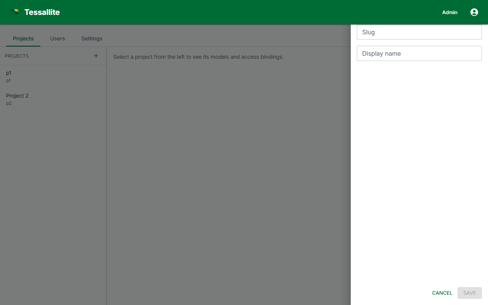

## What this covers

A project is the top-level container within a workspace. It connects a workspace to exactly one data source and holds exactly one model. This article explains what a project is, who can create one, the creation flow, and what you can configure after creation.

---

## Before you start

- You must be signed in as a **Tenant Admin** or a **Modeller** with project-creation permission granted by a Tenant Admin.
- You need the connection details for the data source the project will use. You can enter these during creation or update them later in project settings.

---

## What a project contains

Within the multi-tenant hierarchy — Platform, Workspace, Project, Model — a project sits below the workspace. Each project:

- Connects to exactly one data source (PostgreSQL, BigQuery, or Hadoop/Spark).
- Contains exactly one model, built in the Model Builder.
- Has its own access control: team members can be granted Modeller or Analyst roles scoped to that project.

Multiple projects can exist within the same workspace, each pointing to a different (or the same) data source.

---

## Steps

1. Sign in at port 3000 as a Tenant Admin or Modeller.
2. From the workspace dashboard, click **New Project**.
3. Enter a **Project name**. Use a name that identifies the data domain (for example, `Sales Analytics` or `Logistics 2026`).
4. Enter an optional **Description**. This is visible to all workspace members in the project list.
5. Select the **Data source type**: PostgreSQL, BigQuery, or Hadoop/Spark Thrift Server.
6. Enter the connection parameters for the selected source type. See [Add a Data Source](add-a-data-source.md) for the full parameter reference.
7. Click **Test Connection** to verify. A success message confirms the gateway can reach the source.
8. Click **Create Project**. The project appears in the workspace project list and the Model Builder opens with an empty model.

> The Test Connection step does not save the project. If you close the browser before clicking Create Project, no project is created.

---

## Project settings after creation

Open the project and click the **Settings** tab to edit the following:

| Setting | What it controls | Who can change it |
|---|---|---|
| Name | Display name shown in project lists and BI tool schema listings. | Tenant Admin, Modeller |
| Description | Free-text description shown in the project list. | Tenant Admin, Modeller |
| Data source | Connection parameters and source type. Changing source type after tables have been added invalidates the model. | Tenant Admin |

---

## Related

- [Projects and Models](../concepts/projects-and-models.md)
- [Add a Data Source](add-a-data-source.md)
- [Workspaces and Tenants](../concepts/workspaces-and-tenants.md)

---

← [Roles and Permissions](../concepts/roles-and-permissions.md) | [Home](../index.md) | [Add a Data Source →](add-a-data-source.md)
