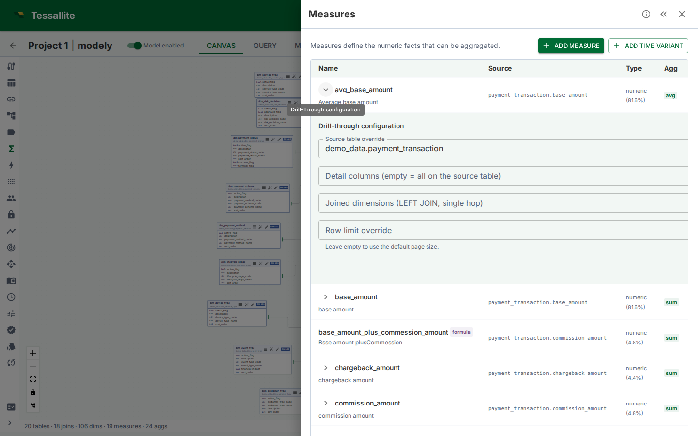

## What this is

Every standard measure has a drill-through set the moment it is saved. By default the set returns every column on the underlying fact table. Curation lets the modeller change that default in four directions:

1. **Detail columns** — narrow the column projection (hide PII, hide internal IDs, hide noise).
2. **Joined dimensions** — add human-readable text from a dimension table that the fact stores only by surrogate key.
3. **Source-table override** — point drill-through at a finer-grained sibling table (e.g. `order_lines` instead of `orders`).
4. **Row-limit override** — cap the page size at something other than the default 1 000.

This page covers each control, the validation rules that protect the analyst, and the worked examples the demo seed boots with.

---

## Where to configure

Open the **Measures** drawer. Every standard measure row has an expand chevron (▸). Click it to reveal the **Drill-through configuration** sub-row.

Calculated measures show no chevron — drill-through on a calculated measure decomposes into one panel per referenced base measure (see [Drill-through](drill-through.md) for the decomposed-drawer model).

*Figure 1 — The curation editor expanded under a measure row. Empty fields fall back to the defaults documented above.*

---

## Detail columns

Pick the columns the analyst should see when they drill into a cell. The picker lists every column on the source fact table; selected entries become the SELECT projection.

- **Empty selection** keeps the default (every column on the source table).
- A column referenced by an active row-security rule **must** stay in the projection — otherwise the endpoint would have no way to filter the drilled rows. The save fails with `DRILL_DETAIL_COLUMN_OFF_TABLE` if the curator removes a security column.
- Columns that exist on the model but on a *different* table are rejected at save time, even if the override source points elsewhere — the projection list is always validated against the table that will actually be read.

**Pick the columns the analyst would name themselves.** Internal IDs, audit timestamps, and `created_by` columns rarely answer the analyst's "which rows made up this number" question; they push the useful columns off the right edge of the drawer. Tighten ruthlessly.

---

## Joined dimensions

Fact tables often store dimensions only by surrogate key — `customer_id`, `product_id`. The drilled rows are then a wall of UUIDs. Joined dimensions fix that by `LEFT JOIN`-ing the dimension table back in for the drill-through query alone.

- The picker lists every dimension defined on the model. Pick the ones whose human-readable column you want surfaced.
- For each joined dimension the drawer surfaces the column under a display-prefixed alias: `customer__name`, `product__category`. The prefix prevents collisions when two joined dimensions both expose a `name` column.
- The dimension's base table must have a direct join to the fact (`v1` is single-hop). Multi-hop dimension joins are rejected with `DRILL_DIMENSION_NO_JOIN`. If the modeller needs a multi-hop dimension, route it through the **source-table override** below.

**Why `LEFT JOIN`** — drill-through must surface every fact row even when the dimension key is missing or unmatched. An `INNER JOIN` would silently drop those rows, masking the very data-quality issue the analyst is investigating.

---

## Source-table override + join path

The default source for drill-through is the measure's source fact table. Override it when a finer-grained sibling carries the row-level detail the analyst wants.

The classic example: `sales_amount_sum` aggregates `sales.amount`, but the line-item detail lives in `order_lines`. By default a drill returns one row per `sales` aggregation; override the source to `order_lines` and the drill returns one row per line item.

When the override is set, Tessallite needs to know **how the override table joins back to the fact** so that grouping-level filters (the cell coordinate) still apply. The editor enumerates every join path of up to four hops between the override and the original fact, and asks the modeller to pick one.

- **Single path** — auto-selected, no picker needed.
- **Multiple paths** — the picker shows each candidate as `table1 → table2 → table3 [cardinality]`. Save is rejected (`DRILL_OVERRIDE_NO_JOIN_PATH`) until one is chosen.
- **No path** — an empty picker with a save-blocking error. Either the override is wrong, or a join is missing in the model.

The cardinality hint tells you whether the picked path expands rows (`one-to-many`) or compresses them (`many-to-one`). For drill-through, an expanding path is usually what you want — that is the whole point of going from `orders` to `order_lines`.

---

## Row-limit override

Per-measure cap on page size. Empty falls back to the global default (currently 1 000; max 10 000). Use this when:

- The fact is so wide that 1 000 rows × 100 columns swamps the browser. Drop to 250.
- The fact is so narrow that bumping to 5 000 rows per page improves the analyst's flow.

Negative values, zeros, and non-integers are rejected client-side before the save fires.

---

## Reset to defaults

The **Reset to defaults** button clears every curation choice and returns the measure to the implicit default (every column, no joins, no override). The implicit drill-through row is preserved — the measure never loses drill-through entirely.

The editor confirms before resetting because the change is destructive: previous curations are not retained as a draft.

---

## Best practices

| Situation | Curation choice | Why |
|---|---|---|
| Fact has 60+ columns including audit metadata | Detail columns: only the 8 the analyst would name | Wider drawers force horizontal scroll and hide the answer |
| Fact stores `customer_id`, dimension stores `customer.name` | Joined dimensions: add `customer` | Surrogate keys are not an answer to "which customer?" |
| Measure aggregates orders, analyst wants line items | Source override: `order_lines`; pick the `order_lines → orders → sales` path | The granularity the analyst needs lives one hop deeper |
| Fact has 10M+ rows; analyst rarely needs > 250 in a session | Row-limit override: 250 | Smaller payloads, faster TTFB, same investigative power |
| Curator removed a column the row-security rule depends on | Save is rejected with `DRILL_DETAIL_COLUMN_OFF_TABLE` | Add the column back, or relax the security rule first |

---

## Business examples

**Retail cohort analysis.** `revenue_sum` on the `sales` fact. Modeller curates: detail columns `order_id, store_id, region, ts, gross, net`; joined dimensions `product` (surfaces `product__category` and `product__season`); no source override. An analyst drills into Q3 / EMEA and immediately sees the line-level revenue with the product category the row belongs to — no follow-up query.

**Finance transaction audit.** `cash_movement_sum` on `gl_journal`. Modeller curates: source override → `gl_journal_lines` with the `gl_journal_lines → gl_journal` path; row limit 5 000; detail columns include the line-level memo, debit/credit indicator, and counterparty code. Auditors drill on a suspicious month/account cell and walk all 4 800 contributing journal lines without leaving the browser.

**Multi-hop logistics.** `delivery_count` on `deliveries`. Modeller wants detail at the `delivery_events` level (which carries the per-stop scan history). Override source → `delivery_events`; pick the two-hop path `delivery_events → delivery_legs → deliveries`. Joined dimension `route` exposes `route__name`. The drawer now shows every scan event behind a delivery count cell with a human route label.

---

## Validation error reference

Stable error codes returned by the PATCH endpoint. Frontends and integrations should branch on the code, not the message text.

| Code | Cause |
|---|---|
| `DRILL_NO_SOURCE_TABLE` | Override source removed without a fallback; the measure has no resolvable fact table |
| `DRILL_DETAIL_COLUMN_OFF_TABLE` | Detail column belongs to a different table than the source (or override) |
| `DRILL_DIMENSION_NOT_IN_MODEL` | Joined dimension id does not belong to this model |
| `DRILL_DIMENSION_NO_JOIN` | Joined dimension's base table has no direct join to the fact |
| `DRILL_SOURCE_TABLE_NOT_IN_MODEL` | Override source table id does not belong to this model |
| `DRILL_OVERRIDE_NO_JOIN_PATH` | Override is set but no join path was provided when more than one exists |
| `DrillThroughOverrideJoinPathInvalid` | Provided join path references unknown joins or is not contiguous |

---

## Permissions

Reading a drill-through set requires the `viewer` role; updating or resetting requires the `modeler` role. The editor hides the Save and Reset buttons when the caller lacks `modeler` so the read-only view is browseable but not editable.

---

## Related

- [Drill-through](drill-through.md) — the analyst-side workflow
- [Define measures](define-measures.md) — where measures and their source columns come from
- [Define joins](define-joins.md) — the joins the source-override picker walks

---

← [Drill-through](drill-through.md) | [Home](../index.md) | [Set a Query Target →](set-a-query-target.md)
