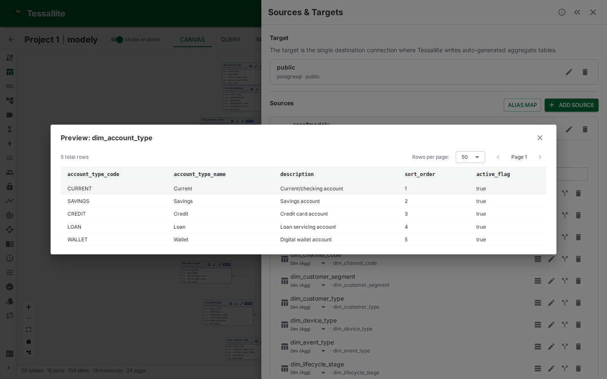

## What this covers

Data preview shows a paginated sample of raw data from a source table, directly in Model Builder. Use it to verify column contents before defining measures or dimensions, check data quality, or confirm the right table was added. This article explains where to find the preview, how to use it, and its limitations.

---

## Where to find it

1. In Model Builder, click a table node on the canvas (or expand a table in the Sources panel).
2. The **Table Details** drawer opens on the right.
3. Click the **Preview Data** button at the top of the drawer.

The preview panel opens below the column list, showing the first page of raw data from the source table.

---

## What it shows

The preview displays a grid of raw rows from the source table:

- **Columns** match the physical source columns.
- **Rows** are fetched directly from the source database with a `LIMIT` clause.
- **Page size** defaults to 100 rows per page.
- **Total row count** is shown above the grid (approximate for large tables on some source types).

Use the pagination controls to navigate through the data. The preview fetches each page on demand — it does not pre-load the entire table.

---

## When to use it

- **Verifying column contents.** Before defining a measure on `revenue`, preview the table to confirm the column contains numeric values and isn't null-heavy.
- **Checking data quality.** Spot unexpected NULLs, formatting issues, or outliers in the raw data.
- **Confirming the right table.** After adding a table by name, preview it to verify it contains the data you expected.
- **Understanding column types.** The preview shows actual values, which is often more informative than reading a `VARCHAR(255)` type declaration.

---

## Limitations

- **Queries the source directly.** Each page load issues a query against the live source database. This is not cached and not aggregate-routed.
- **Large tables may be slow.** On BigQuery or Spark sources, even a `LIMIT 100` query has a minimum latency due to job startup overhead.
- **No filtering or sorting.** The preview shows raw data in source order. For filtered or sorted views, use the Measure Query Panel.
- **Row security not applied.** The preview shows raw source data regardless of persona or row security rules. It is a modeller tool, not an end-user view.

---

## Related

- [Add Tables to a Model](add-tables-to-a-model.md)
- [Define Dimensions](define-dimensions.md)
- [Define Measures](define-measures.md)

---

← [Impact Analysis](impact-analysis.md) | [Home](../index.md) | [Schema Changes →](schema-changes.md)
