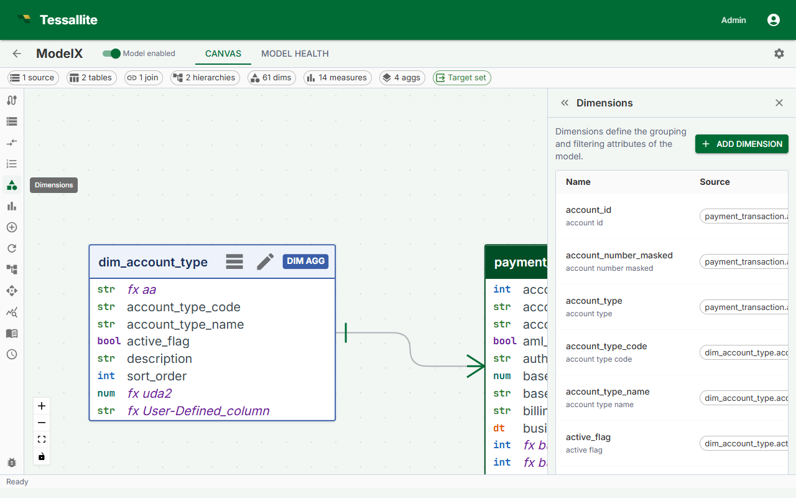

## What this covers

A dimension is a named grouping attribute that maps a business-friendly label to a specific source column. Dimensions appear as columns in the virtual schema that BI tools query. This article explains dimension fields, the definition flow, naming conventions, and what happens when a dimension references a column that no longer exists.

---

## Before you start

- All tables containing the columns you want to use as dimensions must be added to the model. See [Add Tables to a Model](add-tables-to-a-model.md).
- Tables that are not the fact table must be connected to the fact table by a join path. See [Define Joins](define-joins.md).

---

## What a dimension is

A dimension maps a business name to a column in the model's source tables. For example, `orders.status_cd` might be exposed as a dimension named `Order Status`. BI tools see `Order Status` as a queryable column in the model's virtual schema.

Dimensions from any table — fact, dim_aggregate, or dim_detail — are valid. Dimensions from `dim_aggregate` tables can be included in the aggregate grain; dimensions from `dim_detail` tables always cause queries to fall through to raw data.

---

## Dimension fields

| Field | Required | Description |
|---|---|---|
| Name | Yes | Unique identifier for this dimension in the model schema. Business-friendly, title case. |
| Source table | Yes | The table in the model containing the column. |
| Source column | Yes | The column in the source table. |
| Display name | No | Alternate label for BI tools that support display names. Defaults to Name if blank. |
| Description | No | Free-text explanation shown in model metadata and some BI tool tooltips. |
| Default sort order | No | ASC or DESC. Controls default sort when an analyst orders by this dimension. |

---

## Steps

1. Open the Model Builder for the project.
2. Select a table in the Canvas, or click **Add Dimension** in the Toolbelt. The Drawer opens with the dimension form.
3. If you used the Toolbelt button, select the **Source table** from the dropdown first.
4. Select the **Source column** from the list.
5. Enter a **Name** using business terminology — for example, `Sale Date` rather than `sale_dt`.
6. Optionally fill in **Display name**, **Description**, and **Default sort order**.
7. Click **Save**. The dimension count in the Summary Bar increments by one.

---

## Example dimensions

| Dimension name | Source table | Source column | Notes |
|---|---|---|---|
| Sale Date | `dim_date` | `date_actual` | From a dim_aggregate table; can be used as an aggregate grouping key. |
| Product Category | `dim_product` | `category_name` | From a dim_aggregate table; enables pre-aggregation by category. |
| Order Status | `orders` | `status_cd` | From the fact table itself; valid for filtering or grouping. |
| Customer Name | `dim_customer` | `full_name` | From a dim_detail table; queries using this dimension fall through to raw data. |

---

## Naming conventions

- Use business terminology, not database column names.
- Use title case: `Order Status`, not `order_status` or `ORDER_STATUS`.
- Avoid abbreviations that are not universally understood in your organization.
- Names must be unique within the model. Differentiate similar concepts explicitly: `Ship Date` vs `Order Date`.

---

## How dimensions appear to BI tools

When a model is published, each dimension appears as a column in the model's virtual schema. BI tools connecting over JDBC see the workspace slug as the database name, the model name as the schema name, and each dimension as a queryable column. Analysts can GROUP BY, filter on, or ORDER BY any dimension column.

---

## If a dimension references a missing column

If the source column is renamed or dropped after the dimension is defined, the dimension becomes invalid. The Health tab shows an error identifying the affected dimension and missing column. The model cannot be published while errors are present. Edit the dimension to point to the correct column, or delete it if the column has been removed permanently.

---

## Related

- [Dimensions and Measures](../concepts/dimensions-and-measures.md)
- [Define Joins](define-joins.md)
- [Define Measures](define-measures.md)

---

← [Define Joins](define-joins.md) | [Home](../index.md) | [Define Measures →](define-measures.md)
