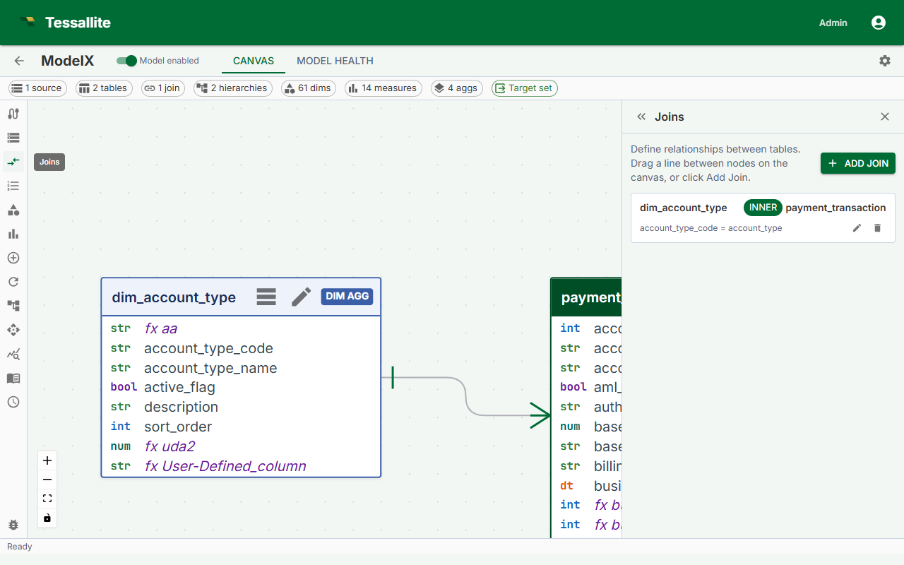

## What this covers

Joins tell Tessallite how tables relate to one another. Without joins, the query router cannot construct the SQL needed to pull dimension attributes into aggregate GROUP BY queries. This article covers the join creation flow, join properties, when to choose INNER vs LEFT, structural constraints, and how to edit or delete a join.

---

## Before you start

- All tables involved in a join must already be added to the model. See [Add Tables to a Model](add-tables-to-a-model.md).
- You must know the foreign key relationship: which column in one table corresponds to the primary key in the other.

---

## Steps

1. Open the Model Builder for the project.
2. In the Toolbelt, click **Add Join**. Alternatively, drag from one table card to another in the Canvas.
3. In the Drawer, set the **Left table** and **Left column** (the many-side, typically the fact table).
4. Set the **Right table** and **Right column** (the one-side, typically a dimension table).
5. Choose the **Join type**: LEFT or INNER.
6. Click **Save Join**. A line appears in the Canvas connecting the two table cards, labeled with the join type.

---

## Join properties

| Property | Description |
|---|---|
| Left table | The table on the left side of the ON clause. |
| Left column | The foreign key column in the left table. |
| Right table | The table being joined to. Typically a dimension table. |
| Right column | The primary key or join key column in the right table. |
| Join type | LEFT or INNER. Controls how unmatched rows are handled. |

---

## INNER vs LEFT

Use **LEFT** in almost all cases. A LEFT join preserves every row from the fact table even when the dimension table has no matching row, preventing silent data loss if a dimension record is missing or the foreign key is null.

Use **INNER** only when you are certain every fact row has a matching dimension row. A misapplied INNER join produces totals lower than expected with no error message.

> Every dimension table must be reachable from the fact table through a join path. A dimension table with no join connection will trigger a warning in the Health tab and cannot be used in aggregate queries.

---

## Structural constraints

- **Star or snowflake only.** Joins radiate outward from the fact table. Cycles are not allowed.
- **No fact-to-fact joins.** Joins between two `fact` tables are not supported. Use two separate projects or pre-join the tables in the source.
- **One join per table pair.** Only one join can exist between any two tables.

The Health tab shows errors for constraint violations. The model cannot be published while errors are present.

---

## Editing a join

Click the join line in the Canvas to open it in the Drawer. Edit any property and click **Save Join**.

---

## Deleting a join

Click the join line in the Canvas, then click **Delete Join** in the Drawer. Dimensions or measures relying on columns in the disconnected table will produce Health tab errors until the join is restored or those objects are removed.

---

## Related

- [Add Tables to a Model](add-tables-to-a-model.md)
- [Define Dimensions](define-dimensions.md)
- [Sources, Tables, and Joins](../concepts/sources-tables-and-joins.md)

---

← [Add Tables to a Model](add-tables-to-a-model.md) | [Home](../index.md) | [Define Dimensions →](define-dimensions.md)
