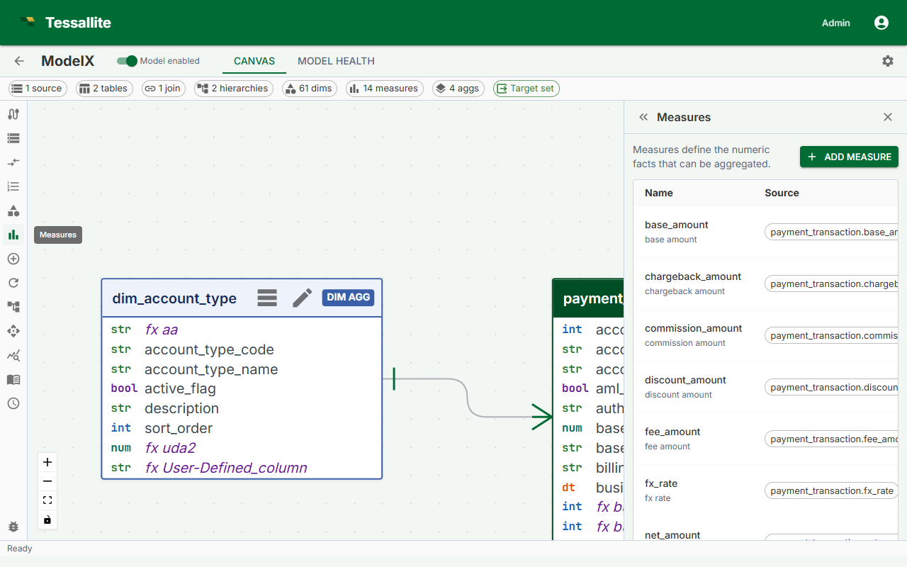

## What this covers

A measure is a named aggregation computed from a column in a fact table. Measures are the numeric values BI tools query — revenue, order count, average session duration, and so on. This article explains what constitutes a measure, how to define one in Model Builder, and the impact of choosing additive versus non-additive aggregation types on query routing.

---

## Before you start

- You must have a model open in Model Builder with at least one fact table added to the canvas.
- The source column you want to aggregate must exist in that fact table.
- Dimensions should be defined before you configure aggregates, because the aggregation type determines which grains Tessallite can serve from pre-aggregated summaries.

---

## Measure definition fields

| Field | Required | Description |
|---|---|---|
| Name | Yes | Internal identifier used in SQL and API references. Must be unique within the model. |
| Display name | No | Label shown in the BI tool field list. Defaults to the name if left blank. |
| Source table | Yes | The fact table containing the column to aggregate. |
| Source column | Yes | The column to aggregate. For COUNT, use the primary key column. |
| Aggregation type | Yes | The SQL aggregation function to apply. |
| Format | No | Presentation token controlling how Tessallite renders the value in the in-app Query panel. One of `currency`, `percent`, `percent_2dp`, `integer`, `decimal_0`, `decimal_1`, `decimal_2dp`, `decimal_3`, `decimal_4`, `decimal_5`, `decimal_6`. The token is stored on the measure and applied client-side; the underlying SQL value is unchanged. |
| Description | No | Free-text note exposed to BI tools that support field descriptions. |

---

## Aggregation types

| Type | Additive | Use case | Example |
|---|---|---|---|
| `SUM` | Yes | Totals of a numeric column | Total revenue, total quantity sold |
| `COUNT` | Yes | Number of rows | Number of orders, number of sessions |
| `AVG` | Yes | Mean of a numeric column | Average order value, average load time |
| `MAX` | Yes | Highest value in a column | Latest event timestamp, highest sale price |
| `MIN` | Yes | Lowest value in a column | Earliest order date, lowest recorded temperature |
| `COUNT DISTINCT` | No | Number of unique values in a column | Unique customers, unique SKUs ordered |

---

## Additive versus non-additive measures

An additive measure can be correctly re-aggregated from a coarser pre-aggregated summary. If Tessallite has a daily `SUM(revenue)` summary by country, it can answer a weekly query by summing those daily rows — the source warehouse is not touched.

`COUNT DISTINCT` is non-additive. Summing distinct counts from a daily summary does not give the correct weekly distinct count because the same value may appear on multiple days. Tessallite requires an exact grain match to serve a `COUNT DISTINCT` measure from a pre-aggregated table. If no aggregate exists at the requested grain, the Query Router falls back to executing the query directly against the fact table.

> **Note:** Plan your aggregates explicitly for every grain you expect to query if you use `COUNT DISTINCT` measures. Without a matching aggregate, those queries always hit the source warehouse at full cost.

---

## Steps

1. Open a model in Model Builder and click **Measures** in the Toolbelt (left sidebar).
2. Click **Add Measure**. The Drawer (right panel) opens with a blank measure form.
3. Enter a **Name**. Use business-readable terms — for example, `total_revenue` rather than `col_amt_sum`. BI tools surface this identifier to end users.
4. Select the **Source table** from the dropdown. Only fact tables already added to the model are listed.
5. Select the **Source column**. The dropdown lists all columns in the selected fact table.
6. Select the **Aggregation type**. If the column contains non-numeric values and you need a row count, use `COUNT` on the primary key rather than the data column.
7. Optionally enter a **Display name** and **Description**.
8. Click **Save**. The measure appears in the Measures list in the Toolbelt and is available to the Query Router immediately.

---

## Editing a measure

Click the measure name in the Toolbelt Measures list. The Drawer opens with the current values. Change any field and click **Save**.

> **Warning:** Renaming a measure changes the column identifier exposed to BI tools. Saved reports or dashboards that reference the old name will break. Coordinate with BI tool users before renaming a measure that is already in production use.

---

## Deleting a measure

Open the measure in the Drawer and click **Delete**. Tessallite removes the measure from all aggregates that included it. Any aggregate that relied solely on the deleted measure will contain no measures and should be updated or deleted to avoid build errors.

---

## Related

- [Dimensions and measures (concept)](../concepts/dimensions-and-measures.md)
- [Define Dimensions](define-dimensions.md)
- [Configure Aggregates](configure-aggregates.md)

---

← [Define Dimensions](define-dimensions.md) | [Home](../index.md) | [Set a Query Target →](set-a-query-target.md)
