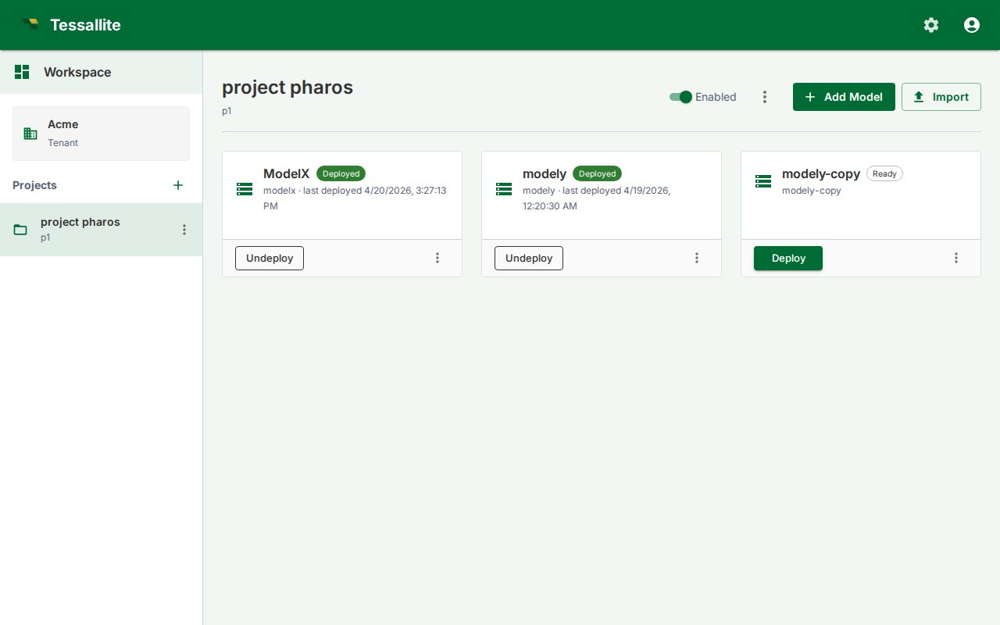

## What this covers

A model in Tessallite is in one of two states: **Deployed** or **Ready**. Only deployed models are visible to BI tools (Excel, Power BI), accept queries through the query router, and have their aggregates refreshed by the scheduler. Ready models are draft state — you can edit them freely, but nothing downstream sees them. This article covers deploying, undeploying, and the difference between the two states.

---

## Before you start

- You must have at least one saved version. Click **Save** first if the status chip reads **Edited** or **Empty**. See [Save and Version a Model](save-and-version-a-model.md).
- The Deploy and Undeploy buttons appear on the Model Builder top toolbar **and** on each model card in the project Explorer, so you can deploy or undeploy without opening the Builder.

---

## Deploying a model

1. Open the Model Builder.
2. Make sure the status chip reads **Saved v{N}** (not **Edited** — Tessallite refuses to deploy edited state, because there is no version to deploy).
3. Click the **Deploy** button (rocket icon). Tessallite sets the model's deploy pointer to the latest saved version and stamps `last_deployed_at`.
4. The status chip changes to **Deployed v{N}**.
5. Within seconds the query router, scheduler, and XMLA gateway start serving the model.

If the model has never been saved, clicking Deploy first prompts you to confirm Save-and-Deploy in one click.

---

## Undeploying a model

1. Open the Model Builder for a deployed model.
2. Click the **Undeploy** button (stop icon).
3. Type `undeploy` in the confirmation box and click **Undeploy**.
4. The deploy pointer is cleared. BI tools stop seeing the model immediately. The scheduler stops refreshing its aggregates.

The model's saved versions stay intact. You can re-deploy any of them later via the Versions dialog.

---

## Deploying or undeploying from the Explorer

Each model card in the project Explorer shows a single toggling button:

- **Deploy** when the model is currently undeployed (filled button). Clicking it deploys the latest saved version. If the model has no saved versions yet, the click surfaces the same error you would see in the Model Builder and the card stays unchanged.
- **Undeploy** when the model is currently deployed (outlined button). Clicking it asks for the typed-name confirmation (`undeploy`) and then clears the deploy pointer.

This is useful for oncall scenarios where you just need to flip one model without jumping into the Builder for each one.

---

## Deployed vs Ready

| Behaviour | Deployed | Ready |
|---|---|---|
| Visible to Excel / Power BI / other BI tools | Yes | No (XMLA gateway hides it) |
| Accepts queries from the query router | Yes | No (returns 409) |
| Aggregates refreshed by the scheduler | Yes | No |
| Schema-drift sweep runs against it | Yes | No |
| Editable in Model Builder | Yes (edits are unsaved) | Yes |

---

## Choosing which version to deploy

The default Deploy action deploys the *latest* saved version. To deploy an older version:

1. Open the Versions dialog (clock icon).
2. Find the version you want.
3. Click **Deploy** on that row.

The deploy pointer jumps; older saved versions are not deleted.

---

## Tips

- Deploy is non-destructive: it sets a pointer, it does not modify saved versions.
- Use Undeploy for time-bounded freezes (compliance reviews, model rebuilds in flight).
- After a Save click, the toolbar chip shows whether the deployed version is in sync with the saved one. **Deployed v3 · edited** means: deploy points at v3, but the live state is now ahead of v3 — Save and Deploy again to ship.

---

## Related articles

- [Save and Version a Model](save-and-version-a-model.md)
- [Export and Import a Model](export-and-import-a-model.md)
- [Run a Refresh](run-a-refresh.md)

---

← [Save and Version a Model](save-and-version-a-model.md) | [Home](../index.md) | [Export and Import a Model →](export-and-import-a-model.md)
