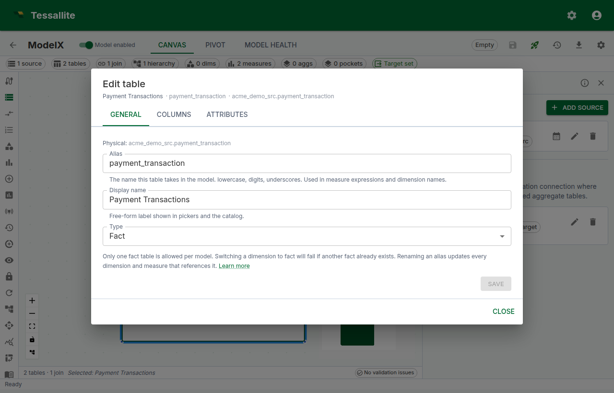
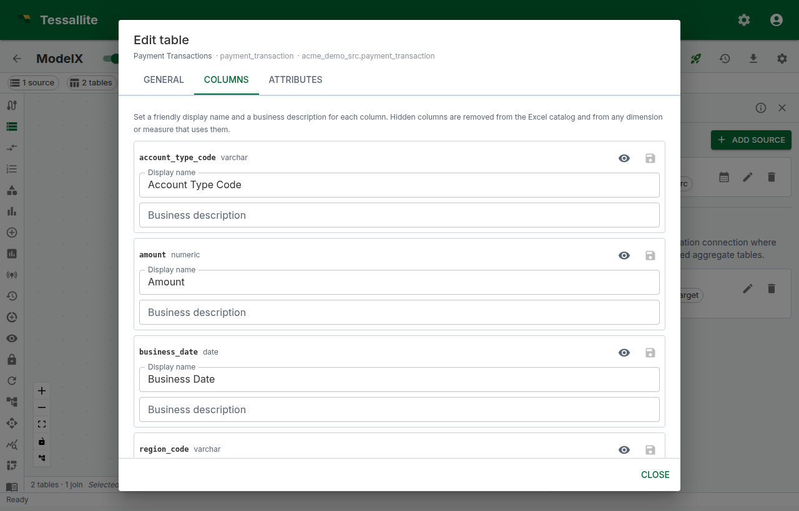
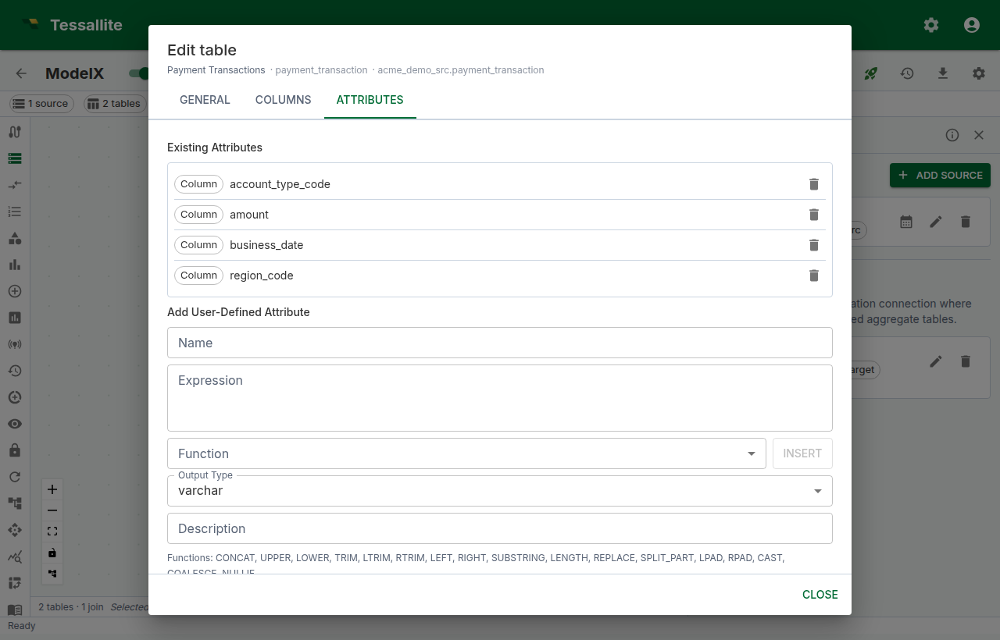
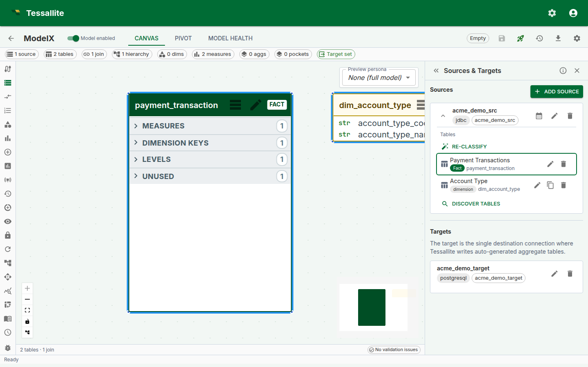

## What this covers

Dimension aliases are how Tessallite handles the modelling pattern known in dimensional design as a *role-playing dimension*: one physical dimension table that participates in the same fact under more than one role. This article explains the concept, the trade-offs, and the practical mechanics — when to use aliases, when not to, how the unified table editor works, and how aliases interact with the calendar and time-variant measures.

---

## What an alias is, and why this pattern exists

A row in the fact table often references the same dimension table multiple times. An order has a *merchant city* and a *payment city*, but both columns join to the same `cities` table. A flight has an *origin airport* and a *destination airport* — both rows in `airports`. Without aliases you have to either:

- duplicate the physical table, which doubles the storage and breaks the single source of truth; or
- pick one role and forfeit the others, leaving valid analytical questions unanswerable.

A dimension alias gives the modeller a third option: register the same physical table multiple times under distinct logical roles. Each alias carries its own joins, dimensions, and display name. Queries can group on each role independently. The physical table is unchanged — only the model's view of it is.

In Kimball-style terms, aliasing is the canonical way to model a role-playing dimension. In Tessallite specifically, every `ModelTable` row carries an `alias` field; when you have a single role, the alias is just an identifier; when you need multiple roles, the alias becomes the natural key the catalog, joins, and dimensions all key off.

---

## When to use an alias — and when not to

Use a dimension alias when:

- The same physical table is referenced from multiple foreign keys on the fact, and each reference has business meaning that should appear independently in queries (orders fact with merchant + payment cities, sales fact with order date + ship date, flights fact with origin + destination airports).
- You need to filter, group, or join differently per role (e.g. "EMEA merchants" is meaningful; "EMEA cities" is not).
- A model carries more than one calendar — fiscal and Gregorian, for example — and individual measures need to pin to a specific calendar.

Do **not** alias just because:

- You want a different display name. The display name is a separate field on the existing table; rename without aliasing.
- Two columns happen to be the same physical type. A `country_id` and a `region_id` both joining to a `geo_codes` table is one role unless the analyst genuinely needs both roles in the same query.
- You're trying to model a slowly changing dimension. SCD-Type-2 has its own treatment (versioned rows, effective dates) — aliasing is orthogonal.

A model with too many aliases ages badly: the catalog grows, naming discipline slips, and analysts struggle to remember which alias is which. Add an alias only when an actual analytical question requires it.

---

## How aliasing works under the hood

Every `ModelTable` row has a `physical_name` (the source table) and an `alias` (the logical role inside the model). Two `ModelTable` rows in the same model can share a `physical_name` but each must have a distinct alias. Joins, dimensions, and the published catalog all key off the alias, not the physical name. Renaming an alias updates every dimension and measure that references it because they store the row's id, not its alias string.

When you create an alias, Tessallite copies the column metadata (display names, descriptions, hidden flags, data types) from the sibling alias of the same physical table so the new role starts from a sensible default rather than a blank catalogue. User-defined attributes are not copied — their formulas reference specific physical columns and need explicit redefinition under the new alias if you want them in the new role.

The published catalog namespaces dimensions and columns by alias: a query that asks for `merchant_city.name` resolves only on the merchant role; a query that asks for `payment_city.name` resolves only on the payment role. This applies uniformly to the Measure Query panel, the Pivot grid, the Excel/JDBC interfaces, and aggregates.

---

## Before you start

- The source must already be added to the project. See [Add a data source](add-a-data-source.md).
- The physical table you want to alias must be added to the model at least once. See [Add tables to a model](add-tables-to-a-model.md).

---

## Create a second alias

1. Open the **Sources** panel in Model Builder.
2. Expand the source whose dimension you want to reuse.
3. On the dimension row (any non-fact table), click the **Create alias** icon (the clone icon next to the edit pencil).
4. Enter a new **Alias** — lowercase, digits, underscores; must be unique within the model. The default **Display name** mirrors the alias and is what BI tools show; edit it if you want a friendlier label.
5. Click **Create**. A new `ModelTable` row is added pointing at the same physical table, and the column metadata of the sibling alias is cloned onto the new alias automatically.

Aliases are independent: each carries its own display name, description, and join configuration. The original table stays unchanged.

---

## Edit a table — the unified dialog

Click the **Edit** pencil on any table row in the Sources panel — or on the same table's node in the canvas — to open the **Edit table** dialog. It has three tabs:

- **General** — alias, display name, and table type (`fact`, `dim_aggregate`, `dim_detail`). Each field saves on its own button; leaving one untouched skips it. Renaming the alias here updates every dimension and measure that references the table.

- **Columns** — per-column display name, business description, and hidden flag. Save a single column from its row, or use **Save N** at the bottom to commit every dirty column at once. The same tab carries a **Sync columns** action that re-discovers columns from the source. Hide columns analysts should not see in the published catalog rather than deleting them — hidden columns remain available for joins and UDA expressions.

- **Attributes** — the catalogue of physical columns and user-defined attributes. Add or edit a UDA from the form here; the function picker inserts a template, and **Validate** runs the expression against the live source before saving. UDAs become first-class columns of the alias they're defined on; they do not leak into sibling aliases.

Switching tabs preserves drafts, so you can move between General, Columns, and Attributes mid-edit without losing work. The **Create alias** icon next to the pencil is a separate action — it acts on the table list rather than on a single row's properties.

### Canvas → Sources focus

Clicking the header of a table node on the canvas opens the Sources panel, expands the source that owns the table, and scrolls the row into view with a brief outline highlight. This is the fast path between visual model exploration on the canvas and the metadata editor in the panel.

---

## Joining each alias independently

After creating a second alias, open the **Joins** panel. Each alias appears as its own node, picking up the alias label rather than the physical name. Add a join from the fact table to each alias, mapping the appropriate fact column — for example, `fact.merchant_city_id → merchant_city.city_id` and `fact.payment_city_id → payment_city.city_id`. Dimensions on each alias then group and filter independently in queries.

If you forget to add the second join, the catalog still publishes the second alias but every query using it falls through to a cross-join warning. Health flags this on save.

---

## Calendar tables are also aliases

A calendar table is a `ModelTable` alias whose `calendar_table_id` is set. Auto-create or Bind on the Sources panel provisions both the calendar registration and a companion alias in one step. Multiple calendars per source are allowed — for instance, a fiscal calendar and a Gregorian calendar — and each lives as its own alias.

If a model has more than one calendar alias, each **time-variant measure** picks which one it uses (see below).

### Pinning a calendar on a time-variant measure

1. Open **Measures**, pick a base measure, and click **Edit**.
2. Scroll to **Time variants**. The section shows a **Calendar alias** picker listing every `ModelTable` in the model with a calendar binding.
3. Pick the alias the measure should use. Period-aware variants (`_ytd`, `_qtd`, `_mtd`, `_prior_year`, `_yoy_growth`, …) are required to have one — the picker is starred when any such variant is enabled.
4. Tick the variants you need and save. All variants of this measure inherit the same calendar alias from the base.

If no alias has a calendar binding the panel shows the *"Period-aware time variants need a calendar alias"* hint instead of the picker; provision a calendar from the Sources panel first.

---

## Naming conventions and best practices

- Use lowercase, digits, and underscores — same rules as snake_case identifiers. Avoid spaces and punctuation.
- Prefer **role-prefixed names**: `merchant_city`, `payment_city`, `order_date`, `ship_date`. Do not embed the physical table name in the alias; it adds noise without communicating role.
- The **display name** is the human label — feel free to title-case it (`Merchant City`); the alias stays in snake_case.
- Calendar aliases are auto-sequenced: `calendar`, `calendar_2`, `calendar_fiscal`, etc. Override at create time if you want a domain-specific name.
- Keep aliases purposeful. If you find yourself with `cities_1`, `cities_2`, `cities_3`, the model has lost role semantics — pause and rename to the actual roles.
- Aliasing the fact table is rarely correct. If you think you need to, you probably want a separate model, a bridge table, or a hierarchical measure instead.
- When a UDA exists on the original alias, recreate it on each new alias only if the analytical question on that role actually needs it. Copying every UDA forward is a smell.

---

## Common pitfalls

- **Forgetting to add the second join.** The new alias appears in the catalog but every query against it produces a cross-join warning. Always check the Joins panel after creating an alias.
- **Reusing an old alias name from a deleted alias.** The catalog rebuilds on save — refresh the model after delete-then-recreate so downstream caches see the new id, not the old one.
- **Editing the wrong alias.** When two aliases share a physical name, they appear under the same source in the Sources panel. The display name is your visual cue; the alias string is the authoritative identifier in tooltips and the catalog.
- **Treating aliases as a renaming shortcut.** Two aliases of the same physical table double the catalog's column count; keep aliases for genuine roles, not for cosmetic variation.
- **Period-aware variants without a calendar alias.** The variants save but routing falls through to live every time. Always pin a calendar alias when enabling period-aware variants.

---

## What happens when you delete an alias

Deleting a `ModelTable` alias removes only that role from the model. The underlying physical table is never altered, and other aliases of the same physical table remain. Joins, dimensions, and measures attached to the deleted alias are removed with it — open Health to confirm there are no orphaned references before you publish.

---

## Worked example: orders with merchant city and payment city

Suppose `orders` is the fact and the source has a single `cities` table. The fact has `merchant_city_id` and `payment_city_id`, both pointing at `cities.city_id`. Without aliases, an analyst can ask "revenue by city" but cannot distinguish merchant city from payment city in the same query.

1. Add `cities` to the model under the alias `merchant_city`.
2. From the Sources panel, click **Create alias** on the `merchant_city` row and enter `payment_city`.
3. In the Joins panel: `orders.merchant_city_id → merchant_city.city_id` and `orders.payment_city_id → payment_city.city_id`.
4. Define dimensions: `Merchant City` on `merchant_city.name`, `Payment City` on `payment_city.name`.
5. In the Measure Query panel, ask for `Revenue` grouped by `Merchant City × Payment City` — the catalog now resolves both roles independently and a single query returns the cross-tabulation.

---

## Troubleshooting

- **"Alias must be unique"** — pick a name that is not already used by another `ModelTable` in this model.
- **Dim picker still shows one entry after creating an alias** — refresh the model; the catalog rebuilds on the next save.
- **Calendar picker is missing on a time-variant measure** — no `ModelTable` in the model has a calendar binding. Open the Sources panel and click the calendar icon to provision one.
- **Period-aware variant rejected on save** — the chosen calendar alias is missing one of the period columns the variant requires (e.g. `quarter_no` for `_qtd`). Edit the calendar's column mapping or pick a different alias.

---

## Related

- [Define Dimensions](define-dimensions.md)
- [Define Joins](define-joins.md)
- [Define Measures](define-measures.md)
- [Configure Calendar Table](configure-calendar-table.md)
- [Configure Time Variants](configure-time-variants.md)

---

← [Define Dimensions](define-dimensions.md) · [Home](../index.md) · [Define Measures](define-measures.md) →
