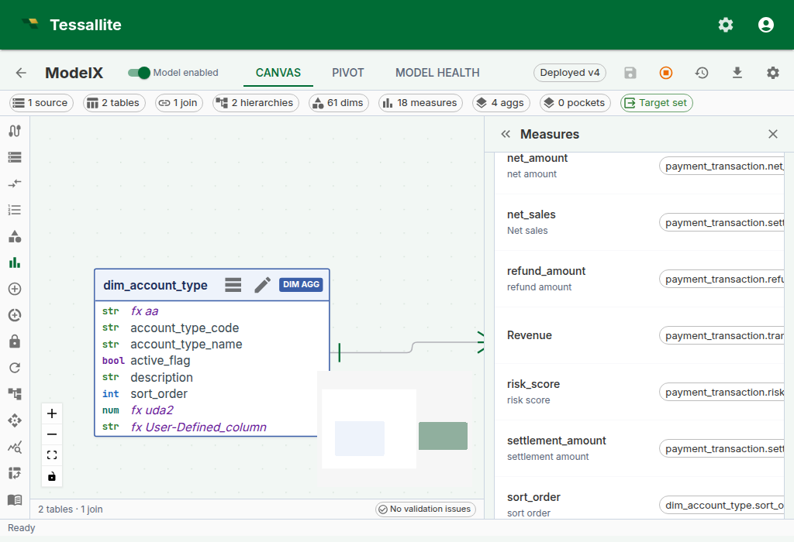
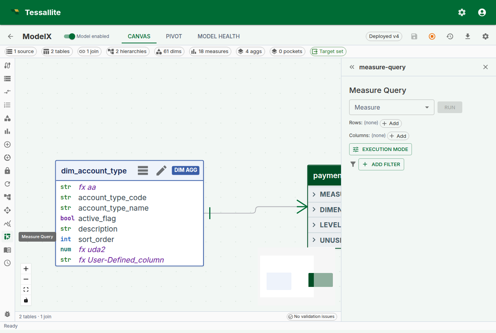
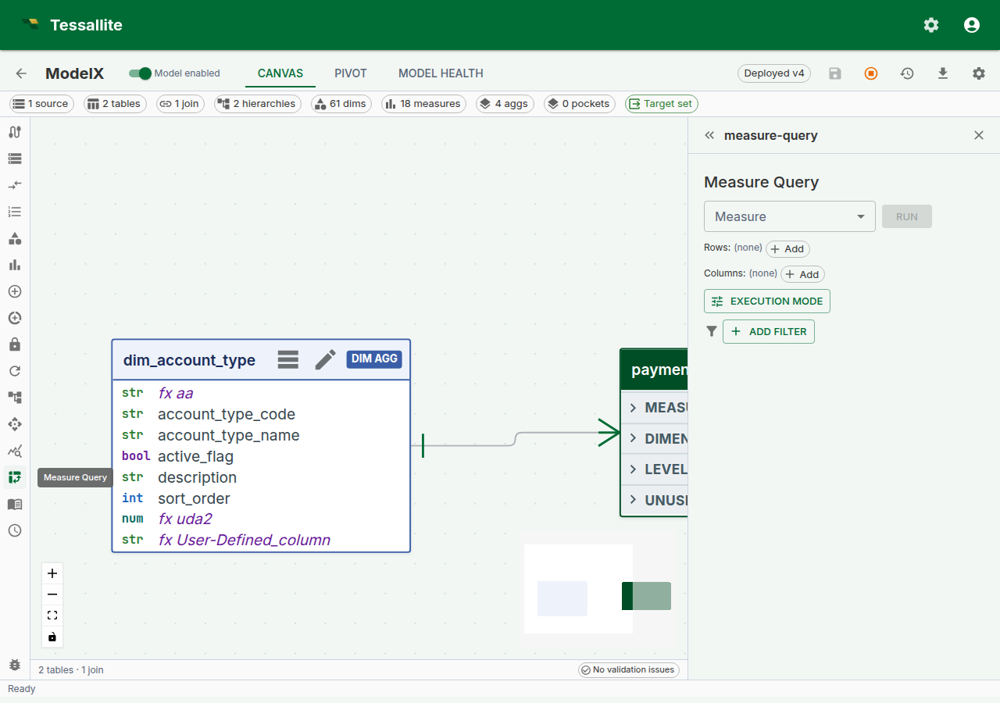

## Why drill-through matters

Every number on every dashboard is a question waiting to be asked. "Revenue for EMEA in Q2 is €4.8M — great, but which orders made up that number?" Without drill-through, answering that question is an IT ticket, a SQL session, and a three-day wait. With drill-through, it's one click.

Drill-through in Tessallite is the bridge from a single aggregated cell to the raw fact-table rows behind it. It answers three questions a business reader always has and should not need to re-ask:

1. **Which rows actually contributed to this number?** (The auditability question.)
2. **Are any of those rows wrong or surprising?** (The trust question.)
3. **Can I export just the rows behind this cell?** (The "build the follow-up deck" question.)

This page explains how drill-through is configured per measure, what exactly comes back when you click a cell, how pagination works so you never freeze the browser on a 10-million-row export, the decomposed drawer used for calculated measures, and the current limits the modeller needs to know.

---

## How drill-through is configured

Drill-through is **not a separate feature you enable**. Every standard measure gets a **drill-through set** automatically the moment it is saved. The set is a tiny configuration object attached to the measure that records four things:

| Field | What it controls | Default |
|---|---|---|
| **Source fact table** | The fact table the measure aggregates. Modellers can override with a finer-grained sibling table; Tessallite asks them to pick a join path back to the original fact when more than one exists. | Auto-detected from the measure. |
| **Detail columns** | Which columns of the source table are returned when drilling. | Every column of the source table. |
| **Joined dimensions** | LEFT-JOINs human-readable dimension columns into the drilled rows (display-prefixed: `customer__name`, `product__category`). | Empty. |
| **Row-limit override** | Caps the page size at a custom value; otherwise the global default applies. | Unset (default 1 000, cap 10 000). |

The reason configuration exists — even though the default "every column" works out of the box — is that fact tables often carry columns you do not want every drill-through consumer to see: internal IDs, PII, audit timestamps that confuse rather than help. The full curation workflow, with all four controls and worked business examples, is documented in [Curate drill-through](curate-drill-through.md).



*Figure 1 — Drill-through configuration on a measure. Leave it at default for "every column". Tighten the detail-columns list when the fact has PII or noise columns. Full description: [drill-through-config-drawer.txt](../assets/screencaps/drill-through-config-drawer.txt).*

---

## What comes back when you click a cell

A drill-through call returns a structured response the frontend renders as a table:

- **`columns`** — the ordered list of column names and their data types. The frontend uses the type to right-align numerics and parse dates.
- **`rows`** — each row is an array of values aligned with `columns`. Values come back typed (numbers as numbers, not strings) so the browser does not re-parse them.
- **`page`** — three opaque pagination fields: `cursor` (where the current page starts), `next_cursor` (what to send for the next page), `has_more` (is there another page).
- **`fact_table`** — the physical name of the fact table rows came from. This is surfaced for transparency — there is no magic middleware reassembling rows from three sources.

Rows are ordered by the first column in the result, always. This is not cosmetic: stable ordering is what makes cursor-based pagination safe. If the ordering drifted between calls, page two could repeat or skip rows from page one.

Literal filter values are **never** concatenated into SQL. Every value is bound as a parameter, which means the endpoint is immune to SQL injection even on a fact table with a column named `"; DROP TABLE orders; --`.



*Figure 2 — A drill-through result in the in-app drawer. Rows are typed, the Route badge explains which engine served them, and pagination lets the analyst walk a result set without freezing the browser. Full description: [drill-through-drawer.txt](../assets/screencaps/drill-through-drawer.txt).*

---

## Calling the endpoint directly

The in-app drawer is the common path, but drill-through is also a stable REST endpoint so a notebook, a Slack bot, or an MCP agent can call it without a UI.

```
POST /api/v1/measures/{measure_id}/drill-through
{
  "filters": [
    { "column": "country", "op": "eq", "value": "DE" }
  ],
  "grouping_levels": [
    { "column": "quarter", "op": "eq", "value": "2024-Q2" }
  ],
  "cursor": null,
  "limit": 500
}
```

`filters` and `grouping_levels` both become `WHERE` predicates. The distinction is semantic:

- **`grouping_levels`** carries the coordinates of the cell you clicked — the dimension values that identify the pivot position. In a pivot with `region` on rows and `quarter` on columns, a click on the EMEA / Q2 cell posts `grouping_levels: [{region: "EMEA"}, {quarter: "2024-Q2"}]`.
- **`filters`** carries any additional global constraints the caller wants to impose on top — for example, a slicer that is set to "only completed orders".

Keeping these separate in the payload (rather than collapsing both into one filter list) matters because the Query Router can validate grouping levels against the model's dimensions before executing — a drill with `grouping_levels: [{not_a_real_dimension: "x"}]` fails with a structured error instead of reaching the database.

**Supported operators** for both: `eq`, `neq`, `gt`, `gte`, `lt`, `lte`, `like`, `ilike`, `in`, `between`, `is_null`, `is_not_null`.

---

## Pagination

Drill-through uses opaque cursor pagination, not offset pagination. This is a deliberate choice.

Offset pagination (`OFFSET 10000 LIMIT 1000`) scans every skipped row on every request — the tenth page scans ten pages of rows before returning one. Cursor pagination uses the last row of the previous page as the `WHERE` anchor for the next page, so every page costs the same regardless of how deep the analyst has walked.

Use it like this:

1. First call: `cursor: null, limit: 500`. The response comes back with `next_cursor: "<opaque-string>"` and `has_more: true`.
2. Second call: pass the `next_cursor` from the previous response back as `cursor`.
3. Keep going until the response returns `next_cursor: null` and `has_more: false`.

The cursor is opaque by design. Do not try to parse it — its shape is implementation detail and will change when the underlying ordering strategy changes.

The per-page limit is clamped at 10 000 rows. The default is 1 000. If you need more than that in one shot, consider whether you really need every row in the browser — drill-through is for investigation, not bulk export. For bulk export, see the CSV/JSON export buttons on the Measure Query Panel grid.

---

## Drill-through on calculated measures

Calculated measures have no single source column, so a straightforward drill-through query would not know which fact table to scan. Since Phase 6 (2026-04-24), clicking a calculated-measure cell opens a **decomposed drill drawer** that handles this by running one drill-through per referenced base measure and stacking the mini-panels.

The drawer shows:

1. A read-only **calculated-value card** at the top with the cell's value and the raw expression, so you can always see what you are drilling into.
2. One **mini drill-panel per referenced base measure**. Each panel is a self-contained drill-through surface with its own 50-row pagination — so you can walk the numerator rows and the denominator rows independently without one disturbing the other.

This trades "one table of rows" for "one table per base measure". In exchange, analysts can answer the follow-up question that otherwise requires running two separate queries: "what are the rows behind the numerator, and what are the rows behind the denominator, for exactly this cell?"



*Figure 3 — A calculated measure's decomposed drill drawer. The numerator and denominator panels paginate independently. Full description: [drill-through-calc-decomposed.txt](../assets/screencaps/drill-through-calc-decomposed.txt).*

---

## When drill-through is not available

Drill-through is deliberately **not** offered for:

- **Composite or multi-fact measures** — a v1 simplification. A measure that aggregates across two joined fact tables has no single "source fact" to drill into; the composite drill-through case will be specified in a future phase.
- **Measures on source systems Tessallite does not yet bind** — PostgreSQL, BigQuery, and Spark / HiveServer2 are all supported as of Phase 8. Other connectors (Snowflake, Databricks SQL Warehouses, etc.) are reserved for later passes; the measure will still return aggregated values normally on those, only drill-through is off.

When drill-through is off, the cell is still clickable in the Measure Query Panel but the drawer opens with a structured error. The error payload includes a stable `error_code` (`DrillThroughUnsupportedComposite`, `DrillThroughConnectorUnsupported`, etc.) so an integration can branch on code rather than parsing the message string.

---

## Worked example — trace a suspicious revenue number

**Context.** A dashboard shows EMEA Q2 revenue at €4.8M. Finance thinks it should be closer to €5.2M. The analyst wants to find the missing ~€400K without waiting for IT.

**Steps.**

1. Open the [Measure Query Panel](measure-query-panel.md). Pick `Revenue` as the measure, `region` on rows, `quarter` on columns. Click **Run**.
2. Click the cell at row `EMEA`, column `2024-Q2`. The drill-through drawer opens with the 312 order lines that contributed.
3. Click the Route badge tooltip. It says `aggregate · rev_by_region_quarter`. So the dashboard reads the aggregate, and the drill-through reads from the source — if they disagree, one of the two is stale.
4. Sort the drawer by `order_date` descending. The most recent row is 2024-03-31. Orders from the final three days of Q2 (2024-06-28, 29, 30) are missing.
5. Run the same query with **Force Live** on (see [Live vs Aggregate](../querying/live-vs-aggregate.md)). The number reads €5.2M — the aggregate is behind. Now the conversation is "refresh the aggregate" rather than "investigate a data bug".

Drill-through did not fix the problem. It made the problem visible in under a minute.

---

## v1 limitations

| Limitation | Impact | Workaround |
|---|---|---|
| Connector coverage | PostgreSQL, BigQuery, and Spark are supported. Other warehouses are not bound to drill-through yet. | For unsupported connectors, query the source directly; aggregation still works |
| No multi-fact joins in drill | The drilled rows come from a single source fact (possibly with the override + join-path expansion documented in [Curate drill-through](curate-drill-through.md)) | Drill each measure separately for cross-fact investigations |
| Per-page limit ≤ 10 000 | Very large drills are paginated, not one-shot | Use the page-aware API, or export the underlying pivot via CSV |

Errors carry stable codes — `DrillThroughUnsupportedCalculated` (now obsolete in the UI since Phase 6 uses the decomposed drawer, still returned by the raw API), `DrillThroughUnsupportedComposite`, `DrillThroughUnknownColumn`, `DrillThroughConnectorUnsupported`, plus the curation-side codes documented in [Curate drill-through](curate-drill-through.md). Integrations should branch on the code, not the human-readable message.

---

## Troubleshooting

| Symptom | Likely cause | Fix |
|---|---|---|
| Cell click returns "DrillThroughUnknownColumn" | A grouping-level column is not projected by the fact table's detail-columns set | Add the column to detail columns, or rebuild the calculated measure to reference a fact that does project it |
| Drill panel shows zero rows on a non-zero cell | The cell was served from an aggregate that rolls up a now-deleted source row; live re-run returns zero | Refresh the aggregate, or use Force Live to confirm source state |
| Drilling on a calculated measure shows only one mini-panel | The calculated expression references only one base measure | Expected — decomposition produces one panel per *distinct* referenced base measure |
| "DrillThroughConnectorUnsupported" on a non-PG / BQ / Spark source | The connector is not bound to drill-through yet | Query the source directly for now; tracked for a later phase |

---

## Related

- [Curate drill-through](curate-drill-through.md) — the modeller-side curation workflow
- [Measure Query Panel](measure-query-panel.md)
- [Calculated Measures](calculated-measures.md)
- [Live vs Aggregate](../querying/live-vs-aggregate.md)

---

← [Live vs Aggregate](../querying/live-vs-aggregate.md) | [Home](../index.md) | [Curate drill-through →](curate-drill-through.md)
