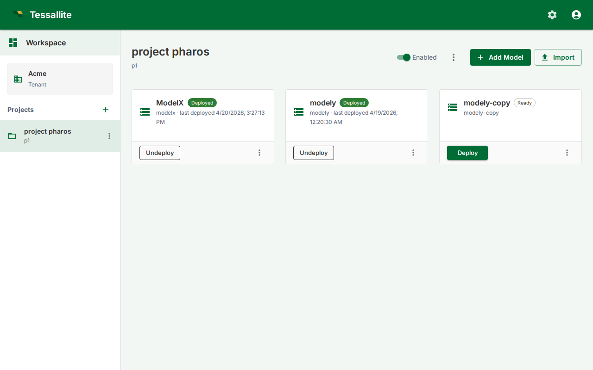

## What this covers

You can export any model as a single JSON file and import it into the same project, a different project in the same tenant, or a different tenant entirely. Connections never travel — credentials stay in the source database — so on import you pick local connections to rebind the model to. This article covers the export download, the import dialog, and how connections are remapped.

---

## Before you start

- To export, you need access to the source model.
- To import, you need access to the target project and at least one connection of each type referenced by the bundle (one Postgres connection per Postgres source, one BigQuery target per BigQuery target, etc.).
- Connections must already exist in the target project. If you do not have them, create them via **Connections** before importing.

---

## Exporting a model

1. Open the Model Builder for the model you want to export.
2. On the toolbar, click the **Export** button (down-arrow into tray icon).
3. Tessallite downloads a file named `{model_slug}.tessallite.json` to your browser's download folder.
4. The file is a single JSON document containing every per-model row — tables, columns, joins, hierarchies, dimensions, measures, aggregates, refresh policies, AI scheduler config, model settings, and the canvas layout.

The file does **not** contain credentials, query history, miss logs, alerts, or anything stored at tenant, project, or system scope.

---

## Importing a model

1. From the Explorer, select the project you want to import into.
2. Click the **Import** button next to **Add Model**.
3. In the dialog, click **Choose .tessallite.json file** and pick the export file.
4. The dialog reads the bundle and shows:
   - The original model's slug and display name (you can override either).
   - Every connection referenced by the bundle, with the source's display name and connection type.
5. For each referenced connection, pick a local connection from the dropdown. Only connections of the matching type appear.
6. Optionally tick **Deploy immediately after import** to save v1 and deploy in one click.
7. Click **Import**. Tessallite creates a new model in the target project, rewrites every internal UUID, rebinds the connections, and (if you ticked Deploy) saves and deploys v1.
8. The Explorer navigates to the new model.

If the source slug already exists in the target project, Tessallite auto-suffixes (`sales`, `sales-2`, `sales-3`).

---

## What is and is not in an export

| In the export | Not in the export |
|---|---|
| Tables, columns, joins, hierarchies, UDAs | Connection credentials |
| Dimensions, measures | Source data, target data |
| Aggregate definitions and refresh policies | Query logs, miss logs, alerts |
| Per-model AI scheduler config and model settings | System / tenant / project settings |
| Canvas layout (table positions, viewport) | Deployed-version pointer (the import always starts undeployed) |

---

## Tips

- Export is the supported way to move a model between environments (dev → staging → prod). The bundle is stable JSON, safe to commit to git.
- Connection rebinding is mandatory. The importer refuses to proceed if any source or target has no mapping.
- Re-imports do not merge — every import creates a brand-new model with a fresh slug and fresh internal UUIDs.

---

## Related articles

- [Save and Version a Model](save-and-version-a-model.md)
- [Deploy a Model](deploy-a-model.md)
- [Add a Data Source](add-a-data-source.md)

---

← [Deploy a Model](deploy-a-model.md) | [Home](../index.md) | [Export and Import a Project →](export-and-import-a-project.md)
