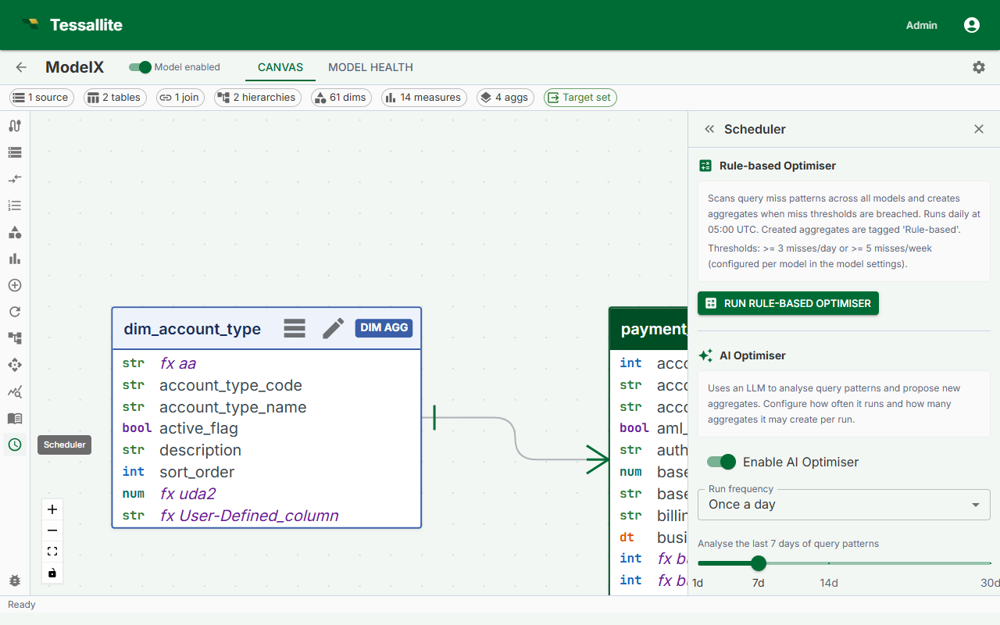

## What this covers

Aggregate schedules control when the Scheduler service refreshes each aggregate. This article explains the two places where schedules are managed, how to write and use cron expressions, how to pause a schedule, and what the Stale status means.

---

## Two places to manage schedules

### Option 1: Canvas → Drawer

1. In Model Builder, locate the aggregate in the Canvas.
2. Click the aggregate to select it.
3. In the Drawer, find the **Refresh Schedule** field.
4. Enter a cron expression or select a preset.
5. Click **Save**. The new schedule takes effect at the next scheduled run time.

### Option 2: Scheduler panel

1. From the workspace sidebar, click **Scheduler**.
2. The Scheduler panel opens, showing all aggregates across all models in the workspace.
3. Locate the aggregate by model or aggregate name, then click its schedule field to edit it inline.
4. Click **Save**.

---

## Scheduler panel columns

| Column | Description |
|--------|-------------|
| Model | The model this aggregate belongs to. |
| Aggregate name | The name assigned to the aggregate in Model Builder. |
| Last refreshed | Timestamp of the most recent completed refresh run. |
| Next scheduled | When the Scheduler will next attempt a refresh. |
| Status | Ready, Building, Stale, or Paused. |
| Actions | Run now, Pause / Resume, Edit schedule. |

---

## Cron expression reference

Tessallite uses standard five-field cron syntax: `minute hour day-of-month month day-of-week`.

| Preset | Cron expression | Meaning |
|--------|----------------|---------|
| Hourly | `0 * * * *` | Runs at the top of every hour. |
| Daily at 02:00 | `0 2 * * *` | Runs once per day at 2:00 AM. |
| Weekly on Sunday 03:00 | `0 3 * * 0` | Runs once per week, Sunday at 3:00 AM. |
| Every 15 minutes | `*/15 * * * *` | Runs at :00, :15, :30, and :45 past every hour. |

All times are evaluated in UTC unless the server's `SCHEDULER_TZ` environment variable is set to an IANA timezone identifier.

---

## Pausing a schedule

In the Scheduler panel, click the **Active** toggle to switch it off. The aggregate retains its data and continues to serve queries, but the Scheduler will not attempt any further refreshes until the toggle is switched back on. A paused aggregate displays status **Paused** in the panel.

---

## Running a refresh immediately

In the Scheduler panel, click **Run now** in the Actions column. The aggregate's status changes to **Building** for the duration of the run. This does not affect the regular schedule.

---

## Viewing refresh history

1. In the Scheduler panel, click the aggregate name.
2. A history drawer opens showing the last 10 refresh runs.
3. Each entry shows start time, duration, and outcome (Success or Failed).
4. For failed runs, click **View log** to see the full Scheduler log for that run.

---

## Stale status

An aggregate is marked **Stale** when its last successful refresh completed more than twice the schedule interval ago. Stale aggregates continue to serve queries using their existing data, but the data may be older than expected.

---

## Related

- [Use the AI Optimiser](use-the-ai-optimiser.md)
- [Configure Aggregates](configure-aggregates.md)
- [Run a Refresh](run-a-refresh.md)
- [Workspace Settings](../admin/workspace-settings.md)

---

← [Use the AI Optimiser](use-the-ai-optimiser.md) | [Home](../index.md) | [Create a Workspace →](../admin/create-a-workspace.md)
