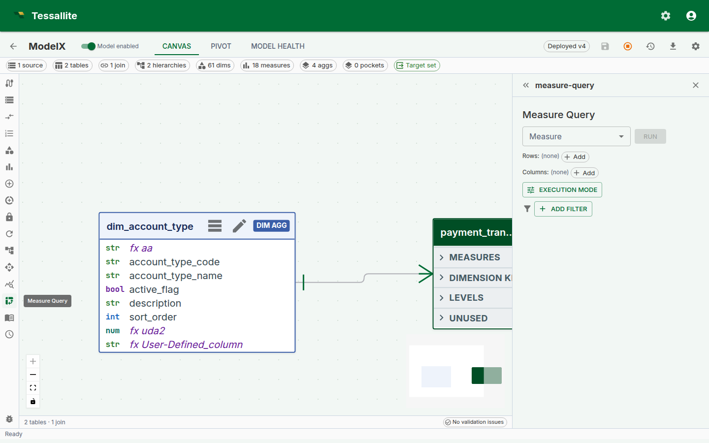
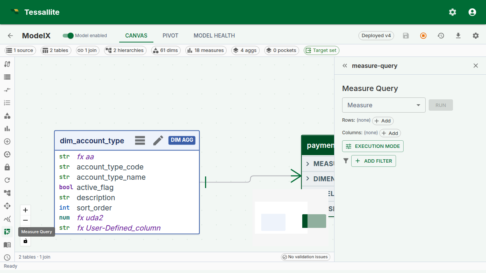
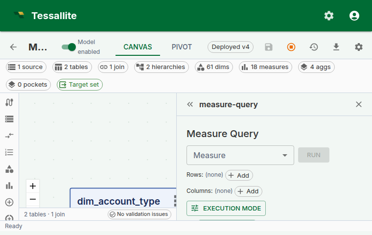

## Why this panel exists

A semantic layer lives or dies by the moment a modeller defines a new measure and checks whether it agrees with the business's mental model. Without a sanity-check surface inside the product, that check happens in Excel, in a notebook, or worse — in a dashboard a week later when the VP asks why the number is wrong.

The **Measure Query Panel** is Tessallite's answer to that moment. It is a minimal, opinionated pivot grid embedded directly inside Model Builder. One measure, up to two dimension axes, totals, a Route badge, and click-to-drill. It is not meant to replace a full BI canvas — it is meant to let a modeller answer "does this measure do what I think it does?" without leaving the app.

Since Phase 6, the panel grew into a small working pivot: **multi-row and multi-column dimension nesting**, **subtotals and grand totals**, **client-side sort**, **one-click variant addition** (YTD, PY, YoY without writing them), **slicer chips**, **inline format editing**, **CSV and JSON export**, and a **Route badge** that tells you which engine served the query. All of these are scoped so the panel remains a sanity-check tool, not a dashboard-builder.

This page walks through what the panel can and cannot do, how the three dropdowns combine, why the Route badge matters, and a worked example from measure definition to drill-down.



*Figure 1 — The full panel. Everything the modeller needs to sanity-check a measure sits in one frame. Full description: [measure-query-panel-overview.txt](../assets/screencaps/measure-query-panel-overview.txt).*

---

## Before you start

- The model must have at least one deployed measure. Calculated measures are welcome — the panel handles drill-through for them specially (see below).
- At least one dimension is typical but not required — a "just the measure" query collapses to a single-cell result, which is a useful sanity check for "does the measure return anything at all?".
- If the measure is time-aware and you want to add variants (YTD, YoY, etc.), the model must have a configured calendar table. See [Configure Calendar Table](configure-calendar-table.md).

---

## The three-dropdown shape

The panel has three primary dropdowns and two toggles. This shape is intentional: every BI tool in the world overloads the "row / column / filter" choice with nine other decisions, and every business user spends the first five minutes with a new tool trying to work out what they are being asked. Tessallite's panel keeps the choice to the irreducible three.

| Dropdown | What it does | Can be empty? |
|---|---|---|
| **Measure** | Picks the single measure whose values fill the cells. Standard or calculated, optionally a time variant. | No — a pivot without a measure is a dimension list, not a pivot. |
| **Row dimensions** | One or more dimensions that appear as rows. Multiple dimensions nest top-down — outermost first. | Yes — the grid collapses to a single row. |
| **Column dimensions** | One or more dimensions that appear as columns. Multiple dimensions nest left-to-right. | Yes — the grid collapses to a single column. |

Plus two toggles:

- **Subtotals / grand totals** — show roll-up rows and columns. Off by default to keep the grid easy to scan for the sanity-check use case; on for anything headed toward a report.
- **Force Live** — bypass aggregate and pocket matchers and run against the source. Covered in [Live vs Aggregate](../querying/live-vs-aggregate.md).

If both row-dimensions and column-dimensions are empty, the grid renders a single cell with the measure's overall value. This is the fastest way to answer "is this measure even wired up?".

---

## Multi-dimension nesting

Since Phase 6, row and column dimensions both accept multiple selections. Nesting reads **outermost first** on rows and **leftmost first** on columns:

```
Row dimensions:    region, quarter
Column dimensions: product_category

          | Furniture | Electronics | Grocery | (grand)
----------+-----------+-------------+---------+--------
EMEA      |           |             |         |
  Q1      |   120 000 |     80 000  |  60 000 | 260 000
  Q2      |   140 000 |     90 000  |  70 000 | 300 000
  total   |   260 000 |    170 000  | 130 000 | 560 000
NA        |
  Q1      |   220 000 |    160 000  | 110 000 | 490 000
  ...
```

Subtotals appear on the second-and-beyond row levels (one per outer-level value). Grand totals are always the last row and last column. The header depth scales with the number of nested dimensions.

**Why outermost-first and not some other order.** Reading top-down matches the way finance tables are taught at school and read by stakeholders. The alternative (innermost-first) is mathematically identical but reads "by quarter, within region" where stakeholders expect "by region, then by quarter". Tessallite picks the convention that matches the reader, not the query planner.

---

## The Route badge

Every executed query shows a Route badge above the grid. The badge text is one of `aggregate`, `pocket`, or `live`. Hover the badge and a tooltip shows the routing reason — which aggregate / pocket matched, or why no match was found.

The Route badge is the single most useful piece of information on the panel when something looks wrong. A cell value that surprises you almost always has one of three origins:

1. **The measure is wrong.** Rare once the measure is saved cleanly — the DSL validator catches most of this.
2. **The aggregate is stale.** Common. The badge reads `aggregate`, the number is the one from when the aggregate last built, and the source has moved since.
3. **The slicer is filtering more than you remember.** Common. The badge does not tell you this directly, but the row / column totals do — if the grand total looks too small, check the slicer chips.

See [Live vs Aggregate](../querying/live-vs-aggregate.md) for a full walkthrough of the three routes and when to Force Live.

---

## One-click variants

A measure that knows about time (measures with a configured time grain) grows a **+ Variant** button on the Measure dropdown. Clicking it reveals a row of chip options — YTD, MTD, QTD, PY, MoM, QoQ, YoY, LTM — each of which becomes a first-class measure column when clicked. No SQL, no new measure definition, no calculated-measure wrestle.



*Figure 2 — One-click variants. Each chip adds a measure column. The tooltip on each chip spells out the exact formula so analysts can audit what "YoY" means in this model. Full description: [measure-query-panel-variants.txt](../assets/screencaps/measure-query-panel-variants.txt).*

Under the hood, the variant is rewritten to a SQL expression using the model's calendar table — Tessallite does not create persistent measures for variants, so the measure catalog stays clean. If a modeller uses the same variant frequently enough to want it catalogued, it can be promoted to a named calculated measure via the Measures panel.

**A modelling note.** Variants only make sense on additive measures. A "Gross margin % YoY" is a ratio of ratios and almost always misleading — Tessallite will let you compute it, but the chip tooltips show the raw formula so the analyst can see what they are asking for.

---

## Slicer chips

Slicer chips sit below the Route badge and function as global `WHERE` predicates on the whole grid. Each chip is one predicate — `region in (EMEA, APAC)`, `year = 2024`, `channel != marketplace` — and every chip is AND'd. A click on a chip's body opens an edit popover; a click on the X removes the chip.

The design intent is that slicers carry **global context** and the row / column dropdowns carry **what you are slicing by**. Mixing the two is the most common first-week mistake for a business user — they put a single-value dimension on rows, see one row, and wonder why. The slicer bar is always at the bottom so "what's constraining my result" is one glance away.

---

## Inline format editing

Every measure carries a format. The format is what turns `1234567.891` into `€1,234,567.89` or `1.23M`. Since Phase 6, the column-header chip on the grid carries the current format and opens an editor popover on click.



*Figure 3 — The inline format editor. Changes can be scoped to this column only, or promoted onto the measure itself for everyone. Full description: [measure-query-panel-format-editor.txt](../assets/screencaps/measure-query-panel-format-editor.txt).*

Two scopes sit at the bottom of the editor:

- **Apply to this column only.** A temporary override that lives in the panel state. Closing and reopening the panel resets it.
- **Save on measure.** Promotes the format onto the measure definition. Every surface — BI tool, MCP agent, other modeller — sees the new format on the next query.

The presets cover 95% of business-display needs; the tail (custom suffix strings, dynamic currency from a column) is not in v1 and is deferred to a future phase.

---

## Client-side sort

Any column header can be clicked to sort the grid. Sort is client-side — the data in the grid is already present, and re-sorting does not re-run the query. This matters because a sort of a 720-row grid is instant, but a sort that re-queries would not be on most warehouses.

Sorting is stable across pagination within the grid view (for large result sets). The Route badge and chips are unaffected by sort.

---

## Export

The **Export** split-button offers CSV and JSON. Both exports contain the same rows that are currently on the grid — they honour subtotals, sort order, and the active slicers. XLSX export is deferred to a future phase; the user need is covered by "export CSV, open in Excel" in the interim.

---

## Drill-through on calculated measures

Calculated measures were previously not drillable from the panel. Since Phase 6, clicking a calculated-measure cell opens a **decomposed drill drawer** that fires one drill-through per referenced base measure and stacks the mini-panels — each paginating independently at 50 rows per page. See the [Drill-through](drill-through.md) page for the full description. The key point for the panel is that **every cell is clickable** — there is no longer an "oh, calculated measures don't drill" asterisk.

---

## Worked example — sanity-check a new calculated measure

**Context.** A modeller just defined `gross_margin_pct` as a calculated measure. They want to confirm it reads sensibly before inviting finance to the model.

**Steps.**

1. Open **Model Builder** → **Measure Query** in the Toolbelt.
2. Pick `Gross margin %` as the measure. Leave row and column dimensions empty.
3. Click **Run**. Expected result: a single cell with an overall percentage value. If it is `NULL`, the denominator is zero at the global grain — usually a sign that the base measure `net_sales` has no data, not that the calculated expression is broken.
4. Add `region` as a row dimension. Click **Run**. Expected result: one percent per region, values in the 20-40% band for a typical retail model. If one region reads 300%, the calculated expression is probably in the wrong mode — switch to `expression_as_written` (see [Calculated Measures](calculated-measures.md)).
5. Add `quarter` as a column dimension. Click **Run**. The grid now reads regions × quarters.
6. Enable subtotals. Confirm subtotals make financial sense — each region's "total" column should read as the overall margin for that region, not a sum of percentages.
7. Click any cell to open the decomposed drill drawer. Confirm the numerator and denominator rows match what you expect.
8. If the number is surprising, click the Route badge. If it reads `aggregate`, turn **Force Live** on, re-run, and compare. A matching number confirms the aggregate is fresh; a different number says refresh the aggregate.

The whole loop takes under two minutes. The measure is then safe to expose to a BI tool.

---

## Scope and limitations

| Feature | v1 | Future |
|---|---|---|
| Single measure per view | Yes | Multi-measure layout deferred to the Phase 8 canvas. |
| Multi-row / multi-column dimensions | Yes (Phase 6) | Cross-tab hierarchy with drill-down on rows deferred. |
| Global slicers | Yes (Phase 6) | Saved slicer presets deferred. |
| Subtotals + grand totals | Yes (Phase 6) | Alternate total functions (averages, medians of subtotals) deferred. |
| Variants (YTD, YoY, etc.) | Yes (Phase 6, built on Phase 2 time intelligence) | Custom user-defined variant formulas deferred — use a calculated measure in the interim. |
| CSV + JSON export | Yes (Phase 6) | XLSX export deferred. |
| Saved views | No | Deferred; use a calculated measure or a pocket to persist a layout. |

---

## Troubleshooting

| Symptom | Likely cause | Fix |
|---|---|---|
| "Run" button greyed out | No measure selected | Pick a measure; dimensions alone are not a query |
| Grid empty after Run | Slicer chips exclude every row | Check the chip row below the Route badge; remove the offending chip |
| Cell values look right but totals look wrong | Subtotals off while dimension nesting on | Enable the subtotals toggle |
| Variant chip missing on a time-aware measure | Calendar table not configured on the model | Run through [Configure Calendar Table](configure-calendar-table.md) |
| Cell click on calculated measure errors | Very old frontend cache | Hard-refresh; Phase 6 shipped the decomposed drawer |

---

## Related

- [Calculated Measures](calculated-measures.md)
- [Drill-through](drill-through.md)
- [Live vs Aggregate](../querying/live-vs-aggregate.md)
- [Configure Time Variants](configure-time-variants.md)
- [Configure Calendar Table](configure-calendar-table.md)

---

← [Model Canvas Tour](model-canvas-tour.md) | [Home](../index.md) | [Live vs Aggregate →](../querying/live-vs-aggregate.md)
