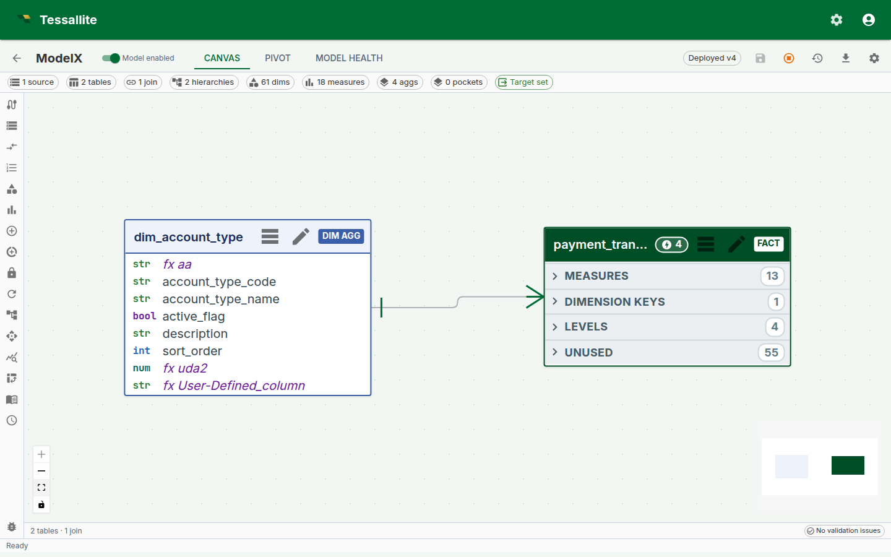
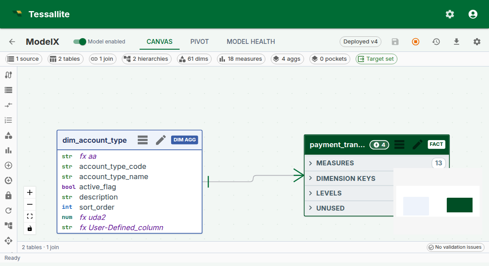
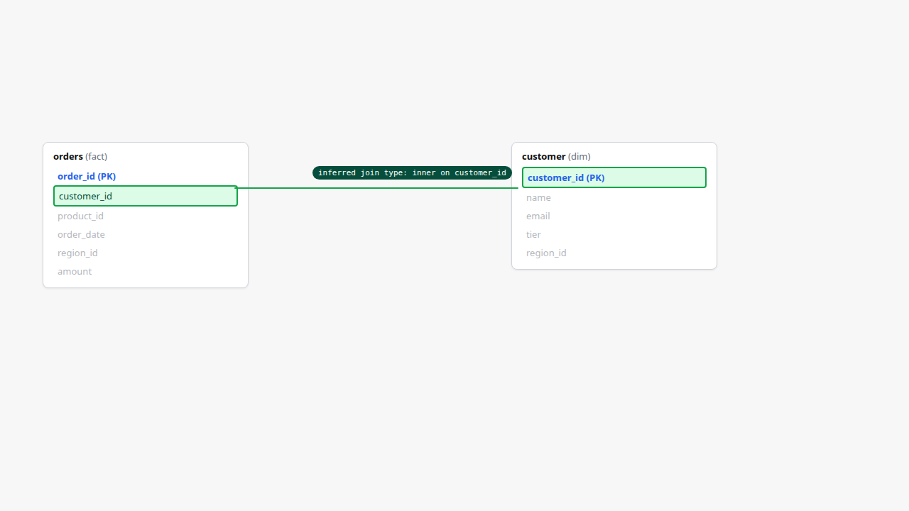
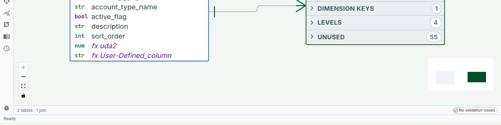

## Why the canvas matters

A semantic model is a graph. It has fact tables, dimension tables, joins between them, hierarchies inside the dimensions, and performance artefacts (aggregates, pockets) attached to the facts. Every popular BI tool represents this graph as a list of clickable things in a left sidebar — which works for a five-table model and falls apart at fifty tables.

The **Model Canvas** is Tessallite's answer: a single graph view that shows the model as it actually is. A fact at the centre, dimensions around it, joins as labelled lines, overlays showing which facts have aggregates or pockets, hierarchies rendered inline on dimension nodes, a minimap for large models, and a status bar for "is anything broken right now". It is the default view on Model Builder — before a modeller defines a dimension or a measure, they see the model.

Phase 6.A pushed the canvas from a read-only diagram into a working authoring surface. This page walks through every surface element and the gestures that ship with it: fact-node column segmentation, minimap navigation, hierarchy overlays, aggregate and pocket chips, drag-to-join v2, and the model-health status bar.

*Figure 1 — The canvas as a single frame. Everything the modeller needs to orient themselves in an unfamiliar model is on this one surface. Full description: [canvas-overview.txt](../assets/screencaps/canvas-overview.txt).*

---

## The fact node

A fact node is a rectangle with three horizontal column segments:

- **Measures (blue strip).** Every measure the model defines over this fact. This is what a BI tool would call "the numbers".
- **Dimensions in use (green strip).** Every column on the fact that participates in a join to a dimension table. This is what a BI tool would call "the slicers".
- **Unused (grey strip, collapsed by default).** Every other column on the fact — internal IDs, audit timestamps, source-system scaffolding. Collapsed because they are rarely interesting, but available at one click when they are.

The three-segment split is not cosmetic. It encodes a decision: when a modeller opens an unfamiliar model, the first three questions they ask are "what does this fact measure?", "what can I slice it by?", and "is there anything else in it?". The canvas puts each answer on its own strip.

**Column cells are interactive.** Click a column in the Dimensions strip to open the join it participates in. Click a column in the Measures strip to open the measure's form. Click a column in the Unused strip to optionally promote it (to a new measure, a new dimension, or to hide it permanently from the view).

---

## Dimension nodes and hierarchies

Dimension nodes are smaller rectangles rendered around the fact. Each shows the dimension's columns in a single list (no three-segment split — dimensions are simpler).

Dimension nodes that participate in a **hierarchy** render the hierarchy inline as a chain of connected pills above the column list — `year → quarter → month → day` for a date dimension, `country → region → city` for a geography. The chain shows the distinct-value count on each level so a modeller can see at a glance whether the hierarchy has the fanout they expect (5 years, 20 quarters, 60 months — or is one of those unexpected?).

*Figure 2 — The hierarchy overlay on a date dimension. Explicit, visible, queryable — not hidden metadata. Full description: [canvas-hierarchy-overlay.txt](../assets/screencaps/canvas-hierarchy-overlay.txt).*

**Why render the hierarchy on the node.** Hierarchies are the single most common source of "why is my drill-down not working" in BI tools. Most tools hide the hierarchy in a settings panel three clicks deep. Putting it on the node means "does this dimension have a drill-down path?" is answerable by looking, not clicking.

Click any pill to open the hierarchy editor. Click-to-drill in the pivot surface walks this same chain.

---

## Joins — the labelled lines

Joins between fact and dimension nodes are rendered as labelled lines. The label reads `fact.column = dimension.column`. The line's thickness hints at join cardinality (thicker for fan-in; thinner for many-to-many).

Double-click a line to open the join drawer. Right-click to disable, inspect, or delete.

### Drag-to-Join v2

A new join is authored by dragging from a column cell on one node to a column cell on another:

1. Click-and-hold on a fact-node column (e.g. `orders.customer_id`).
2. Drag toward the target dimension node. As you cross the boundary, every non-matching column on the target is dimmed; matching columns (by name and type) get a green acceptance ring.
3. Release on the target column. Tessallite infers the join cardinality (usually `many_to_one` for fact-to-dimension) and opens the join drawer pre-filled so the modeller can confirm or adjust.

*Figure 3 — Drag-to-Join v2. Joins are authored from data, not from a dropdown. Full description: [canvas-drag-to-join.txt](../assets/screencaps/canvas-drag-to-join.txt).*

The v2 gesture replaces the earlier right-click → "New join" → two-dropdown flow. It is optimised for the common case (fact-to-dimension by shared column name) and falls back cleanly to the manual path for the uncommon (different column names on each side).

---

## Aggregate and pocket overlay chips

Fact nodes carry **overlay chips** in the top-right corner showing every aggregate and every pocket attached to the fact. Each chip carries the artefact name and a type indicator (`agg` for aggregate, `pocket` for pocket). Hover a chip and a popover shows the grain, measures, freshness, and last-build status.

The chips are there because "does this fact have performance artefacts already?" is the question a modeller asks on every new model, and the wrong answer — "I thought there was an aggregate and there isn't" or "I defined one and now I can't find it" — loses a lot of time.

**Chip states:**

- **Green** — aggregate / pocket is up-to-date against the source.
- **Amber** — stale (last build is older than the refresh schedule expects).
- **Red** — failed to build; click the chip for the build error.

Click a chip to open the aggregate or pocket configuration drawer for that artefact.

---

## Minimap

The minimap sits anchored bottom-right of the canvas. It renders the whole model in a reduced 280x180 px frame, with node rectangles colour-coded (fact blue, dimension green, pocket violet). A yellow rectangle inside the minimap shows the current viewport.

**Interactions:**

- **Click anywhere** on the minimap to pan the main canvas to that point.
- **Click-and-drag** inside the yellow rectangle to scrub the viewport around the model.
- **Toggle** the minimap off with the minimap icon in the status bar (small models rarely need it).

The minimap is the feature that makes a 50-table model practical. Without it, "where is the customer dimension again?" is a scroll-and-hunt; with it, it's a one-click jump.

---

## Canvas status bar

A slim status bar stretches across the bottom of the canvas. Six badges, each a summary of one facet of model health:

| Badge | What it means |
|---|---|
| `N tables` | Total fact and dimension tables on the model. |
| `N joins` | Active joins. Disabled joins are excluded. |
| `N aggregates (M stale)` | Total aggregates; `stale` count is amber if any aggregate is behind schedule. |
| `N pockets` | Total pockets. |
| `health: green/amber/red` | Overall health rollup — green if no amber or red facets; amber if any aggregate is stale or any join has a warning; red if any artefact failed to build. |
| `last saved N min ago` | Time since the last save of the model definition. |

*Figure 4 — The navigational overview (minimap) and the health-at-a-glance bar. Full description: [canvas-minimap-and-status.txt](../assets/screencaps/canvas-minimap-and-status.txt).*

Click any badge to jump to the matching panel — the aggregates badge opens the Aggregates panel, the joins badge opens a join list, etc. This is the "one-glance → one-click → fix" loop the canvas is designed around.

---

## Layout and persistence

The canvas supports:

- **Pan.** Click-and-drag empty canvas to pan. Two-finger trackpad also pans.
- **Zoom.** `Ctrl/Cmd + scroll`, `+` / `-` keys, or the zoom-to-fit and zoom-100% icons in the status bar.
- **Layout.** Node positions are saved on the model. The first time a model is opened, Tessallite auto-lays-out using a star-schema radial layout. After that, every move the modeller makes is persisted.
- **Zoom-to-fit.** The zoom-to-fit icon restores the view to "whole model in frame". Helpful after a deep zoom into one node.

Layouts are per-model, not per-user — every modeller on the same model sees the same layout. This is a deliberate trade-off: shared layouts make conversations about the model easier ("the customer dim on the top-right"). If two modellers disagree about layout, the last save wins.

---

## Worked example — first 60 seconds in an unfamiliar model

**Context.** A new modeller has just been added to the `retail_demo` workspace. They have never seen this model before. Here is what the canvas tells them in the first minute:

1. **The status bar** reads "5 tables · 3 joins · 2 aggregates (1 stale) · 1 pocket · health: amber · last saved 2 min ago". So the model is small, someone is actively editing it, and one aggregate is behind.
2. **The fact node** is `orders`. Its Measures strip shows `revenue`, `margin`, `quantity`. Its Dimensions-in-use strip shows `region_code`, `product_id`, `order_date`. No ambiguity about what the model is about.
3. **The date dimension** shows a hierarchy chain `year → quarter → month → day` with counts `5 / 20 / 60 / 1 826`. The model covers five years of daily data.
4. **The orders fact** has two chips — a green `agg · rev_by_region_quarter` and an amber `agg · margin_by_product_month`. The amber one is the stale aggregate the status bar mentioned. Click it → the drawer shows "last built 4 days ago, schedule is daily". Decide: refresh now, or tighten the schedule.
5. **The minimap** shows the whole graph. Four dimensions radiating from one fact. Familiar shape; no surprises.

Under one minute. The modeller has the shape, the coverage, and the one open question (the stale aggregate) without opening a single panel.

---

## Keyboard shortcuts

| Key | Action |
|---|---|
| `Space + drag` | Force-pan (useful when cursor is over a node) |
| `Ctrl/Cmd + scroll` | Zoom |
| `0` | Zoom to fit |
| `1` | Zoom to 100% |
| `M` | Toggle minimap |
| `H` | Toggle hierarchy overlay on all dimension nodes |
| `/` | Focus the canvas search (jumps to a named table) |
| `Esc` | Close the active drawer or popover |

---

## Troubleshooting

| Symptom | Likely cause | Fix |
|---|---|---|
| Canvas renders empty on a populated model | Browser canvas-layout cache is behind a recent model change | Hard-refresh; layout re-runs once |
| Drag-to-join never lands | Source and target columns have incompatible types | Check types; Tessallite refuses a join where the types would silently cast |
| Stale aggregate chip does not clear after refresh | Frontend cache; the refresh completed on the server | Re-open the model; chip state is recomputed on panel mount |
| Hierarchy overlay missing on a dimension that should have one | Hierarchy not yet configured on the dimension | Open the dimension → add levels → save |
| Minimap viewport rectangle doesn't match view | Very rare; a layout regression | Report it; workaround is to toggle minimap off/on |

---

## Related

- [Add Tables to a Model](add-tables-to-a-model.md)
- [Define Joins](define-joins.md)
- [Define Dimensions](define-dimensions.md)
- [Configure Aggregates](configure-aggregates.md)
- [Configure Pocket Tables](configure-pocket-tables.md)
- [Measure Query Panel](measure-query-panel.md)

---

← [Calculated Measures](calculated-measures.md) | [Home](../index.md) | [Measure Query Panel →](measure-query-panel.md)
