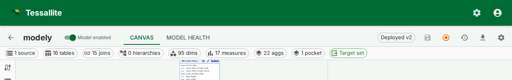

## What this covers

Every change you make in the Model Builder — adding a table, defining a join, editing a measure — lives in the live model state immediately. **Save** captures that state as an immutable version row, so you can roll back to it later or redeploy it without rebuilding the change. This article covers when to save, what the version history shows, and how to revert.

---

## Before you start

- You must be able to edit the model. See your project access role in **Tenant Admin → Project Access**.
- Save and Versions buttons appear on the Model Builder top toolbar, next to the model name.

---

## Saving a version

1. Open the Model Builder for any model.
2. Make whatever edits you intend (add a table, edit a measure, drag table cards on the Canvas).
3. The status chip on the toolbar reads **Edited** with an amber dot whenever the live state differs from the last saved version.
4. Click the **Save** button (disk icon). Tessallite snapshots the entire per-model state — tables, columns, joins, dimensions, measures, hierarchies, UDAs, aggregate definitions, refresh policies, AI scheduler config, model settings, and the canvas layout — into a new version row.
5. The status chip switches to **Saved v{N}** and the dot turns off.

---

## Viewing version history

1. On the toolbar, click the **Versions** button (clock icon).
2. The Versions dialog lists every saved version with version number, who saved it, when, and an optional summary.
3. The version that is currently deployed shows a green badge.

---

## Reverting to an older version

> Reverting deletes every newer version. There is no undo.

1. Open the Versions dialog.
2. Find the version you want to roll back to and click **Revert**.
3. Type `revert to v{N}` in the confirmation box (where N is the version number) and click **Revert**.
4. Tessallite replaces the live state with the chosen version's snapshot and deletes every newer version row.
5. Aggregate definitions that exist in the live state but not in the chosen snapshot are marked **retired**; the next retirement sweep drops their physical tables.
6. If the model was deployed when you clicked Revert, the deploy pointer is retargeted to the version you reverted to and `last_deployed_at` is refreshed. Query routing and the XMLA gateway switch to the reverted shape immediately. Models that were undeployed stay undeployed.

---

## What is and is not in a version

| In the version | Not in the version |
|---|---|
| Tables, columns, joins, hierarchies, UDAs | Project connections (credentials never leave the source DB) |
| Dimensions, measures | System / tenant / project settings |
| Aggregate definitions and refresh policies | Query logs, miss logs, alerts |
| Per-model AI scheduler config and model settings | Deployment pointer (lives separately on the model row) |
| Canvas layout (table positions, viewport) | |

---

## Tips

- Click Save before any large refactor — having a clean rollback target is cheaper than reconstructing the change.
- Use the optional summary on Save to record *why* the change was made; the field is plain text and travels with the version row.
- The first time you click Save on an existing model, version 1 captures the current live state.

---

## Related articles

- [Deploy a Model](deploy-a-model.md)
- [Export and Import a Model](export-and-import-a-model.md)
- [View Model Lineage](view-model-lineage.md)

---

← [Manage Aggregate Schedules](manage-aggregate-schedules.md) | [Home](../index.md) | [Deploy a Model →](deploy-a-model.md)
