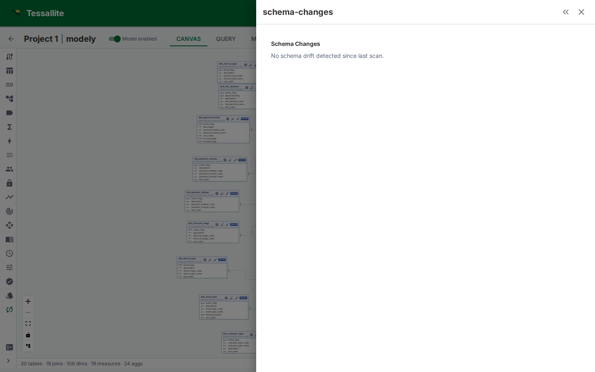

## What this covers

The Schema Changes panel compares the source schema with the version of that schema currently stored in the model. It is the review surface for drift: added columns, removed columns, type changes, and source objects that no longer match the semantic model.

## Why it matters

A semantic model is only reliable while its source bindings are reliable. If a source column is removed, a measure may become invalid. If a data type changes, a dimension may still compile but produce different grouping or sorting behavior. Schema Changes gives the modeller a controlled review step before syncing those changes into the model.

## Reading the panel

| Field | Meaning |
|---|---|
| Table | Model table whose physical source changed. |
| Change type | Added column, removed column, renamed column, type change, or metadata-only change. |
| Column | The affected source column. |
| Impact | Whether dimensions, measures, joins, data tags, row-security rules, or downstream assets depend on it. |
| Action | Import, acknowledge, review, or fix the affected model object. |

## Recommended workflow

1. Open Model Builder and click **Schema Changes** in the toolbelt.
2. Review removed and type-changed columns first. These are most likely to break queries.
3. For a removed column, check whether it backs a measure, dimension, row-security rule, data tag, or drill-through set.
4. For an added column, decide whether to import it, hide it, tag it, or leave it out of the model.
5. After syncing columns, re-run validation from Model Health.
6. If the changed column is used by dashboards or jobs, check [Impact Analysis](impact-analysis.md) before renaming or deleting semantic objects.

## What not to do

Do not blindly sync every new source column into the business catalogue. New columns are visible to modellers, and if promoted into dimensions or measures they can reach BI users. Review sensitivity first, then apply [Data Tags](data-tags.md) where needed.

## Related

- [Data Preview](data-preview.md)
- [Impact Analysis](impact-analysis.md)
- [Data Tags](data-tags.md)
- [Model Health](../concepts/model-health.md)

---

← [Data Preview](data-preview.md) | [Home](../index.md) | [View Model Lineage →](view-model-lineage.md)
