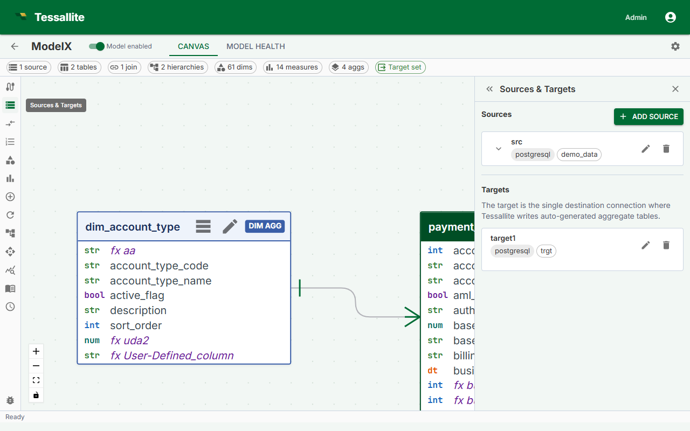

## What this covers

The query target is the database schema or dataset where Tessallite writes pre-aggregated summary tables. The Scheduler service must be able to connect to this location with write access. This article explains what the query target is, how to configure it in Model Builder, and how to choose between writing to the same data source or a separate one.

---

## What is the query target?

When Tessallite builds an aggregate, it executes a query against the source data and writes the result as a summary table in the query target. When a BI tool submits a query that matches an available aggregate, Tessallite reads from the summary table instead of the full fact table. This is what produces the speed improvement.

The query target must be:

- A schema or dataset on a data source that is already connected to Tessallite.
- Writable by the credentials the Scheduler service uses to connect to that data source.
- Accessible at the time the Scheduler runs its refresh jobs. If the connection is unavailable during a scheduled refresh, the build fails.

---

## Required permissions on the target schema

| Permission | Why it is needed |
|---|---|
| `CREATE TABLE` | Tessallite creates a new summary table for each aggregate on first build. |
| `INSERT` | Tessallite writes rows into the summary table on each refresh. |
| `DROP TABLE` | Tessallite drops and recreates the summary table on each full refresh to remove stale data. |

> **Warning:** The Scheduler service connects using the credentials stored in the data source connection, not the credentials of the logged-in user. Verify that the connection's service account has these permissions on the target schema before saving.

---

## Same-source versus separate-target

| Scenario | When to use it | Considerations |
|---|---|---|
| Same source | Source schema allows writes; you want to keep aggregates close to the data they summarise. | Simpler to set up. Aggregates and source tables share the same connection. One less data source to manage. |
| Separate target | Source schema is read-only; you want to isolate aggregate storage; or you are using BigQuery and want aggregates in a dedicated dataset to control billing and IAM. | Requires a second connection configured in Tessallite. Gives cleaner separation between raw data and Tessallite-managed tables. Common pattern for BigQuery deployments. |

---

## Steps

1. Open the model in Model Builder.
2. Click **Settings** in the Toolbelt (left sidebar). The Drawer (right panel) shows the model settings.
3. Scroll to the **Query Target** section.
4. Select the **Connection** from the dropdown. This lists all data source connections configured in Tessallite. Choose the connection for the database where you want aggregates written.
5. Enter the **Schema / dataset name**. This is the schema (PostgreSQL, Snowflake, Redshift) or dataset (BigQuery) inside the selected connection where summary tables will be created. The schema must already exist; Tessallite does not create it.
6. Click **Save**. Tessallite validates that the Scheduler service can reach the target with the expected permissions. If validation fails, an error message describes which permission or connection step failed.

> **Note:** If validation passes but an aggregate build later fails with a permission error, the most likely cause is that the schema-level grant was applied but the connection's service account has a table-level override blocking it. Review the grants on the target schema directly in the data warehouse.

---

## What happens if the target is unreachable

If the Scheduler cannot connect to the query target when a refresh runs, the aggregate's status changes to **Error**. The failure is recorded in the Scheduler log and shown in the Health tab. No data is written. Previously built summary tables remain in place, so existing queries that matched those aggregates continue to be served, but the data may become stale if the source has been updated.

---

## Related

- [Define Measures](define-measures.md)
- [Configure Aggregates](configure-aggregates.md)
- [Aggregates (concept)](../concepts/aggregates.md)

---

← [Drill-through](drill-through.md) | [Home](../index.md) | [Configure Aggregates →](configure-aggregates.md)
