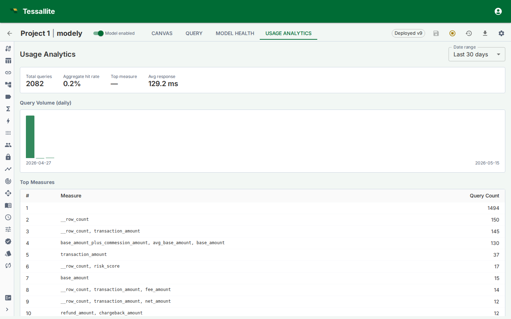

## What this covers

Usage Analytics is a read-only Model Builder tab that shows how a deployed model is being queried. It helps modellers understand adoption, latency, aggregate hit rate, common measures, and query patterns that may deserve new aggregates or pockets.

## What to look at first

| Metric | What it tells you |
|---|---|
| Query volume | Whether the model is actively used and when traffic peaks. |
| Aggregate hit rate | How often queries are served from aggregate tables instead of live source scans. |
| Average or median latency | Whether users experience the model as interactive. |
| Top measures | Which business metrics are driving workload. |
| Top aggregates | Which acceleration objects are earning their storage and refresh cost. |
| Miss patterns | Repeated live queries that the optimizer may be able to accelerate. |

## How to use the tab

Start with the trend, then inspect the detail. A high query volume with a low aggregate hit rate usually means the model is valuable but under-accelerated. A low query volume with many aggregates suggests over-building or a model that has not been adopted. A few top measures dominating traffic should guide aggregate grains and refresh SLAs.

Usage Analytics is also useful after a deploy. Compare the post-deploy latency and hit-rate movement with the Model Health cold-start section. If a new model version caused more live routing, inspect query misses and aggregate validity.

## Common decisions

| Observation | Likely action |
|---|---|
| High live-route count on the same grain | Create or approve an aggregate for that grain. |
| Queries repeatedly filter to the same narrow subset | Consider a pocket table. |
| One aggregate has no hits over the evaluation window | Retire it or let the lifecycle policy remove it. |
| A newly deployed model is slower than the previous version | Check invalid aggregates, changed dimensions, and route badge reasons. |

## Related

- [Configure Aggregates](configure-aggregates.md)
- [Predictive Aggregates](predictive-aggregates.md)
- [Aggregate Lifecycle](aggregate-lifecycle.md)
- [Live vs Aggregate](../querying/live-vs-aggregate.md)

---

← [Use the AI Optimiser](use-the-ai-optimiser.md) | [Home](../index.md) | [Configure Row Security →](configure-row-security.md)
