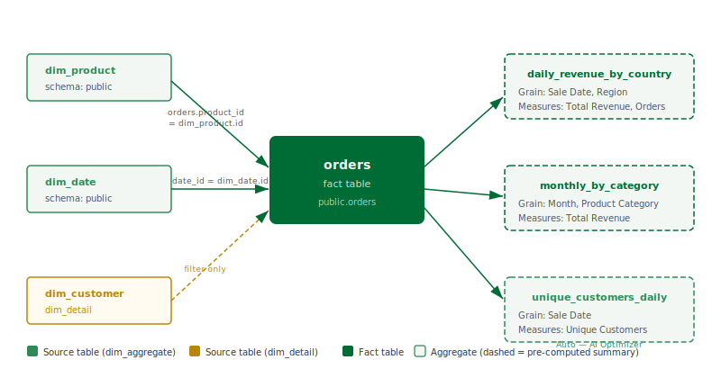

## What this covers

The Lineage view displays a read-only directed graph showing how data flows through the model — from source tables into the fact table, and from the fact table into each aggregate. This article explains how to open the Lineage view, what each node and edge type represents, and what you can learn from the graph.

---

## How to open the Lineage view

1. Open the model in Model Builder.
2. In the Toolbelt (left sidebar), click **Lineage**. Alternatively, select the **Lineage** tab at the top of the Model Builder canvas area.
3. The lineage graph renders automatically. It reflects the current saved state of the model. Unsaved changes in the Canvas are not shown.

> **Note:** The lineage graph is regenerated each time you open the view. On large models with many source tables and aggregates, rendering may take a few seconds.

---

## Node types

| Node type | Visual style | What it represents |
|---|---|---|
| Source table | Rectangle with a table icon | A dim_aggregate or dim_detail table joined into the model. Shown with the schema-qualified table name. |
| Fact table | Rectangle, highlighted with a distinct fill colour | The central fact table of the model. There is exactly one per model. |
| Aggregate | Rounded rectangle with a dashed border | A pre-aggregated summary table, either manually configured or auto-created by the Optimizer. The grain (selected dimensions) is listed inside the node. |

---

## Edge types

| Edge type | Direction | What it represents |
|---|---|---|
| Join edge | Source table → Fact table | A join defined in the model between a dimension table and the fact table. Labelled with the join key columns. |
| Aggregate edge | Fact table → Aggregate | The definition of an aggregate: which dimensions (grain) and which measures the aggregate covers. Hovering over the edge shows the full dimension and measure list. |

---

## What lineage is useful for

- **Understanding aggregate coverage:** Identify which aggregates draw from which source tables. If a source table is being considered for a schema change, the lineage graph shows which aggregates will be affected and need to be rebuilt.
- **Identifying unused aggregates:** Aggregates with no downstream query patterns appear in the graph with no outbound edges. These are candidates for deletion to reduce Scheduler load.
- **Planning schema changes:** Before renaming or dropping a source column, check the lineage view to see which dimensions or measures reference that column, and therefore which aggregates depend on it.
- **Onboarding:** A new team member can read the lineage graph to understand the full model structure without having to click through each aggregate individually.

---

## Limitations

- The lineage view is read-only. All changes to the model are made in the Canvas view.
- The graph reflects only the saved model state. Unsaved Canvas changes do not appear.
- Query patterns (which BI queries matched which aggregates) are visible in the Optimizer panel, not in the lineage view.
- Auto-created aggregates from the Optimizer appear in the lineage graph alongside manually configured ones. There is no visual distinction in the lineage view between the two origins; check the Aggregates list in the Toolbelt to see the origin label.

---

## Related

- [Run a Refresh](run-a-refresh.md)
- [View Diagnostics](view-diagnostics.md)
- [Use the AI Optimiser](use-the-ai-optimiser.md)

---

← [Run a Refresh](run-a-refresh.md) | [Home](../index.md) | [View Diagnostics →](view-diagnostics.md)
