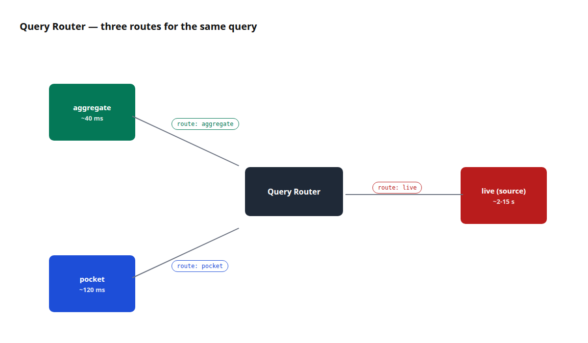
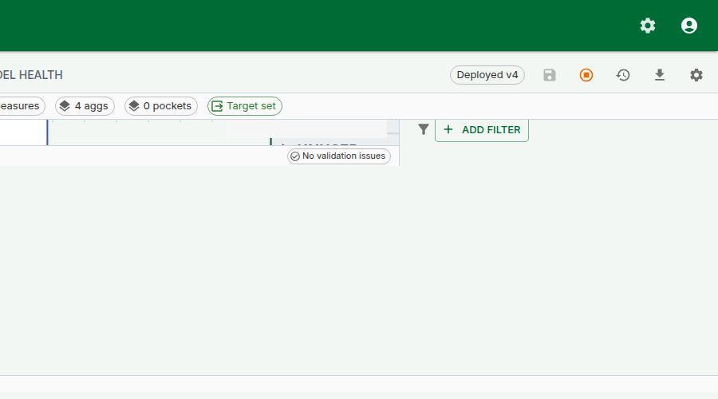

## Why this matters

Every query a business asks has two ways to be answered: scan the source fact table and compute the answer from scratch, or read a pre-computed summary and save the scan. On a 50-million-row fact the first path takes 3 seconds; the second takes 40 milliseconds. The user does not care which path — they just want the right number, quickly.

Tessallite's Query Router makes the choice on every query. Most of the time it picks correctly and invisibly, and the analyst never thinks about it. But there are three moments every modeller hits:

1. **The number looks wrong.** Is it wrong at the source, or is a stale aggregate lying to everyone?
2. **A new aggregate was just built.** Is the router actually using it?
3. **A number on Tuesday disagreed with the same number on Thursday.** Did the aggregate refresh in between?

The **Route badge** and the **Force Live** toggle exist so the analyst can answer all three in under a minute without a SQL console. This page covers what the three routes are, how the badge names the one that ran, when to reach for Force Live, and how row security interacts with the routing choice.

*Figure 1 — The three routing paths. The Route badge on the result identifies which ran and its tooltip explains why. Full description: [route-badge-three-paths.txt](../assets/screencaps/route-badge-three-paths.txt).*

---

## The three routes

### aggregate

A pre-computed roll-up of the model at a specific grain over selected measures. The Query Router matches the query's grain and measure set against every registered aggregate; if one covers the request, the router rewrites the query to read from the aggregate instead of the source.

- **When it fires.** The query's grain is a subset of the aggregate's grain, and every measure asked for is present in the aggregate.
- **Latency.** 10-100 ms typical; depends on aggregate size, not source size.
- **Freshness.** As fresh as the last build. If the source advances, the aggregate is stale until refreshed.

### pocket

A curator-registered derived table — a small, opinionated materialisation shaped for a specific query pattern. Think "a pre-filtered view of the fact table scoped to Q1 2024" or "a pre-joined revenue-by-region table used by three dashboards".

- **When it fires.** The query's shape (filters, grain, measures) matches a known pocket.
- **Latency.** Comparable to aggregate; pockets are usually smaller than aggregates and often narrower.
- **Freshness.** Depends on the pocket's refresh schedule, which is curator-owned.

### live (source)

The query runs directly against the source fact table. No pre-computation, no rewriting — SQL that any database admin would recognise.

- **When it fires.** No aggregate and no pocket covers the query, or Force Live is on.
- **Latency.** Depends on the source. A warehouse indexed for BI will be fast; a raw OLTP source will not.
- **Freshness.** Real-time — reads exactly what's in the source right now.

---

## The Route badge

Every executed query shows a Route badge above the result grid. The badge text is the name of the route (`aggregate`, `pocket`, or `live`). Hover it and a tooltip reveals the **routing reason** — the same explanation the `/explain` endpoint returns — so you do not need a second request to see why a particular path was chosen.

Three numeric chips sit next to the badge:

- **rows** — the number of rows returned.
- **ms** — end-to-end execution time, including router, connector, and network.
- **bytes** — bytes scanned at the executor level (when the connector reports it; some do not).

The badge, its tooltip, and the three chips appear identically on the Query Panel and the Measure Query Panel. The same information is surfaced in the REST `/query` response body under `routing`, so a notebook or an agent sees the same explanation.

**Reading the badge.** When the badge reads `aggregate`, the number you are looking at is as fresh as the last aggregate build. When it reads `pocket`, similar — as fresh as the pocket's refresh schedule. When it reads `live`, the number is the source's current truth.

---

## The Force Live toggle

The **Force Live** toggle sits next to the Execute button. Switching it on forces the next query to skip aggregate and pocket matching and run directly against the source. Use it when you need to:

- **Verify that the source agrees with a pre-computed aggregate.** Run normally (badge: `aggregate`). Switch Force Live on. Re-run. If the two numbers disagree, the aggregate is stale or the aggregate's build logic is wrong.
- **Compare a recent source change against an aggregate that has not yet been refreshed.** Force Live reads post-change data; the aggregate route reads the pre-refresh snapshot.
- **Reproduce a reported discrepancy.** A finance analyst says Q2 revenue should be €5.2M and the dashboard says €4.8M. Run the same query both ways; if Force Live matches the analyst's number, the aggregate is the culprit.

*Figure 2 — The Force Live toggle. One query, not a default setting. Full description: [force-live-toggle.txt](../assets/screencaps/force-live-toggle.txt).*

**Force Live is a per-query flag.** It resets to off on panel reload. It never becomes a default for a model. This is deliberate: forcing live on every query would defeat the purpose of aggregates. Force Live is an investigative tool.

**Row security is always enforced.** Force Live changes which table the query reads from, not which rows the caller is allowed to see. Every live query is still wrapped with the same row-security predicate that applies to aggregate and pocket routes. See [Configure Row Security](../modelling/configure-row-security.md).

---

## When to use which

| Goal | Use |
|---|---|
| Build a dashboard that reads a known slice | Let the router pick; aggregate is preferred |
| Investigate a single value that looks wrong | Run the query with Force Live; compare the Route badge reason against the aggregate route |
| Confirm a pocket table is doing its job | Run the query normally; check the badge reads `pocket` |
| Test a query before aggregates exist | Force Live; the miss will be logged and the Optimizer may propose an aggregate |
| Run the same query every 10 seconds | **Don't.** Let the router pick and let the aggregate serve it |
| Export every row behind a dashboard cell | Click the cell → [Drill-through](../modelling/drill-through.md); Force Live changes aggregation, not export |

---

## Worked example — chase down a stale number

**Context.** A finance analyst reports that the "Gross margin %" figure on the executive dashboard disagrees with the value they computed by hand from the source fact.

**Steps.**

1. Open the [Measure Query Panel](../modelling/measure-query-panel.md). Replicate the dashboard's query: `Gross margin %` by region.
2. Click **Run**. Route badge reads `aggregate`. Value for EMEA: 28.4%.
3. Hover the badge. Tooltip reads "Served by aggregate `margin_by_region` (last built 2026-04-20, 4 days ago)."
4. Switch **Force Live** on. Click **Run** again. Route badge reads `live`. Value for EMEA: 31.2%.
5. The aggregate is four days stale. The source has moved. Refresh the aggregate (see [Run a Refresh](../modelling/run-a-refresh.md)) or accept the staleness and reschedule the build.
6. After refresh, run the query normally (Force Live off). Route badge reads `aggregate`, value reads 31.2%. Dashboard matches the analyst's hand-computed number.

The whole investigation took two Route-badge hovers and a toggle click. No SQL session. No IT ticket.

---

## The Optimizer link

Queries that fall to the live path log a **miss** — a structured record that says "this query was served live and would have matched an aggregate if one existed at grain X with measures Y". The Optimizer consumes these misses and proposes aggregates. See [Use the AI Optimiser](../modelling/use-the-ai-optimiser.md).

This is why "test a query with Force Live" is a constructive action even when the number comes back correct — the miss record tells the Optimizer what aggregate would have been useful.

---

## Troubleshooting

| Symptom | Likely cause | Fix |
|---|---|---|
| Badge always reads `live` | No aggregate or pocket covers the query grain | Define one (see [Configure Aggregates](../modelling/configure-aggregates.md)) or accept the live cost |
| Badge reads `aggregate` but the number is stale | Aggregate refresh is behind its schedule | Refresh manually, or tighten the schedule |
| Force Live on but badge reads `aggregate` | Very rare — a caching layer in front of the Router returned a cached response | Clear the frontend cache or re-run from a fresh tab |
| Query works for one user and not another, both with Force Live on | Row security rule fires for one user and not the other | See [Configure Row Security](../modelling/configure-row-security.md) |
| "bytes" chip always reads 0 | Connector does not report scanned bytes | Not a bug — PostgreSQL does not report this; BigQuery does |

---

## Related

- [Query Routing](../concepts/query-routing.md)
- [Measure Query Panel](../modelling/measure-query-panel.md)
- [Drill-through](../modelling/drill-through.md)
- [Configure Row Security](../modelling/configure-row-security.md)

---

← [Measure Query Panel](../modelling/measure-query-panel.md) | [Home](../index.md) | [Drill-through →](../modelling/drill-through.md)
